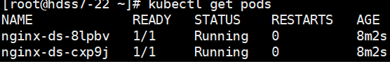
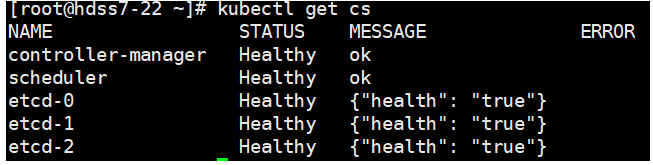
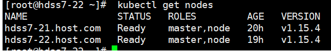
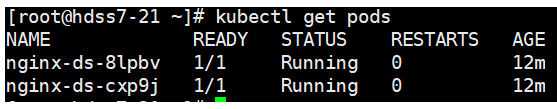

**Kube-Proxy简述**

参考文献：
 https://ywnz.com/linuxyffq/2530.html

运行在每个节点上，监听 API Server 中服务对象的变化，再通过管理 IPtables 来实现网络的转发
 Kube-Proxy 目前支持三种模式：

- UserSpace
  - k8s v1.2 后就已经淘汰
- IPtables
  - 目前默认方式

- IPVS--推荐，支持7层
  - 需要安装ipvsadm、ipset 工具包和加载 ip_vs 内核模块

kube-proxy部署在hdss7-21,hdss7-22上：

首先安装ipset，ipvsadm

```
# yum install   ipset  -y 
# yum -y install ipvsadm
```

然后在hdss7-200上申请证书：

```
# vi /opt/certs/kube-proxy-csr.json
```


```
{
    "CN": "system:kube-proxy",
    "key": {
        "algo": "rsa",
        "size": 2048
    },
    "names": [
        {
            "C": "CN",
            "ST": "beijing",
            "L": "beijing",
            "O": "od",
            "OU": "ops"
        }
    ]
}
```


```
# cfssl gencert -ca=ca.pem -ca-key=ca-key.pem -config=ca-config.json -profile=client kube-proxy-csr.json |cfssl-json -bare kube-proxy-client
```

拷贝证书到21，22上：

```
# cd /opt/kubernetes/server/bin/cert/
# scp hdss7-200:/opt/certs/kube-proxy-client-key.pem ./
# scp hdss7-200:/opt/certs/kube-proxy-client.pem ./
```

配置：

```
# cd /opt/kubernetes/server/bin/conf
# kubectl config set-cluster myk8s \
  --certificate-authority=/opt/kubernetes/server/bin/cert/ca.pem \
  --embed-certs=true \
  --server=https://10.4.7.10:7443 \
  --kubeconfig=kube-proxy.kubeconfig
# kubectl config set-credentials kube-proxy \
  --client-certificate=/opt/kubernetes/server/bin/cert/kube-proxy-client.pem \
  --client-key=/opt/kubernetes/server/bin/cert/kube-proxy-client-key.pem \
  --embed-certs=true \
  --kubeconfig=kube-proxy.kubeconfig
# kubectl config set-context myk8s-context \
  --cluster=myk8s \
  --user=kube-proxy \
  --kubeconfig=kube-proxy.kubeconfig
# kubectl config use-context myk8s-context --kubeconfig=kube-proxy.kubeconfig
```

编辑开启ipvs内核的脚本：


```
# vi /root/ipvs.sh

#!/bin/bash
ipvs_mods_dir="/usr/lib/modules/$(uname -r)/kernel/net/netfilter/ipvs"
for i in $(ls $ipvs_mods_dir|grep -o "^[^.]*")
do
  /sbin/modinfo -F filename $i &>/dev/null
  if [ $? -eq 0 ];then
    /sbin/modprobe $i
  fi
done
```


```
# chmod u+x /root/ipvs.sh
# sh /root/ipvs.sh
```

编辑kube-proxy启动脚本：红色部分根据IP修改

```
# vi /opt/kubernetes/server/bin/kube-proxy.sh
```


```
#!/bin/sh
./kube-proxy \
  --cluster-cidr 172.7.0.0/16 \
  --hostname-override hdss7-21.host.com \
  --proxy-mode=ipvs \
  --ipvs-scheduler=nq \
  --kubeconfig ./conf/kube-proxy.kubeconfig
```


执行权限并创建日志存储目录：

```
# chmod +x /opt/kubernetes/server/bin/kube-proxy.sh
# mkdir -p /data/logs/kubernetes/kube-proxy
```

编辑supervisord启动文件：红色部分根据IP修改

```
# vi /etc/supervisord.d/kube-proxy.ini
```


```
[program:kube-proxy-7-21]
command=/opt/kubernetes/server/bin/kube-proxy.sh                     ; the program (relative uses PATH, can take args)
numprocs=1                                                           ; number of processes copies to start (def 1)
directory=/opt/kubernetes/server/bin                                 ; directory to cwd to before exec (def no cwd)
autostart=true                                                       ; start at supervisord start (default: true)
autorestart=true                                                     ; retstart at unexpected quit (default: true)
startsecs=30                                                         ; number of secs prog must stay running (def. 1)
startretries=3                                                       ; max # of serial start failures (default 3)
exitcodes=0,2                                                        ; 'expected' exit codes for process (default 0,2)
stopsignal=QUIT                                                      ; signal used to kill process (default TERM)
stopwaitsecs=10                                                      ; max num secs to wait b4 SIGKILL (default 10)
user=root                                                            ; setuid to this UNIX account to run the program
redirect_stderr=true                                                 ; redirect proc stderr to stdout (default false)
stdout_logfile=/data/logs/kubernetes/kube-proxy/proxy.stdout.log     ; stderr log path, NONE for none; default AUTO
stdout_logfile_maxbytes=64MB                                         ; max # logfile bytes b4 rotation (default 50MB)
stdout_logfile_backups=4                                             ; # of stdout logfile backups (default 10)
stdout_capture_maxbytes=1MB                                          ; number of bytes in 'capturemode' (default 0)
stdout_events_enabled=false                                          ; emit events on stdout writes (default false)
```


更新supervisord：

```
# supervisorctl update
# supervisorctl status
```

创建nginx-ds pod：（21上执行就行）

```
# vi /root/nginx-ds.yaml
```


```
apiVersion: extensions/v1beta1
kind: DaemonSet
metadata:
  name: nginx-ds
spec:
  template:
    metadata:
      labels:
        app: nginx-ds
    spec:
      containers:
      - name: my-nginx
        image: harbor.od.com/public/nginx:v1.7.9
        ports:
        - containerPort: 80
```


```
# kubectl create -f nginx-ds.yaml
```

查看：

```
# kubectl get pods 
```



 

 

最后验证集群状态：

etcd controller-manager scheduler状态：

```
#kubectl get cs
```




nodes状态：

```
# kubectl get nodes
```




 pods状态：

```
#kubectl get pods
```

