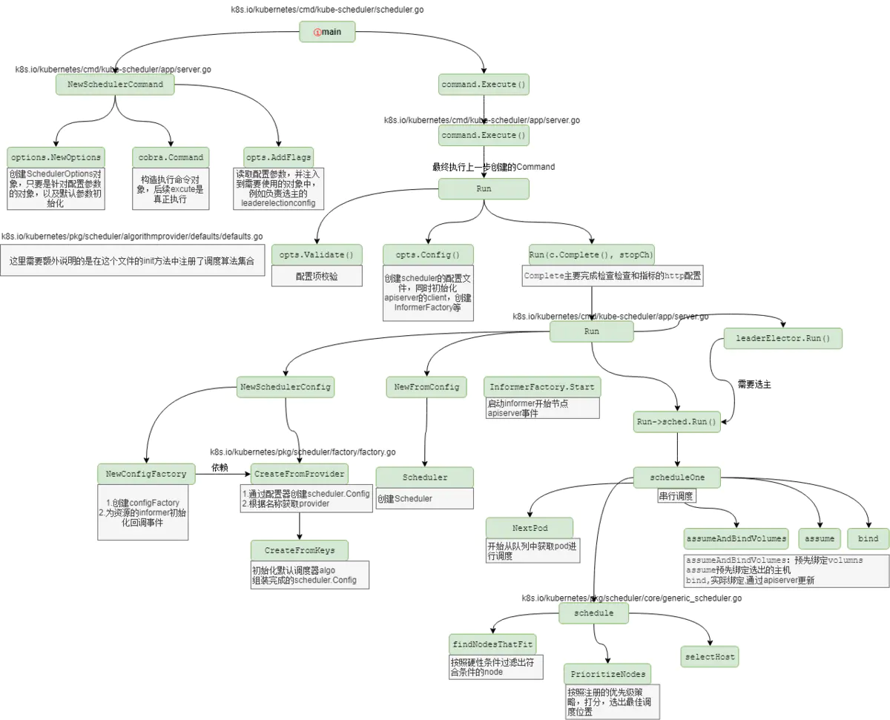
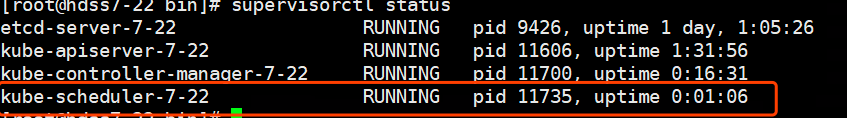
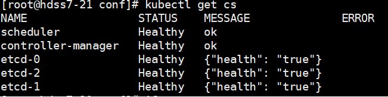

# 二进制安装kubernetes（四）kube-scheduler组件安装

## 介绍资料转载地址：https://www.jianshu.com/p/c4c60ccda8d0

## kube-scheduler在集群中的作用

kube-scheduler是以插件形式存在的组件，正因为以插件形式存在，所以其具有可扩展可定制的特性。kube-scheduler相当于整个集群的调度决策者，其通过预选和优选两个过程决定容器的最佳调度位置。

## kube-scheduler源码中的关键性调用链




kube-scheduler部署在hdss7-21,22上：

创建启动脚本：

```
# vi /opt/kubernetes/server/bin/kube-scheduler.sh
```


```
#!/bin/sh
./kube-scheduler \
  --leader-elect  \
  --log-dir /data/logs/kubernetes/kube-scheduler \
  --master http://127.0.0.1:8080 \
  --v 2
```


执行权限：

```
# chmod +x /opt/kubernetes/server/bin/kube-scheduler.sh
```

创建日志存储目录：

```
# mkdir -p /data/logs/kubernetes/kube-scheduler
```

编辑supervisord脚本：红色部分第二台需要修改

```
 # vi /etc/supervisord.d/kube-scheduler.ini
```


```
[program:kube-scheduler-7-21]
command=/opt/kubernetes/server/bin/kube-scheduler.sh                     ; the program (relative uses PATH, can take args)
numprocs=1                                                               ; number of processes copies to start (def 1)
directory=/opt/kubernetes/server/bin                                     ; directory to cwd to before exec (def no cwd)
autostart=true                                                           ; start at supervisord start (default: true)
autorestart=true                                                         ; retstart at unexpected quit (default: true)
startsecs=30                                                             ; number of secs prog must stay running (def. 1)
startretries=3                                                           ; max # of serial start failures (default 3)
exitcodes=0,2                                                            ; 'expected' exit codes for process (default 0,2)
stopsignal=QUIT                                                          ; signal used to kill process (default TERM)
stopwaitsecs=10                                                          ; max num secs to wait b4 SIGKILL (default 10)
user=root                                                                ; setuid to this UNIX account to run the program
redirect_stderr=true                                                     ; redirect proc stderr to stdout (default false)
stdout_logfile=/data/logs/kubernetes/kube-scheduler/scheduler.stdout.log ; stderr log path, NONE for none; default AUTO
stdout_logfile_maxbytes=64MB                                             ; max # logfile bytes b4 rotation (default 50MB)
stdout_logfile_backups=4                                                 ; # of stdout logfile backups (default 10)
stdout_capture_maxbytes=1MB                                              ; number of bytes in 'capturemode' (default 0)
stdout_events_enabled=false                                              ; emit events on stdout writes (default false)
```


更新supervisord：

```
# supervisorctl update
# supervisorctl status
```




 检查一下状态：

```
# ln -s /opt/kubernetes/server/bin/kubectl /usr/bin/kubectl
# kubectl get cs
```



 

 

至此kube-scheduler已经安装完成，接下来安装kubelet。

 

 

 