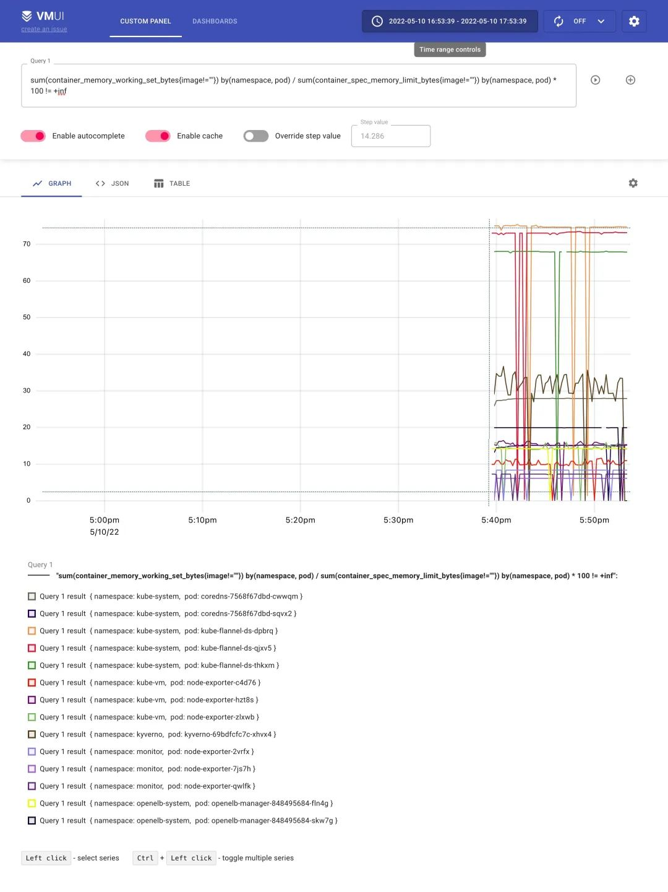

# 使用vmagent代替Prometheus采集监控指标

vmagent 可以帮助我们从各种来源收集指标并将它们存储在 VM 或者任何其他支持 remote write 协议的 Prometheus 兼容的存储系统中。

# 特性

vmagent 相比于 Prometheus 抓取指标来说具有更多的灵活性，比如除了拉取（pull）指标还可以推送（push）指标，此外还有很多其他特性：

- 可以替换 prometheus 的 scraping target
- 支持从 Kafka 读写数据
- 支持基于 prometheus relabeling 的模式添加、移除、修改 labels，可以在数据发送到远端存储之前进行数据的过滤
- 支持多种数据协议，influx line 协议，graphite 文本协议，opentsdb 协议，prometheus remote write 协议，json lines 协议，csv 数据等
- 支持收集数据的同时，并复制到多种远端存储系统
- 支持不可靠远端存储，如果远程存储不可用，收集的指标会在 `-remoteWrite.tmpDataPath` 缓冲，一旦与远程存储的连接被修复，缓冲的指标就会被发送到远程存储，缓冲区的最大磁盘用量可以用 `-remoteWrite.maxDiskUsagePerURL` 来限制。
- 相比 prometheus 使用更少的内存、cpu、磁盘 io 以及网络带宽
- 当需要抓取大量目标时，抓取目标可以分散到多个 vmagent 实例中
- 可以通过在抓取时间和将其发送到远程存储系统之前限制唯一时间序列的数量来处理高基数和高流失率问题
- 可以从多个文件中加载 scrape 配置


# 部署

接下来我们以抓取 Kubernetes 集群指标为例说明如何使用 vmagent，我们这里使用自动发现的方式来进行配置。vmagent 是兼容 prometheus 中的 `kubernetes_sd_configs` 配置的，所以我们同样可以使用。

要让 vmagent 自动发现监控的资源对象，需要访问 APIServer 获取资源对象，所以首先需要配置 rbac 权限，创建如下所示的资源清单。

```yaml
# vmagent-rbac.yaml
apiVersion: v1
kind: ServiceAccount
metadata:
  name: vmagent
  namespace: kube-vm
---
apiVersion: rbac.authorization.k8s.io/v1
kind: ClusterRole
metadata:
  name: vmagent
rules:
  - apiGroups: ["", "networking.k8s.io", "extensions"]
    resources:
      - nodes
      - nodes/metrics
      - services
      - endpoints
      - endpointslices
      - pods
      - app
      - ingresses
    verbs: ["get", "list", "watch"]
  - apiGroups: [""]
    resources:
      - namespaces
      - configmaps
    verbs: ["get"]
  - nonResourceURLs: ["/metrics", "/metrics/resources"]
    verbs: ["get"]
---
apiVersion: rbac.authorization.k8s.io/v1
kind: ClusterRoleBinding
metadata:
  name: vmagent
roleRef:
  apiGroup: rbac.authorization.k8s.io
  kind: ClusterRole
  name: vmagent
subjects:
  - kind: ServiceAccount
    name: vmagent
    namespace: kube-vm
```

然后添加 vmagent 配置，我们先只配置自动发现 Kubernetes 节点的任务，创建如下所示的 ConfigMap 对象：

```yaml
# vmagent-config.yaml
apiVersion: v1
kind: ConfigMap
metadata:
  name: vmagent-config
  namespace: kube-vm
data:
  scrape.yml: |
    global:
      scrape_interval: 15s
      scrape_timeout: 15s

    scrape_configs:
    - job_name: nodes
      kubernetes_sd_configs:
        - role: node
      relabel_configs:
      - source_labels: [__address__]
        regex: "(.*):10250"
        replacement: "${1}:9111"
        target_label: __address__
        action: replace
      - action: labelmap
        regex: __meta_kubernetes_node_label_(.+)
```

这里我们通过自动发现 Kubernetes 节点获取节点监控指标，需要注意 `node` 这种 role 的自动发现默认获取的是节点的 `10250` 端口，这里我们需要通过 `relabel` 将其 `replace` 为 `9111`。

然后添加 vmagent 部署资源清单，如下所示：

```yaml
# vmagent-deploy.yaml
apiVersion: v1
kind: PersistentVolumeClaim
metadata:
  name: vmagent-pvc
  namespace: kube-vm
spec:
  accessModes:
    - ReadWriteOnce
  resources:
    requests:
      storage: 1Gi
  storageClassName: nfs-client
---
apiVersion: apps/v1
kind: Deployment
metadata:
  name: vmagent
  namespace: kube-vm
  labels:
    app: vmagent
spec:
  selector:
    matchLabels:
      app: vmagent
  template:
    metadata:
      labels:
        app: vmagent
    spec:
      serviceAccountName: vmagent
      containers:
        - name: agent
          image: "victoriametrics/vmagent:v1.77.0"
          imagePullPolicy: IfNotPresent
          args:
            - -promscrape.config=/config/scrape.yml
            - -remoteWrite.tmpDataPath=/tmpData
            - -remoteWrite.url=http://vminsert:8480/insert/0/prometheus
            - -envflag.enable=true
            - -envflag.prefix=VM_
            - -loggerFormat=json
          ports:
            - name: http
              containerPort: 8429
          volumeMounts:
            - name: tmpdata
              mountPath: /tmpData
            - name: config
              mountPath: /config
      volumes:
        - name: tmpdata
          persistentVolumeClaim:
            claimName: vmagent-pvc
        - name: config
          configMap:
            name: vmagent-config
```

我们将 vmagent 配置通过 ConfigMap 挂载到容器 `/config/scrape.yml`，另外通过 `-remoteWrite.url=http://vminsert:8480/insert/0/prometheus` 指定远程写入的地址，这里我们写入前面的 vminsert 服务，另外有一个参数 `-remoteWrite.tmpDataPath`，该路径会在远程存储不可用的时候用来缓存收集的指标，当远程存储修复后，缓存的指标就会被正常发送到远程写入，所以最好持久化该目录。

## 集群模式

单个 vmagent 实例可以抓取数万个抓取目标，但是有时由于 CPU、网络、内存等方面的限制，这还不够。在这种情况下，抓取目标可以在多个 vmagent 实例之间进行拆分。集群中的每个 vmagent 实例必须使用具有不同 `-promscrape.cluster.memberNum` 值的相同 `-promscrape.config` 配置文件，该参数值必须在 `0 ... N-1` 范围内，其中 `N` 是集群中 vmagent 实例的数量。集群中 vmagent 实例的数量必须传递给 `-promscrape.cluster.membersCount` 命令行标志。例如，以下命令可以在两个 vmagent 实例的集群中传播抓取目标：

```yaml
vmagent -promscrape.cluster.membersCount=2 -promscrape.cluster.memberNum=0 -promscrape.config=/path/config.yml ...
vmagent -promscrape.cluster.membersCount=2 -promscrape.cluster.memberNum=1 -promscrape.config=/path/config.yml ...
```

当 vmagent 在 Kubernetes 中运行时，可以将 `-promscrape.cluster.memberNum` 设置为 StatefulSet pod 名称，pod 名称必须以 `0 ... promscrape.cluster.memberNum-1` 范围内的数字结尾，例如，`-promscrape.cluster.memberNum=vmagent-0`。

默认情况下，每个抓取目标仅由集群中的单个 vmagent 实例抓取。如果需要在多个 vmagent 实例之间复制抓取目标，则可以通过 `-promscrape.cluster.replicationFactor` 参数设置为所需的副本数。例如，以下命令启动一个包含三个 vmagent 实例的集群，其中每个目标由两个 vmagent 实例抓取：

```yaml
vmagent -promscrape.cluster.membersCount=3 -promscrape.cluster.replicationFactor=2 -promscrape.cluster.memberNum=0 -promscrape.config=/path/to/config.yml ...
vmagent -promscrape.cluster.membersCount=3 -promscrape.cluster.replicationFactor=2 -promscrape.cluster.memberNum=1 -promscrape.config=/path/to/config.yml ...
vmagent -promscrape.cluster.membersCount=3 -promscrape.cluster.replicationFactor=2 -promscrape.cluster.memberNum=2 -promscrape.config=/path/to/config.yml ...
```

需要注意的是如果每个目标被多个 vmagent 实例抓取，则必须在 `-remoteWrite.url` 指向的远程存储上启用重复数据删除。

所以如果你抓取的监控目标非常大，那么我们建议使用 vmagent 集群模式，那么可以使用 StatefulSet 方式进行部署

```yaml
# vmagent-sts.yaml
apiVersion: v1
kind: Service
metadata:
  name: vmagent
  namespace: kube-vm
  annotations:
    prometheus.io/scrape: "true"
    prometheus.io/port: "8429"
spec:
  selector:
    app: vmagent
  clusterIP: None
  ports:
    - name: http
      port: 8429
      targetPort: http
---
apiVersion: apps/v1
kind: StatefulSet
metadata:
  name: vmagent
  namespace: kube-vm
  labels:
    app: vmagent
spec:
  replicas: 2
  serviceName: vmagent
  selector:
    matchLabels:
      app: vmagent
  template:
    metadata:
      labels:
        app: vmagent
    spec:
      serviceAccountName: vmagent
      containers:
        - name: agent
          image: victoriametrics/vmagent:v1.77.0
          imagePullPolicy: IfNotPresent
          args:
            - -promscrape.config=/config/scrape.yml
            - -remoteWrite.tmpDataPath=/tmpData
            - -promscrape.cluster.membersCount=2
            # - -promscrape.cluster.replicationFactor=2 # 可以配置副本数
            - -promscrape.cluster.memberNum=$(POD_NAME)
            - -remoteWrite.url=http://vminsert:8480/insert/0/prometheus
            - -envflag.enable=true
            - -envflag.prefix=VM_
            - -loggerFormat=json
          ports:
            - name: http
              containerPort: 8429
          env:
            - name: POD_NAME
              valueFrom:
                fieldRef:
                  fieldPath: metadata.name
          volumeMounts:
            - name: tmpdata
              mountPath: /tmpData
            - name: config
              mountPath: /config
      volumes:
        - name: config
          configMap:
            name: vmagent-config
  volumeClaimTemplates:
    - metadata:
        name: tmpdata
      spec:
        accessModes:
          - ReadWriteOnce
        storageClassName: nfs-client
        resources:
          requests:
            storage: 1Gi
```

我们这里就使用 StatefulSet 的形式来管理 vmagent，直接应用上面的资源即可：

```bash
# 先将前面示例中的 prometheus 停掉
☸ ➜ kubectl scale deploy prometheus --replicas=0 -n kube-vm
☸ ➜ kubectl apply -f vmagent-rbac.yaml
☸ ➜ kubectl apply -f vmagent-config.yaml
☸ ➜ kubectl apply -f vmagent-sts.yaml
☸ ➜ kubectl get pods -n kube-vm -l app=vmagent
NAME        READY   STATUS    RESTARTS   AGE
vmagent-0   1/1     Running   0          3m43s
vmagent-1   1/1     Running   0          2m9s
```

这里我们部署了两个 vmagent 实例来抓取监控指标，我们这里一共 3 个节点。

```bash
☸ ➜ kubectl get nodes
NAME      STATUS   ROLES                  AGE   VERSION
master1   Ready    control-plane,master   44d   v1.22.8
node1     Ready    <none>                 44d   v1.22.8
node2     Ready    <none>                 44d   v1.22.8
```

所以两个 vmagent 实例会分别采集部分指标，我们可以通过查看日志来进行验证：

```bash
☸ ➜ kubectl logs -f vmagent-0 -n kube-vm
# ......
{"ts":"2022-05-10T04:44:44.004Z","level":"info","caller":"VictoriaMetrics/lib/promscrape/scraper.go:393","msg":"static_configs: added targets: 1, removed targets: 0; total targets: 1"}
{"ts":"2022-05-10T04:44:44.006Z","level":"info","caller":"VictoriaMetrics/lib/promscrape/scraper.go:393","msg":"kubernetes_sd_configs: added targets: 2, removed targets: 0; total targets: 2"}
☸ ➜ kubectl logs -f vmagent-1 -n kube-vm
# ......
{"ts":"2022-05-10T04:46:17.893Z","level":"info","caller":"VictoriaMetrics/lib/promscrape/scraper.go:393","msg":"kubernetes_sd_configs: added targets: 1, removed targets: 0; total targets: 1"}
```

从日志可以看出 `vmagent-0` 实例发现了 2 个 targets，`vmagent-1` 实例发现了 1 个 targets，这也符合我们预期的。

接下来我们再新增其他内容的监控，比如 APIServer、容器等等，配置如下所示：

```yaml
# vmagent-config2.yaml
apiVersion: v1
kind: ConfigMap
metadata:
  name: vmagent-config
  namespace: kube-vm
data:
  scrape.yml: |
    global:
      scrape_interval: 15s
      scrape_timeout: 15s

    scrape_configs:

    - job_name: nodes
      kubernetes_sd_configs:
        - role: node
      relabel_configs:
      - source_labels: [__address__]
        regex: "(.*):10250"
        replacement: "${1}:9111"
        target_label: __address__
        action: replace
      - action: labelmap
        regex: __meta_kubernetes_node_label_(.+)

    - job_name: apiserver
      scheme: https
      bearer_token_file: /var/run/secrets/kubernetes.io/serviceaccount/token
      tls_config:
        ca_file: /var/run/secrets/kubernetes.io/serviceaccount/ca.crt
        insecure_skip_verify: true
      kubernetes_sd_configs:
      - role: endpoints
      relabel_configs:
      - action: keep
        regex: default;kubernetes;https
        source_labels:
        - __meta_kubernetes_namespace
        - __meta_kubernetes_service_name
        - __meta_kubernetes_endpoint_port_name

    - job_name: cadvisor
      bearer_token_file: /var/run/secrets/kubernetes.io/serviceaccount/token
      scheme: https
      tls_config:
        ca_file: /var/run/secrets/kubernetes.io/serviceaccount/ca.crt
        insecure_skip_verify: true
      kubernetes_sd_configs:
      - role: node
      relabel_configs:
      - action: labelmap
        regex: __meta_kubernetes_node_label_(.+)
      - replacement: /metrics/cadvisor
        target_label: __metrics_path__

    - job_name: endpoints
      kubernetes_sd_configs:
      - role: endpoints
      relabel_configs:
      - action: drop
        regex: true
        source_labels:
        - __meta_kubernetes_pod_container_init
      - action: keep_if_equal
        source_labels:
        - __meta_kubernetes_service_annotation_prometheus_io_port
        - __meta_kubernetes_pod_container_port_number
      - action: keep
        regex: true
        source_labels:
        - __meta_kubernetes_service_annotation_prometheus_io_scrape
      - action: replace
        regex: (https?)
        source_labels:
        - __meta_kubernetes_service_annotation_prometheus_io_scheme
        target_label: __scheme__
      - action: replace
        regex: (.+)
        source_labels:
        - __meta_kubernetes_service_annotation_prometheus_io_path
        target_label: __metrics_path__
      - action: replace
        regex: ([^:]+)(?::\d+)?;(\d+)
        replacement: $1:$2
        source_labels:
        - __address__
        - __meta_kubernetes_service_annotation_prometheus_io_port
        target_label: __address__
      - action: labelmap
        regex: __meta_kubernetes_service_label_(.+)
      - source_labels:
        - __meta_kubernetes_pod_name
        target_label: pod
      - source_labels:
        - __meta_kubernetes_namespace
        target_label: namespace
      - source_labels:
        - __meta_kubernetes_service_name
        target_label: service
      - replacement: ${1}
        source_labels:
        - __meta_kubernetes_service_name
        target_label: job
      - action: replace
        source_labels:
        - __meta_kubernetes_pod_node_name
        target_label: node
```

大部分的配置在前面 Prometheus 章节都介绍过了，核心就是通过 `relabel_configs` 来控制抓取的任务，vmagent 是兼容传统的 prometheus 重新标记规则的，但也有一些独特的 action，比如上面配置中我们使用了一个 `keep_if_equal` 的操作，该操作的意思是如果指定的标签值相等则将该条数据保留下来。

有时，如果某个指标包含两个具有相同值的标签，则需要删除它。这可以通过 vmagent 支持的 `drop_if_equal` 操作来完成。例如，如果以下 relabel 规则包含 `real_port` 和 `required_port` 的相同标签值，则它会删除指标：

```yaml
- action: drop_if_equal
  source_labels: [real_port, needed_port]
```

该规则将删除以下指标：`foo{real_port="123",needed_port="123"}`，但会保留以下指标：`foo{real_port="123",needed_port="456"}`。

有时可能需要只对指标子集应用 relabel，在这种情况下，可以将 `if` 选项添加到 `relabel_configs` 规则中，例如以下规则仅将 `{foo="bar"}` 标签添加到与 `metric{label=~"x|y"}` 序列选择器匹配的指标：

```yaml
- if: 'metric{label=~"x|y"}'
  target_label: "foo"
  replacement: "bar"
```

`if` 选项可以简化传统的 `relabel_configs` 规则，例如，以下规则可以删除与 `foo{bar="baz"}` 序列选择器匹配的指标：

```yaml
- if: 'foo{bar="baz"}'
  action: drop
```

这相当于以下传统的规则：

```yaml
- action: drop
  source_labels: [__name__, bar]
  regex: "foo;baz"
```

不过需要注意的是 Prometheus 还不支持 `if` 选项，现在只支持 VictoriaMetrics。

现在更新 vmagent 的配置。

```bash
☸ ➜ kubectl apply -f vmagent-config2.yaml
```

配置刷新有两种方式：

- 发送 SUGHUP 信号给 vmagent 进程
- 向 `http://vmagent:8429/-/reload` 发送一个 http 请求

刷新后就可以开始采集上面的指标了，同样我们也可以通过 `http://vmselect/select/0/vmui/` 来访问 vmui，比如现在我们来查询 pod 的内存使用率，可以使用如下的查询语句：

```c
sum(container_memory_working_set_bytes{image!=""}) by(namespace, pod) / sum(container_spec_memory_limit_bytes{image!=""}) by(namespace, pod) * 100 != +inf
```



vmagent 作为采集指标重要的一环，当然对它的监控也不可少。vmagent 通过 `http://vmagent:8429/metrics` 暴露了很多指标，如 `vmagent_remotewrite_conns` 远程存储连接，`vm_allowed_memory_bytes` 可使用的内存大小，我们把一些重要的指标收集起来，通过 Grafana 进行展示，能够更好的帮助我们分析 vmagent 的状态。

我们可以使用 https://grafana.com/grafana/dashboards/12683 来展示 vmagent 的状态。

