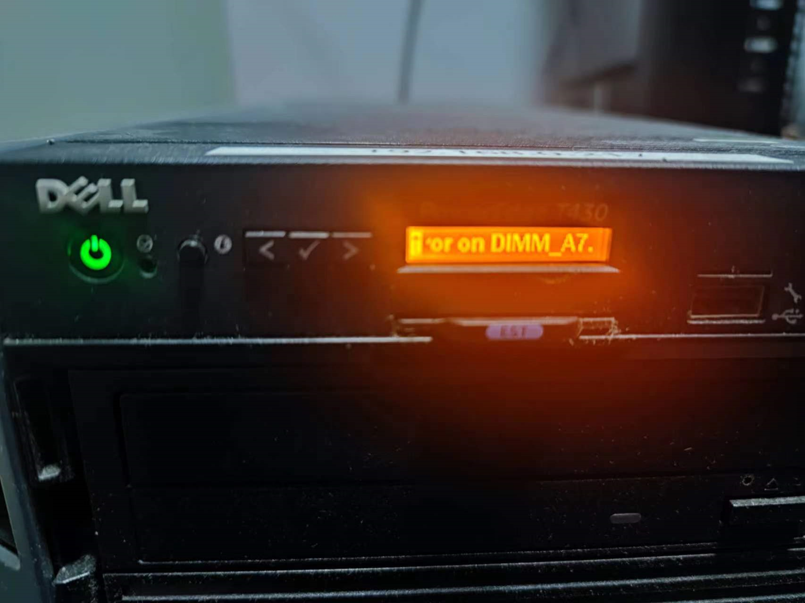
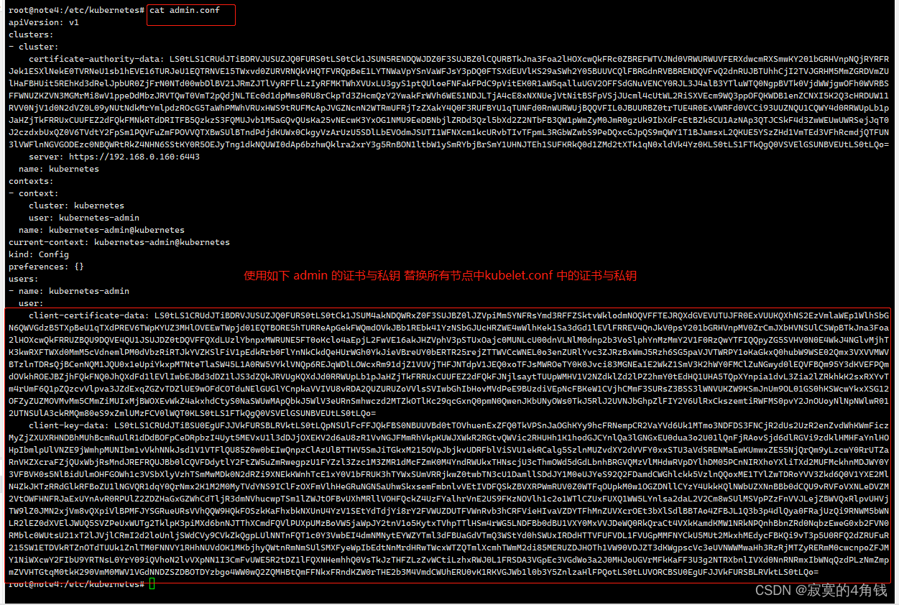
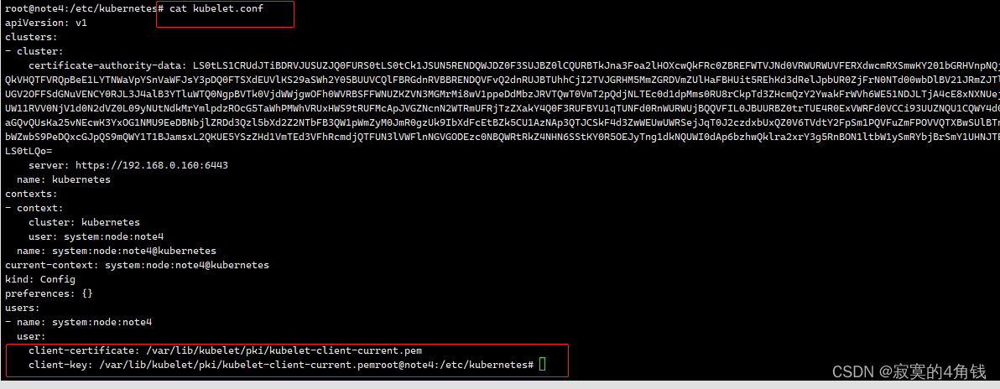
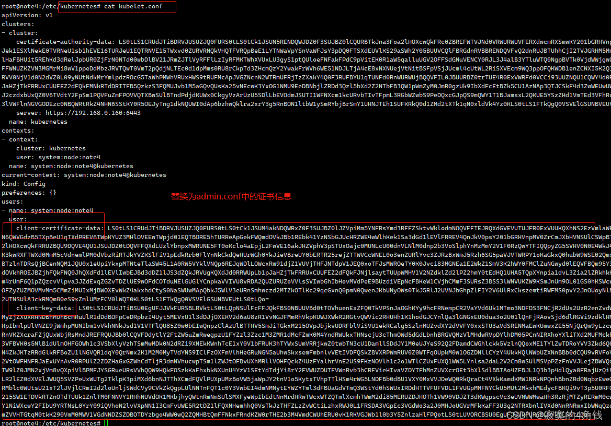
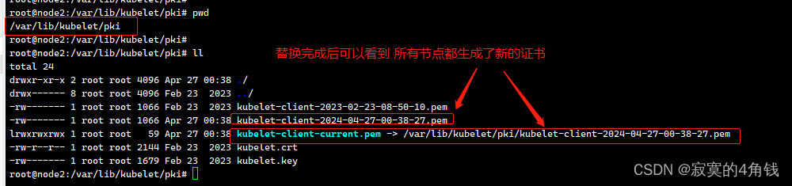

# 记一次异常断电造成kubernetes故障

## 断电造成kubernetes故障

> http://31mwww.linuxea.com/2580.html
> https://blog.csdn.net/liuyij3430448/article/details/130406844
> 因为宿主机系统 esxi 的内存条老化，导致esxi异常关机。内部虚拟机全部断电。总共30几台吧。
>
> 经过检查和擦拭内存金手指，服务器正常开机。
>
> 老家伙你不能倒下啊。你不run了我就得run啊。。。

服务器显示状态




## 处理存储空间问题

所幸，os 层面并没有损坏。系统正常的开机。硬盘已经满了。不知道这个设备之前是怎么在磁盘根目录100%的情况下还能正常运行的。

### 发现异常

- vim在保存任何文件的时候都会显示vim.viminfo报错。
- 运行速度非常缓慢

经过检查是根目录存储空间不足。

```bash
cd /var/log
rm -rf vmware-*
rm -rf *{0..9}
rm -rf *.tar.gz
```

经过上边的处理之后，系统重启，速度变快了。

## 集群节点信息和日志

> 这个是一个远古集群，版本是1.18，主要运行一些runner。没做很多的监控告警，处理起来非常棘手。先看master节点的解决思路，master节点不解决，slave不会起来。

### master2节点

kubelet启动异常，日志显示，当然kubelet启动不成功，其他组件也不可能起来。

```bash
failed to run Kubelet: unable to load bootstrap kubeconfig: stat /etc/kubernetes/bootstrap-kubelet.conf: no such file or directory
```

### master3节点

kubelet启动异常，日志显示，当然kubelet启动不成功，其他组件也不可能起来。

```bash
failed to run Kubelet: unable to load bootstrap kubeconfig: stat /etc/kubernetes/bootstrap-kubelet.conf: no such file or directory
```

### master1节点

因为各种原因吧，可能当时误删除了。。。但是集群正常运行也没在意这个。

## 临时解决这个问题

在`/usr/lib/systemd/system/kubelet.service.d/10-kubeadm.conf`中去掉`--bootstrap-kubeconfig=/etc/kubernetes/bootstrap-kubelet.conf`后重启


## 证书更新

> 经过查询，证书已经全部过期，使用kubeadm更新证书，然后集群并没有正常变为Ready。

### 使用命令更新

```bash
通过 kubeadm部署的k8s集群，默认生成的证书有效期是一年.需要每年更新证书.

1、查看证书有效期
kubeadm alpha certs check-expiration

2、更新证书，如果是HA集群模式，所有master需要执行
kubeadm alpha certs renew all

3、通过crontab定时更新证书
0 0 15 10 * kubeadm alpha certs renew all

4、证书过期kubectl命令无法使用
# 更新客户端配置
sudo cp -i /etc/kubernetes/admin.conf $HOME/.kube/config
sudo chown $(id -u):$(id -g) $HOME/.kube/config


-----------证书说明---------------

1.Kubernetes 集群根证书
/etc/kubernetes/pki/ca.crt
/etc/kubernetes/pki/ca.key

由此根证书签发的证书有:
  kube-apiserver 组件持有的服务端证书
    /etc/kubernetes/pki/apiserver.crt
　　/etc/kubernetes/pki/apiserver.key
  kubelet 组件持有的客户端证书
　　/etc/kubernetes/pki/apiserver-kubelet-client.crt
　　/etc/kubernetes/pki/apiserver-kubelet-client.key

注意：kubelet 上一般不会明确指定服务端证书, 而是只指定 ca 根证书, 让 kubelet 根据本地主机信息自动生成服务端证书并
保存到配置的cert-dir文件夹中。轮换的证书默认位于目录 /var/lib/kubelet/pki。

2.汇聚层(aggregator)证书
/etc/kubernetes/pki/front-proxy-ca.crt
/etc/kubernetes/pki/front-proxy-ca.key

由此根证书签发的证书只有一组:
  代理端使用的客户端证书, 用作代用户与 kube-apiserver 认证
    /etc/kubernetes/pki/front-proxy-client.crt
    /etc/kubernetes/pki/front-proxy-client.key

3.etcd 集群根证书
/etc/kubernetes/pki/etcd/ca.crt
/etc/kubernetes/pki/etcd/ca.key

由此根证书签发机构签发的证书有:
  etcd server 持有的服务端证书
    /etc/kubernetes/pki/etcd/server.crt
    /etc/kubernetes/pki/etcd/server.key
  peer 集群中节点互相通信使用的客户端证书
    /etc/kubernetes/pki/etcd/peer.crt
    /etc/kubernetes/pki/etcd/peer.key
  pod 中定义 Liveness 探针使用的客户端证书
    /etc/kubernetes/pki/etcd/healthcheck-client.crt
    /etc/kubernetes/pki/etcd/healthcheck-client.key
  配置在 kube-apiserver 中用来与 etcd server 做双向认证的客户端证书
    /etc/kubernetes/pki/apiserver-etcd-client.crt
    /etc/kubernetes/pki/apiserver-etcd-client.key
```

这时kubelet已经启动，但是NotReady。差不多是下面这种情况，因为当时并没有详细记录这块。

```bash
[root@xxx ~]# kubectl get node
NAME      STATUS                        ROLES    AGE    VERSION
xxx    NotReady   master   647d   v1.18.1
xxx   NotReady                         <none>   647d   v1.18.1
xxx   NotReady                         <none>   647d   v1.18.1
```

### 命令更新的缺陷和修复[control-plane&&worker都需要更新]

报错

```bash
# kubelet
1518 bootstrap.go:265] part of the existing bootstrap client certificate is expired: 2024-02-23 08:13:25 +0000 UTC
1518 server.go:273] failed to run Kubelet: unable to load bootstrap kubeconfig: stat /etc/kubernetes/bootstrap-kubelet.conf: no such file or directory
# api-server
I0427 00:51:31.877435       1 log.go:172] http: TLS handshake error from 192.168.0.124:56108: EOF
I0427 00:52:22.075177       1 log.go:172] http: TLS handshake error from 192.168.0.124:42214: EOF
I0427 00:53:45.493054       1 log.go:172] http: TLS handshake error from 192.168.0.160:35706: EOF

```

进入各个节点的 **/var/lib/kubelet/pki**文件夹 查看kubelet的证书 发现还是老证书 由此可以证明 **kubeadm alpha certs renew all**命令不会更新kubelet证书

所以此时k8s集群还是不可用状态

这里可以使用admin.conf中的证书信息替换 所有节点的中kubelet.conf 证书信息

```bash
即admin.conf中的client-certificate-data 与 client-key-data  
替换kubelet.conf  client-certificate 与 client-key
```

> 借鉴来源 https://blog.csdn.net/liuyij3430448/article/details/130406844



kubelet.conf 原始配置



kubelet.conf 替换后



所有节点替换完成后 可以看到 /var/lib/kubelet/pki 文件夹下生成了新的kubelet-client证书



此时再恢复kubelet.conf 中的原始配置即可 （不恢复也可以正常使用）


## apiserver和etcd组件修复

查询组件，apiserver一直启动不起来。

从证书表格中查询到，apiserver使用了这些证书，是已经更新过了。

```bash
    /etc/kubernetes/pki/apiserver-etcd-client.crt
    /etc/kubernetes/pki/apiserver-etcd-client.key
```

日志显示

```bash
....
Error: context deadline exceeded
```

原因是因为etcd的节点不健康

使用以下命令解决问题

```bash
## 配置环境
# export ETCDCTL_API=3
# alias etcdctl='etcdctl --endpoints=https://127.0.0.1:2379 --cacert=/etc/kubernetes/pki/etcd/ca.crt --cert=/etc/kubernetes/pki/etcd/server.crt --key=/etc/kubernetes/pki/etcd/server.key'

## 查看 etcd 集群成员列表
# etcdctl member list
a9b6a1341829d62a, started, k8s-master03, https://172.20.5.13:2380, https://172.20.5.13:2379, false
d1c737a26ea4dd70, started, k8s-master01, https://172.20.5.11:2380, https://172.20.5.11:2379, false
fe2d4a2a33304913, started, k8s-master02, https://172.20.5.12:2380, https://172.20.5.12:2379, false

## 删除 etcd 集群成员 k8s-masterxxx
# etcdctl member remove fe2d4a2a33304913
Member fe2d4a2a33304913 removed from cluster 36067d1f1ca3f1db

## 退出容器
# exit

```

apiserver可以正常运行


## 总结

做了什么搞好的

- 更新了 /etc/kubernetes/目录下的证书使用kubeadm命令
- 复制admin.conf作为当前kubectl的配置文件
- 复制 admin.conf里的证书临时作为kubelet证书使用，让他轮转产生新的证书
-  产生新的证书之后 /var/lib/kubelet/pki kubelet文件更改回原来的 /var/lib/kubelet/pki下的证书，不改也行。
- 删除etcd下多余的成员

