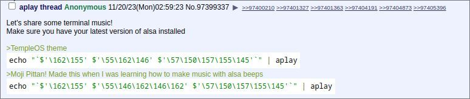

# Bash利用扩展字符集实现rm

## 事出有因

昨天在群里看到一个暴躁老哥遇到了一个恶搞教程,使用一段特殊的代码删除了自己的/home目录。气的他直骂自己是傻逼。

果然，自己的快乐是建立在别人的痛苦之上的，不好意思我笑出声来了。




这个是什么意思呢？我这边查了一些资料然后把过程记录下来。


## 过程

### 金蝉脱壳

这个代码的含义是 `rm -rf /home`。

仔细去看，其实执行部分在两个尖角号之间，跟管道后面的aplay毛关系都没有。

至于为啥是echo呢不过也是个障眼法罢了。

除去管道后面和echo ”“部分，现在已经脱壳完毕，中间部分我们来一点一点的看。


### 查古知今

脱壳之后，分段出现了几个符号，我们查询Bash特殊字符列表，得知含义。附加查询表格：

```bash
``  # 命令引用。也被称作反引号
$''  # 引用字符串扩展。这个结构将转义八进制或十六进制的值转换成ASCII3或Unicode字符。
\162\155 # 进制字符 
```


#### Bash特殊字符列表

| 特殊字符            | 字符含义                                                     |
| ------------------- | ------------------------------------------------------------ |
| #                   | 注释符,如果一行脚本的开头是#（除了#!），那么代表这一行是注释，不会被执行 |
| ;                   | 命令分隔符[分号]。允许在同一行内放置两条或更多的命令。       |
| ;;                  | case条件语句终止符[双分号]。                                 |
| ;;&, ;&             | case条件语句终止符（Bash4+ 版本）。                          |
| .                   | 1.等价与source命令。2.可以作为隐藏文件。3. 当前工作目录。4.正则表达式中，表示单个字符 |
| "                   | 双引号，部分引用（弱引用）。                                 |
| '                   | 单引号，全引用（强引用)。                                    |
| ,                   | 逗号运算符。逗号运算符1将一系列的算术表达式串联在一起。算术表达式依次被执行，但只返回最后一个表达式的值。 |
| \                   | 转义符[反斜杠]。转义某字符的标志                             |
| /                   | 文件路径分隔符[正斜杠]。起分割路径的作用。                   |
| `                   | 命令引用。也被称作反引号                                     |
| :                   | 空命令[冒号]。它在shell中等价于”NOP”（即no op，空操作）与shell内建命令true有同样的效果。它本身也是Bash的内建命令之一，返回值是true（0）。 |
| !                   | 取反（或否定）操作符[感叹号]。                               |
| *                   | 通配符[星号]。                                               |
| ?                   | 测试操作符[问号]。在一些特定的语句中，? 表示一个条件测试。 也可以作为 通配符。 |
| $                   | 取值符号[钱字符]，用来进行变量替换（即取出变量的内容）。行结束符[EOF]。 在正则表达式中，$ 匹配行尾字符串 |
| ${}                 | 参数替换。                                                   |
| $'...'              | 引用字符串扩展。这个结构将转义八进制或十六进制的值转换成ASCII3或Unicode字符。 |
| `$*, $@`            | 位置参数。                                                   |
| $?                  | 返回状态变量。此变量保存一个命令、一个函数或该脚本自身的返回状态。 |
| $$                  | 进程ID变量。此变量保存该运行脚本的进程ID。                   |
| ()                  | 通过括号执行一系列命令会产生一个子shell（subshell）。 括号中的变量，即在子shell中的变量，在脚本的其他部分是不可见的。父进程脚本不能访问子进程（子shell）所创建的变量。 |
| `{xxx,yyy,zzz,...}` | 花括号扩展结构。                                             |
| `{a..z}`            | 扩展的花括号扩展结构。                                       |
| {}                  | 代码块[花括号]，又被称作内联组（inline group）。它实际上创建了一个匿名函数（anonymous function），即没有名字的函数。但是，不同于那些“标准”函数，代码块内的变量在脚本的其他部分仍旧是可见的。 |
| [ ]                 | 花括号扩展结构。                                             |
| `{xxx,yyy,zzz,...}` | 测试。在 [ ] 之间填写测试表达式。值得注意的是，[ 是shell内建命令 test 的一个组成部分，而不是外部命令 /usr/bin/test 的链接。 |
| `[[ ]]`             | 测试。在 [[ ]] 之间填写测试表达式。相比起单括号测试 （[ ]），它更加的灵活。它是一个shell的关键字。并且可以支持正则表达式 |
| `$[ ... ]`          | 整数扩展符。在 $[ ] 中可以计算整数的算术表达式。             |
| (( ))               | 整数扩展符。在 (( )) 中可以计算整数的算术表达式。            |
| `> &> >& >> < <>`   | 重定向。                                                     |
| ~+                  | 当前工作目录。它等同于内部变量 $PWD。                        |
| ~-                  | 先前的工作目录。它等同于内部变量 $OLDPWD。                   |
| =~                  | 正则表达式匹配。 在[[]] 测试符的使用过程中就需要用到         |

#### ASCII码进制对照表

|八进制 | 十六进制 | 十进制 | 字符 | 八进制 | 十六进制 | 十进制 | 字符|
|--|--|--|--|--|--|--|--|
|00 | 00 | 0 | nul | 100 | 40 | 64 | @|
|01 | 01 | 1 | soh | 101 | 41 | 65 | A|
|02 | 02 | 2 | stx | 102 | 42 | 66 | B|
|03 | 03 | 3 | etx | 103 | 43 | 67 | C|
|04 | 04 | 4 | eot | 104 | 44 | 68 | D|
|05 | 05 | 5 | enq | 105 | 45 | 69 | E|
|06 | 06 | 6 | ack | 106 | 46 | 70 | F|
|07 | 07 | 7 | bel | 107 | 47 | 71 | G|
|10 | 08 | 8 | bs | 110 | 48 | 72 | H|
|11 | 09 | 9 | ht | 111 | 49 | 73 | I|
|12 | 0a | 10 | nl | 112 | 4a | 74 | J|
|13 | 0b | 11 | vt | 113 | 4b | 75 | K|
|14 | 0c | 12 | ff | 114 | 4c | 76 | L|
|15 | 0d | 13 | er | 115 | 4d | 77 | M|
|16 | 0e | 14 | so | 116 | 4e | 78 | N|
|17 | 0f | 15 | si | 117 | 4f | 79 | O|
|20 | 10 | 16 | dle | 120 | 50 | 80 | P|
|21 | 11 | 17 | dc1 | 121 | 51 | 81 | Q|
|22 | 12 | 18 | dc2 | 122 | 52 | 82 | R|
|23 | 13 | 19 | dc3 | 123 | 53 | 83 | S|
|24 | 14 | 20 | dc4 | 124 | 54 | 84 | T|
|25 | 15 | 21 | nak | 125 | 55 | 85 | U|
|26 | 16 | 22 | syn | 126 | 56 | 86 | V|
|27 | 17 | 23 | etb | 127 | 57 | 87 | W|
|30 | 18 | 24 | can | 130 | 58 | 88 | X|
|31 | 19 | 25 | em | 131 | 59 | 89 | Y|
|32 | 1a | 26 | sub | 132 | 5a | 90 | Z|
|33 | 1b | 27 | esc | 133 | 5b | 91 | [|
|34 | 1c | 28 | fs | 134 | 5c | 92 | \|
|35 | 1d | 29 | gs | 135 | 5d | 93 | ]|
|36 | 1e | 30 | re | 136 | 5e | 94 | ^|
|37 | 1f | 31 | us | 137 | 5f | 95 | _|
|40 | 20 | 32 | sp | 140 | 60 | 96 | '|
|41 | 21 | 33 | ! | 141 | 61 | 97 | a|
|42 | 22 | 34 | " | 142 | 62 | 98 | b|
|43 | 23 | 35 | # | 143 | 63 | 99 | c|
|44 | 24 | 36 | $ | 144 | 64 | 100 | d|
|45 | 25 | 37 | % | 145 | 65 | 101 | e|
|46 | 26 | 38 | & | 146 | 66 | 102 | f|
|47 | 27 | 39 | ` | 147 | 67 | 103 | g|
|50 | 28 | 40 | ( | 150 | 68 | 104 | h|
|51 | 29 | 41 | ) | 151 | 69 | 105 | i|
|52 | 2a | 42 | * | 152 | 6a | 106 | j|
|53 | 2b | 43 | + | 153 | 6b | 107 | k|
|54 | 2c | 44 | , | 154 | 6c | 108 | l|
|55 | 2d | 45 | - | 155 | 6d | 109 | m|
|56 | 2e | 46 | . | 156 | 6e | 110 | n|
|57 | 2f | 47 | / | 157 | 6f | 111 | o|
|60 | 30 | 48 | 0 | 160 | 70 | 112 | p|
|61 | 31 | 49 | 1 | 161 | 71 | 113 | q|
|62 | 32 | 50 | 2 | 162 | 72 | 114 | r|
|63 | 33 | 51 | 3 | 163 | 73 | 115 | s|
|64 | 34 | 52 | 4 | 164 | 74 | 116 | t|
|65 | 35 | 53 | 5 | 165 | 75 | 117 | u|
|66 | 36 | 54 | 6 | 166 | 76 | 118 | v|
|67 | 37 | 55 | 7 | 167 | 77 | 119 | w|
|70 | 38 | 56 | 8 | 170 | 78 | 120 | x|
|71 | 39 | 57 | 9 | 171 | 79 | 121 | y|
|72 | 3a | 58 | : | 172 | 7a | 122 | z|
|73 | 3b | 59 | ; | 173 | 7b | 123 | {|
|74 | 3c | 60 | <  | 174 | 7c | 124 | \| |
|75 | 3d | 61 | = | 175 | 7d | 125 | }|
|76 | 3e | 62 | >  | 176 | 7e | 126 | ~|
|77 | 3f | 63 | ? | 177 | 7f |127||

## 水落石出

经过查询ASCII码，其中无法读取部分为

```bash
rm -rf /home
```

这时已经知道了这个恶搞命令的全部细节。


## 青出于蓝

我们在查找ASCII码和Bash特殊字符的时候，发现还可以用十六进制写一个，下面这个例子是我写的。

> [在线字符转八进制ASCII码工具](https://tool.hiofd.com/char-convert-octal-ascii/)
>
> [在线ASCII码字符串转16进制字符串工具](https://tool.hiofd.com/ascii-convert-hex-online/)

我们用i am paperdragon为例子去做，

```bash
[root@VM94654B337042743 ~]# docker run -it --rm alpine sh
apk / # apk add bash
fetch https://dl-cdn.alpinelinux.org/alpine/v3.18/main/x86_64/APKINDEX.tar.gz
fetch https://dl-cdn.alpinelinux.org/alpine/v3.18/community/x86_64/APKINDEX.tar.gz
(1/4) Installing ncurses-terminfo-base (6.4_p20230506-r0)
(2/4) Installing libncursesw (6.4_p20230506-r0)
(3/4) Installing readline (8.2.1-r1)
(4/4) Installing bash (5.2.15-r5)
Executing bash-5.2.15-r5.post-install
Executing busybox-1.36.1-r2.trigger
OK: 10 MiB in 19 packages
/ # bash
8b54799f34e5:/#

# 使用八进制方式
8b54799f34e5:/# echo $'\151'$'\040'$'\141'$'\155'$'\040'$'\160'$'\141'$'\160'$'\145'$'\162'$'\144'$'\162'$'\141'$'\147'$'\157'$'\156'
i am paperdragon


# 使用十六进制方式
8b54799f34e5:/# echo $'\x69\x20\x61\x6D\x20\x70\x61\x70\x65\x72\x64\x72\x61\x67\x6F\x6E'
i am paperdragon

# 混合方式
8b54799f34e5:/# echo $'\x69\x20\x61\x6D\x20\x70\x61\x70\x65\x72\x64\x72\x61\x67\157\156'
i am paperdragon

```


```bash
# rm -rfv /tmp/
echo  "`$'\162\155' $'\55\162\146' $'\57\164\155\160\57\052'`"  | clean
```


