# Linux备份为liveOS

> 使用Systemback克隆Ubuntu系统
> https://zhuanlan.zhihu.com/p/375912899

\#基于Systemback⼯具实现ubuntu系统的镜像归档、复制和克隆安装#

## ⼀、准备⼯作

1. 待克隆的ubuntu系统主机
2. U盘，≥8G
3. 新的主机（什么操作系统⽆限制）

## ⼆、注意事项

⾃主程序不要安装在系统根⽬录“/”下，否则可能导致程序克隆不成功，建议安装在/opt⽬录下三、步骤：安装systemback⼯具 -> 制作镜像 -> 刻录U盘 -> U盘启动安装

### 安装systemback⼯具

下载（⼯具包已下载）：[https://nchc.dl.sourceforge.net/project/systemback/1.8/Systemback_Install_Pack_v1.8.402.tar.xz](https://link.zhihu.com/?target=https%3A//nchc.dl.sourceforge.net/project/systemback/1.8/Systemback_Install_Pack_v1.8.402.tar.xz)         

解压：tar -xvf ./Systemback_Install_Pack_v1.8.402.tar.xz

安装：cd Systemback_Install_Pack_v1.8.402/ sudo bash install.sh

\#Systemback⽀持的ubuntu最⾼到ubuntu16，不过安装ubuntu18上也没问题，提示选择安装版本时选择“ 4 ─ Ubuntu 16.04.X LTS (Xenial Xerus)”

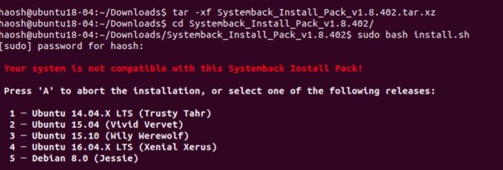

打印出： Systemback installation is successful. 表示安装成功。

### 打开Systemback⼯具，开始制作系统镜像，并写⼊U盘

应⽤中⼼（按win键）搜索打开Systemback。

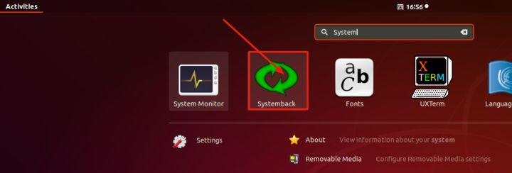

打开后，登录⻚⾯需要输⼊⽤户密码，进⼊主界⾯：

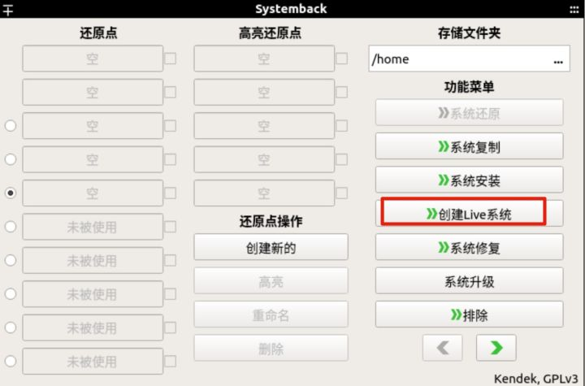

直接点击“创建Live系统”，进⼊

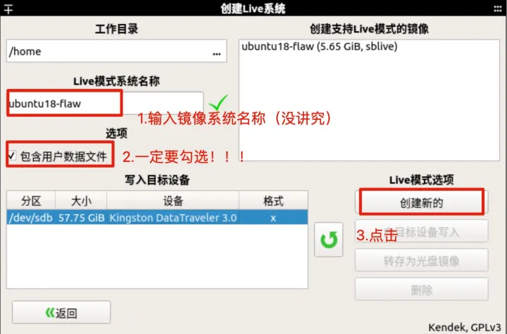

输⼊镜像名称，勾选“包含⽤户数据⽂件”，点击“创建新的”镜像，等待完成。。。

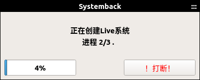

完成后，会提示写⼊U盘，点“确定后”返回主⻚⾯

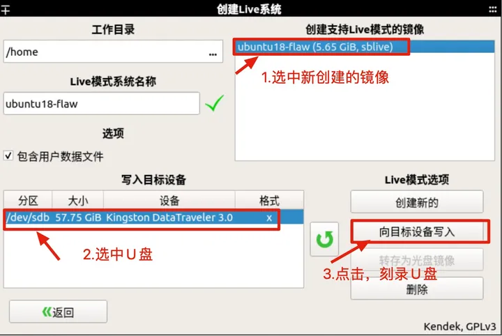

接着选中刚才创建好的镜像⽂件、选中待写⼊的U盘（U盘为ext4格式，如果未读出，点刷新按钮），点击“向⽬标设备写⼊”，开始刻录U盘。

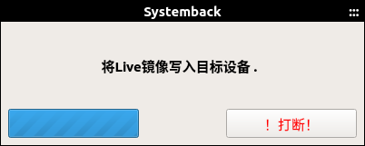

等待写⼊完成，⼀个Live模式镜像的Ubuntu系统盘即制作好了。

！！！特别说明！！！

该模式创建的镜像不是ghost的ISO⽂件，是⼀个Live模式的镜像，如果要制作ISO⽂件，则通过“转存为光盘镜像”按钮制作。

这⾥选择Live模式镜像原因（“转存为光盘镜像”按钮不可⽤）是ISO镜像⽂件不能⼤于4G，⽽我们要克隆的系统很可能会超过4G，关于如何制作                                              超出4G的ISO⽂件，也有解决办法，有点复杂，这⾥未做尝试，可以参考：解决systemback ⽆法⽣成超过4G的iso的问题。

## U盘安装

U盘插⼊新的主机，bios设置U盘启动后，开机，

进⼊Systemback的Live恢复模式启动⻚⾯，出现的画⾯可能是乱码，不⽤管，直接回⻋，进⼊Live模式的ubuntu系统

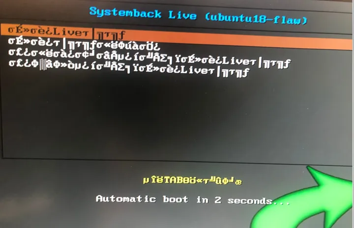

应⽤程序⾥找到Systemback应⽤，打开，选择“系统安装”

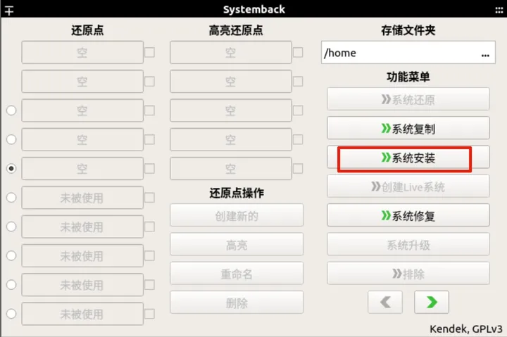

输⼊新系统的⽤户名、密码、主机名，下⼀步

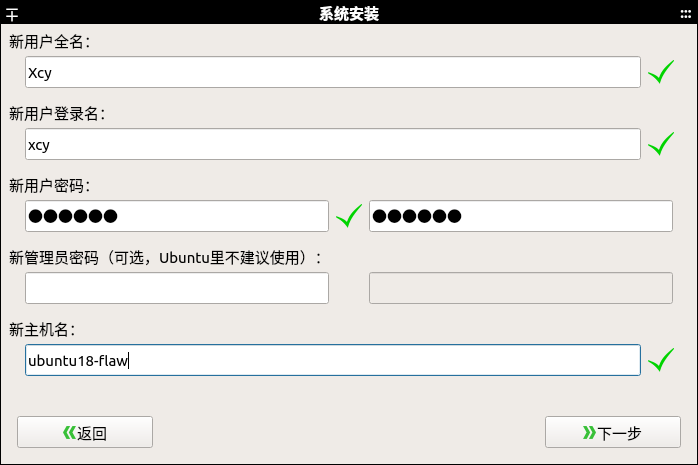

进⼊系统安装⻚⾯，这⾥要注意要做系统分区，下⾯细说

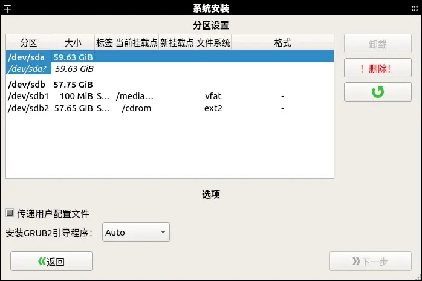

上⾯两个主分区，⼀个是主机硬盘，⼀个是U盘（看分区⼤⼩），⽬标是安装在主机硬盘上。

### 需要分配4个分区

**⼀般设置4个区间即可，"/"(ext4)， “/home”(ext4), “swap”, “boot/efi”。其中**

1. 先分配"swap"，⼤⼩与内存相当即可，我设置的是4G
2. 再分配"/boot”，⼤⼩200m即可，我设置的是500M
3. 再分配“/”，⽂件系统选ext4，因为我们的应⽤程序和数据都在系统根⽬录“/”或者/“opt”⽬录下，所以这⾥要分配更多空间，⾄少30G
4. 最后的空间分配给“/home”，⽂件系统选ext4，预留⾜够空间存放系统⽤户数据（/桌⾯/⽂档/下载/图⽚等资料）                          

要重新分区前先删除已有分区

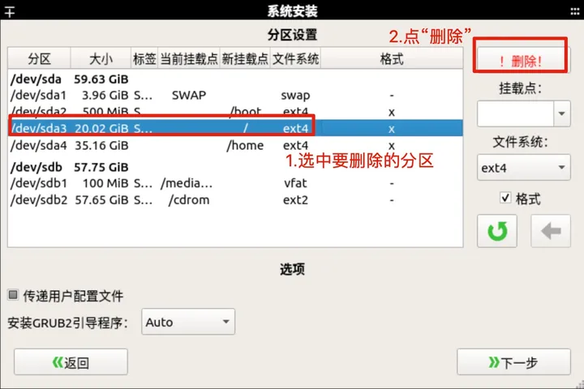

重新分配分区：

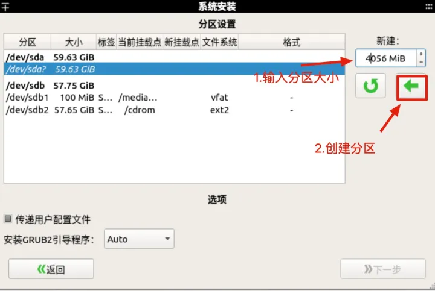

依次创建"/"(ext4)， “/home”(ext4), “swap”, “boot/efi” 4个分区

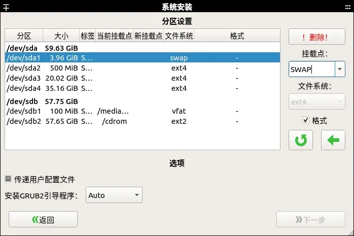

挂载分区：

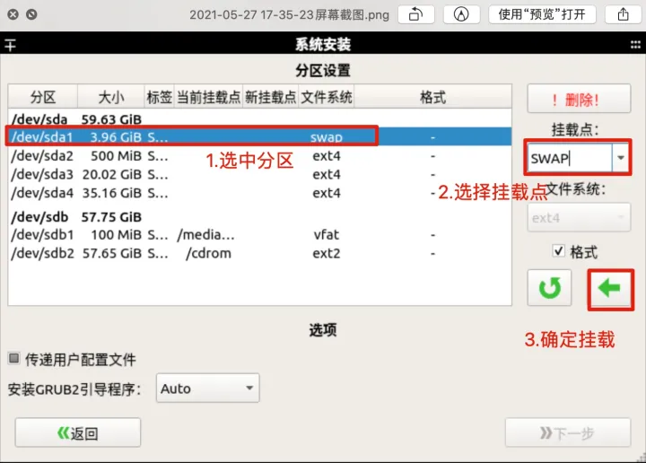

4个分区都挂载完成的界⾯：

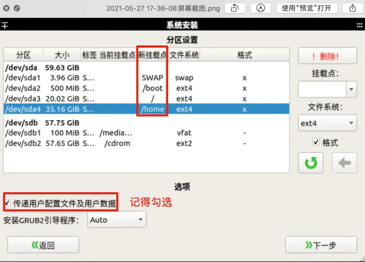

分区挂载好之后，最后勾选“传递⽤户配⽂件及⽤户数据”，点击“下⼀步”，开始安装系统

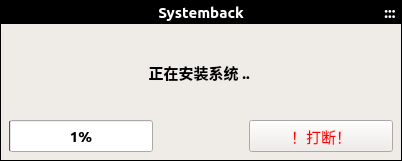

等待安装完成后，重启，将bios⾥启动磁盘改回主机硬盘，启动系统。到此，整个过程中没有出现报错问题，重启后的系统就是克隆的系统了。
