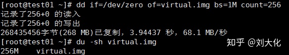
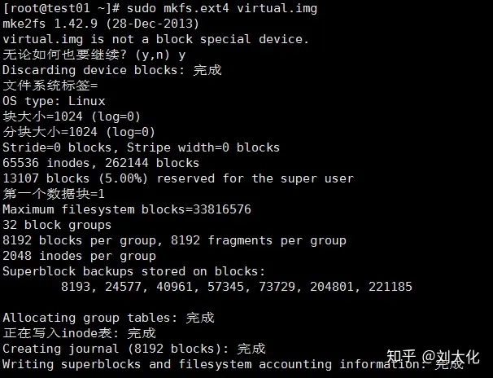
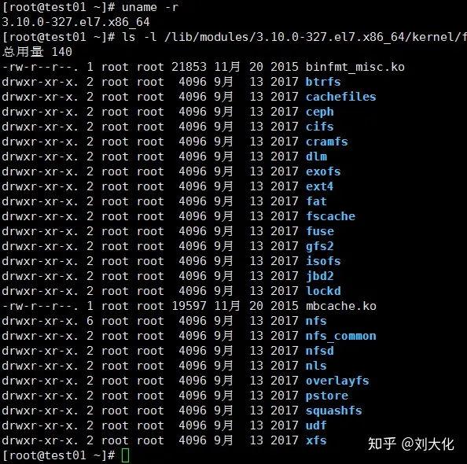
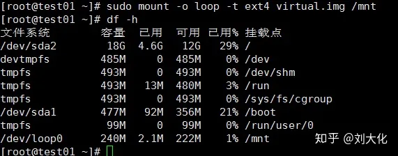
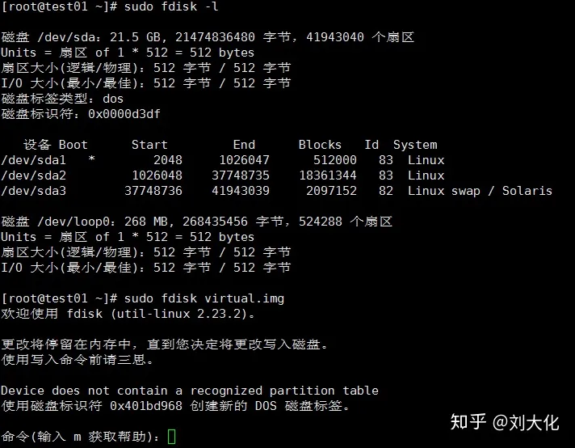
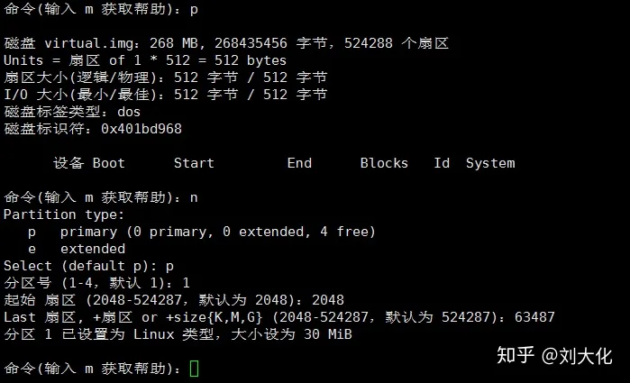
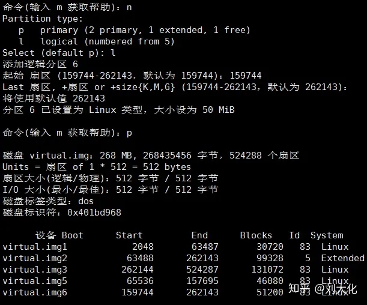
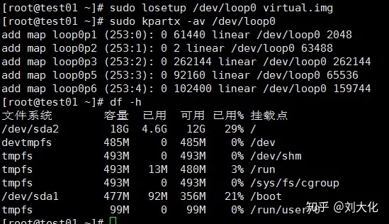
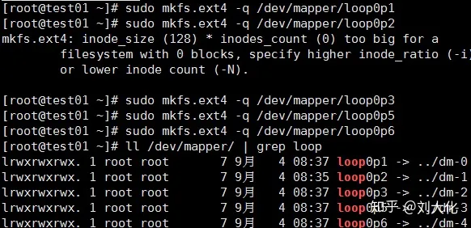
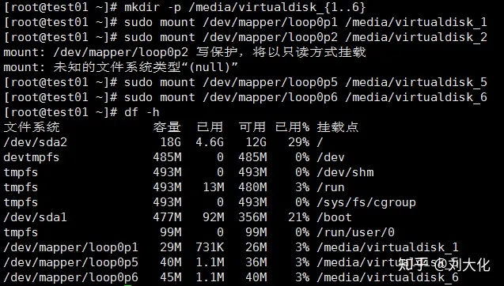

# 命令创建虚拟镜像文件

> https://zhuanlan.zhihu.com/p/81767176

## 1.使用 dd 命令创建虚拟镜像文件



## 2.使用 mkfs 命令格式化磁盘（我们这里是自己创建的虚拟磁盘镜像）



查看Linux 支持哪些文件系统



## 使用 mount 命令挂载磁盘到目录树

```bash
$ mount -o loop -t ext4 virtual.img /mnt
# 也可以省略挂载类型，很多时候 mount 会自动识别

# 以只读方式挂载
$ mount -o loop --ro virtual.img /mnt
# 或者mount -o loop,ro virtual.img /mnt
```




## 使用 fdisk 为磁盘分区







## 使用 losetup 命令建立镜像与回环设备的关联

```bash
$ sudo losetup /dev/loop0 virtual.img
# 如果提示设备忙你也可以使用其它的回环设备，"ls /dev/loop*"参看所有回环设备
*
# 解除设备关联
$ sudo losetup -d /dev/loop0*

$ sudo apt-get install kpartx
$ sudo kpartx -av /dev/loop0

*# 取消映射
$ sudo kpartx -dv /dev/loop0*
```



```bash
$ sudo mkfs.ext4 -q /dev/mapper/loop0p1
$ sudo mkfs.ext4 -q /dev/mapper/loop0p5
$ sudo mkfs.ext4 -q /dev/mapper/loop0p6
```



## 格式化完成后在`/media`目录下新建四个空目录用于挂载虚拟磁盘：

```bash
# 挂载磁盘分区
$ sudo mount /dev/mapper/loop0p1 /media/virtualdisk_1
$ sudo mount /dev/mapper/loop0p5 /media/virtualdisk_2
$ sudo mount /dev/mapper/loop0p6 /media/virtualdisk_3
*
# 卸载磁盘分区
$ sudo umount /dev/mapper/loop0p1
$ sudo umount /dev/mapper/loop0p5
$ sudo umount /dev/mapper/loop0p6*
```

