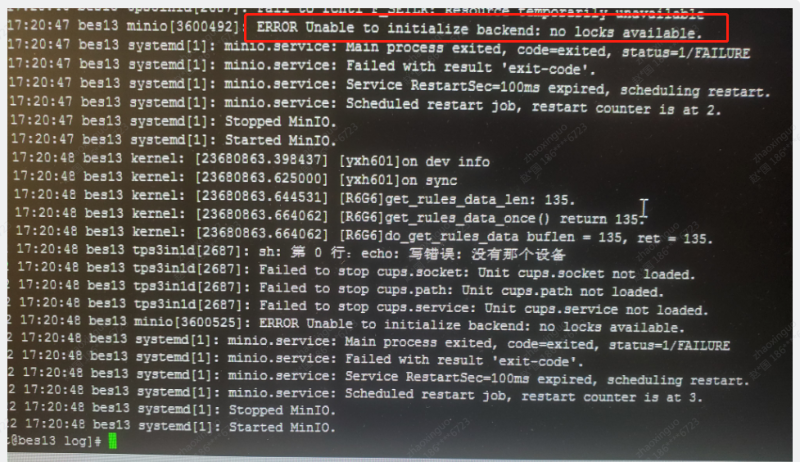
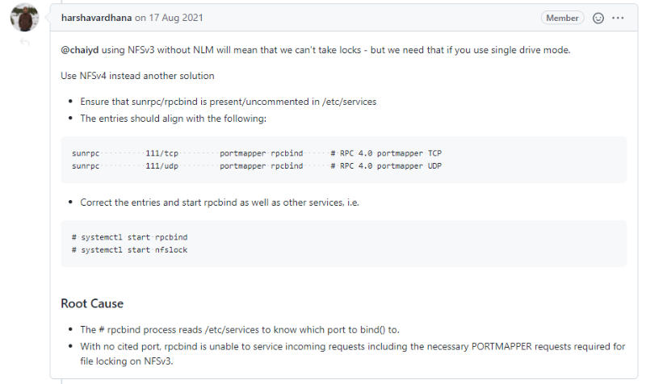

# MinIO挂载到nfs不成功

## ERROR Unable to initialize backend: no locks available.

服务器做了nas共享存储后，修改minio的数据目录为nas共享目录，启动minio服务失败，报错信息如上图所示：

从这个日志来看，应该是minio拿不到nfs文件系统的锁。
解决方案

    nfs挂载时加nolock参数
    
    使用nfsv4,而不是用nfsv3

参考

gitlab底层也是用的minio,gitlab官方文档是这么写的

File locking: GitLab requires advisory file locking, which is only supported natively in NFS version 4. NFSv3 also supports locking as long as Linux Kernel 2.6.5+ is used. We recommend using version 4 and do not specifically test NFSv3

https://docs.gitlab.com/ee/administration/nfs.html

总结

最后我们选择了方案2，但是Minio官网是推荐用nfsv4协议挂载.