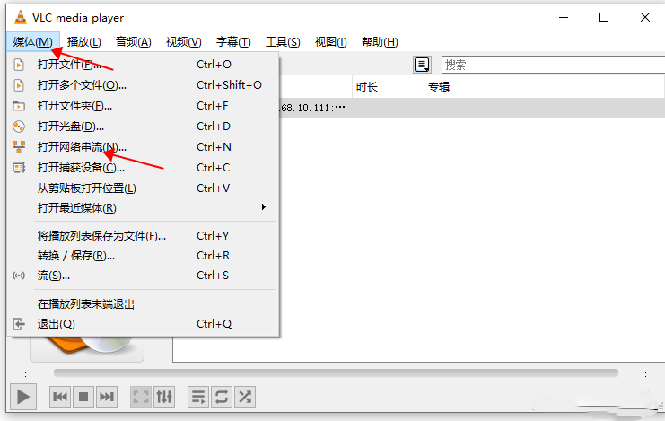

# Nginx作为推流服务器

> 本文档参考文档制作： https://www.fnmqs.work/archives/161/
>
> 教程里使用的 https://github.com/arut/nginx-rtmp-module.git 这个模块太老了，3年之前更新过，所以重新更改方案使用了https://github.com/winshining/nginx-http-flv-module，这个模块在实现前者的功能的同时还实现了flv拉流量的功能，功能上强很多，而且更新及时。

## 功能对比

- [nginx-rtmp-module](https://github.com/arut/nginx-rtmp-module) 提供的所有功能。
- nginx-http-flv-module 的其他功能与 [nginx-rtmp-module](https://github.com/arut/nginx-rtmp-module) 的对比：

| 功能                     | nginx-http-flv-module | nginx-rtmp-module | 备注                                      |
| ------------------------ | --------------------- | ----------------- | ----------------------------------------- |
| HTTP-FLV (播放)          | √                     | x                 | 支持 HTTPS-FLV 和 chunked 回复            |
| GOP 缓存                 | √                     | x                 |                                           |
| 虚拟主机                 | √                     | x                 |                                           |
| 省略 `listen` 配置项     | √                     | 见备注            | 配置中必须有一个 `listen`                 |
| RTMP/HTTP-FLV 纯音频支持 | √                     | 见备注            | `wait_video` 或 `wait_key` 开启后无法工作 |
| HLS 单轨支持             | √                     | x                 |                                           |
| `reuseport` 支持         | √                     | x                 |                                           |
| 定时打印访问记录         | √                     | x                 |                                           |
| JSON 风格的数据信息      | √                     | x                 |                                           |
| 录制的数据信息           | √                     | x                 |                                           |
| 大小端无关               | √                     | 见备注            | `big-endian` 分支部分支持                 |

## 兼容性

[NGINX](http://nginx.org) 的版本**应该**大于或者等于 1.2.6，与其他版本的兼容性未知。

## 编译Nginx时需要的依赖和库

1. 编译工具链：gcc、g++或clang等编译器工具；
2. PCRE（Perl Compatible Regular Expressions）库：用于正则表达式支持；
3. OpenSSL库：用于支持HTTPS和加密功能；
4. zlib库：用于压缩和解压缩支持；
5. libxml2库：用于WebDAV模块的XML解析支持
6. libxslt库：用于XSLT转换支持。

也可以直接输入以下代码安装依赖和库

```js
apt update
apt install gcc make
apt install libpcre3-dev zlib1g-dev libssl-dev libxml2-dev libxslt1-dev
```

上述命令适用于Ubuntu系统，对于其他Linux发行版，可以使用相应的包管理器来安装这些依赖和库。

## 下载源代码

Nginx官网:https://nginx.org/en/download.html 可以从官网找到很多版本的源代码， 这里示范为Nginx 1.22版本

### 下载Nginx和Nginx-http-flv-module源代码

```bash
wget http://nginx.org/download/nginx-1.25.4.tar.gz
tar -xvf nginx-1.25.4.tar.gz
git clone https://github.com/winshining/nginx-http-flv-module.git
```

#### 过程

```bash
root@user-VirtualBox:/home/user/Desktop/nginx-flv# wget http://nginx.org/download/nginx-1.25.4.tar.gz
--2024-02-18 17:05:07--  http://nginx.org/download/nginx-1.25.4.tar.gz
Resolving nginx.org (nginx.org)... 3.125.197.172, 52.58.199.22, 2a05:d014:5c0:2601::6, ...
Connecting to nginx.org (nginx.org)|3.125.197.172|:80... connected.
HTTP request sent, awaiting response... 200 OK
Length: 1236273 (1.2M) [application/octet-stream]
Saving to: ‘nginx-1.25.4.tar.gz’

nginx-1.25.4.tar.gz               100%[=============================================================>]   1.18M   697KB/s    in 1.7s    

2024-02-18 17:05:10 (697 KB/s) - ‘nginx-1.25.4.tar.gz’ saved [1236273/1236273]

root@user-VirtualBox:/home/user/Desktop/nginx-flv# tar -xvf nginx-1.25.4.tar.gz 
nginx-1.25.4/
nginx-1.25.4/man/
nginx-1.25.4/LICENSE
nginx-1.25.4/configure
nginx-1.25.4/auto/
nginx-1.25.4/CHANGES
nginx-1.25.4/CHANGES.ru
nginx-1.25.4/html/
nginx-1.25.4/contrib/
nginx-1.25.4/README

root@user-VirtualBox:/home/user/Desktop/nginx-flv# git clone https://github.com/winshining/nginx-http-flv-module.git
Cloning into 'nginx-http-flv-module'...
remote: Enumerating objects: 2514, done.
remote: Counting objects: 100% (163/163), done.
remote: Compressing objects: 100% (97/97), done.
remote: Total 2514 (delta 86), reused 92 (delta 66), pack-reused 2351
Receiving objects: 100% (2514/2514), 3.86 MiB | 3.18 MiB/s, done.
Resolving deltas: 100% (1720/1720), done.
root@user-VirtualBox:/home/user/Desktop/nginx-flv# 
```


## 编译安装

完成后会安装在/usr/local/nginx-flv下

    mv ../nginx-http-flv-module .
    ./configure --prefix=/usr/local/nginx-flv --with-http_ssl_module --with-http_secure_link_module --add-module=nginx-http-flv-module
    make 
    make install

## 使用

Nginx配置文件 nginx.conf

```nginx

#user  nobody;
worker_processes  auto;
 
#error_log  logs/error.log;
#error_log  logs/error.log  notice;
#error_log  logs/error.log  info;
 
error_log  logs/error.log warn;
pid        logs/nginx.pid;
 
 
events {
    worker_connections  10240;
    use epoll;
    multi_accept on;
}
 
 
http {
    include       mime.types;
    default_type  application/octet-stream;
 
    server_names_hash_bucket_size 128;
    client_header_buffer_size 32k;
    large_client_header_buffers 4 32k;
    client_max_body_size 50m;
 
    log_format nginx_json '{    "time": "$time_local", '
                               '"remote_ip": "$remote_addr", '
                               '"remote_user": "$remote_user", '
                               '"domain":"$host", '
                               '"responsetime":$request_time, '
                               '"request": "$request", '
                               '"response": "$status", '
                               '"bytes": $body_bytes_sent, '
                               '"referrer": "$http_referer", '
                               '"upstreamtime":"$upstream_response_time", '
                               '"upstreamaddr":"$upstream_addr", '
                               '"x_forwarded_for":"$http_x_forwarded_for", '
                               '"agent": "$http_user_agent" }';
 
    access_log  logs/access.log  nginx_json;
 
    sendfile        on;
    tcp_nopush     on;
    server_tokens off;
    keepalive_timeout  65;
 
    gzip  on;
    gzip_min_length  1k;
    gzip_buffers    4 16k;
    gzip_http_version 1.0;
    gzip_comp_level 2;
    gzip_types      text/plain application/x-javascript text/css application/xml;
    gzip_vary on;
 
    client_header_timeout 10;
    client_body_timeout 10;
    client_body_buffer_size 10K;
    proxy_buffering off;
 
    reset_timedout_connection on;
    send_timeout 10;
 
 
    charset utf-8;
 
    server {
        listen       80;
        server_name  localhost;
 
        #charset koi8-r;
 
        #access_log  logs/host.access.log  main;
 
        location / {
            root   html;
            index  index.html index.htm;
        }
 
        #error_page  404              /404.html;
 
        # redirect server error pages to the static page /50x.html
        #
        error_page   500 502 503 504  /50x.html;
        location = /50x.html {
            root   html;
        }
 

 
        location /live {
            flv_live on;
            chunked_transfer_encoding on; #支持'Transfer-Encoding: chunked'方式回复
            add_header 'Access-Control-Allow-Origin' '*'; #添加额外的HTTP头
            add_header 'Access-Control-Allow-Credentials' 'true'; #添加额外的HTTP头
        }
 
        location /flv {
             flv_live on;
             chunked_transfer_encoding on;
             add_header 'Access-Control-Allow-Origin' '*';
             add_header 'Access-Control-Allow-Credentials' 'true'; #添加额外的HTTP头
        }
 
 
        location /stat {
            #推流播放和录制统计数据的配置
 
            rtmp_stat all;
            rtmp_stat_stylesheet stat.xsl;
        }
 
        location /stat.xsl {
            root html; #指定 stat.xsl 的位置
        }
 
        #如果需要 JSON 风格的 stat, 不用指定 stat.xsl
        #但是需要指定一个新的配置项 rtmp_stat_format
 
        #location /stat {
        #    rtmp_stat all;
        #    rtmp_stat_format json;
        #}
 
 
 
    }
}
```

lv配置 conf/lv.conf

```bash
rtmp_auto_push on;
rtmp_auto_push_reconnect 1s;
rtmp_socket_dir /tmp;
 
rtmp {
    out_queue           4096;
    out_cork            8;
    max_streams         128;
    timeout             15s;
    drop_idle_publisher 15s;
 
    log_interval 5s; #interval used by log module to log in access.log, it is very useful for debug
    log_size     1m; #buffer size used by log module to log in access.log
 
    server {
        listen 1935;
        application live {
            #开启直播
            live on;
            record off;

            #可以把转完码的视频放在这个文件里，这样可以拉这个视频进行播放
            #play /opt/video;
 
            # 允许从任何源push流
            allow publish all;
 
            # 允许从任何地方来播放流
            allow play all;
 
            # 20秒内没有push，就断开链接。
            drop_idle_publisher 20s;

            ##打开 GOP 缓存，减少首屏等待时间
            gop_cache on; 
 
        }
 
 
    }
 
 
}
```

## 启动Nginx服务

```bash
#检测配置文件语法，如果正常，提示(syntax is ok)
/usr/local/nginx-flv/sbin/nginx -t
#运行
/usr/local/nginx-flv/sbin/nginx -c /usr/local/nginx-flv/conf/nginx.conf
```

## 测试推流和拉流服务

### 推流服务

可以在本地服务器下载安装ffmpeg后，读取一个mp4文件，推流到上面搭建的直播服务，来进行试验。
 命令如下，test-video.mp4就是你本地的视频文件名称，live是前面配置的application名称，test就是自定义的流名称。

注意

一些旧版本的 FFmpeg 不支持选项 -c copy，可以使用选项 -vcodec copy -acodec copy 替代。

appname 用于匹配 rtmp 配置块中的 application 块，具体可以参考（nginx-http-flv-module: 基于nginx-rtmp-module的流媒体服务器。具备nginx-rtmp-module的所有功能，增加了HTTP-FLV，GOP缓存和VHOST（一个IP对应多个域名）的功能。Media streaming server based on nginx-rtmp-module. In addtion to the features nginx-rtmp-module provides, HTTP-FLV, GOP cache and VHOST (one IP for multi domain names) are supported now.）。

streamname 可以随意指定，但是不能省略。

RTMP 默认端口为 1935，如果要使用其他端口，必须指定 :port。

ffmpeg -re -i test-video.mp4 -c copy -f flv rtmp://192.168.10.111:1936/live/test

#看到如下信息，就是开始推流了

```bash
fmpeg version 3.4.11-0ubuntu0.1 Copyright (c) 2000-2022 the FFmpeg developers
  built with gcc 7 (Ubuntu 7.5.0-3ubuntu1~18.04)
  configuration: --prefix=/usr --extra-version=0ubuntu0.1 --toolchain=hardened --libdir=/usr/lib/x86_64-linux-gnu --incdir=/usr/include/x86_64-linux-gnu --enable-gpl --disable-stripping --enable-avresample --enable-avisynth --enable-gnutls --enable-ladspa --enable-libass --enable-libbluray --enable-libbs2b --enable-libcaca --enable-libcdio --enable-libflite --enable-libfontconfig --enable-libfreetype --enable-libfribidi --enable-libgme --enable-libgsm --enable-libmp3lame --enable-libmysofa --enable-libopenjpeg --enable-libopenmpt --enable-libopus --enable-libpulse --enable-librubberband --enable-librsvg --enable-libshine --enable-libsnappy --enable-libsoxr --enable-libspeex --enable-libssh --enable-libtheora --enable-libtwolame --enable-libvorbis --enable-libvpx --enable-libwavpack --enable-libwebp --enable-libx265 --enable-libxml2 --enable-libxvid --enable-libzmq --enable-libzvbi --enable-omx --enable-openal --enable-opengl --enable-sdl2 --enable-libdc1394 --enable-libdrm --enable-libiec61883 --enable-chromaprint --enable-frei0r --enable-libopencv --enable-libx264 --enable-shared
  libavutil      55. 78.100 / 55. 78.100
  libavcodec     57.107.100 / 57.107.100
  libavformat    57. 83.100 / 57. 83.100
  libavdevice    57. 10.100 / 57. 10.100
  libavfilter     6.107.100 /  6.107.100
  libavresample   3.  7.  0 /  3.  7.  0
  libswscale      4.  8.100 /  4.  8.100
  libswresample   2.  9.100 /  2.  9.100
  libpostproc    54.  7.100 / 54.  7.100
Input #0, mov,mp4,m4a,3gp,3g2,mj2, from 'test-video.mp4':
  Metadata:
    major_brand     : isom
    minor_version   : 512
    compatible_brands: isomiso2avc1mp41
    encoder         : Lavf57.56.101
  Duration: 00:01:25.27, start: 0.000000, bitrate: 166 kb/s
    Stream #0:0(und): Video: h264 (High) (avc1 / 0x31637661), yuv420p(tv, bt709), 1280x638, 156 kb/s, 29.01 fps, 29 tbr, 1000k tbn, 2000k tbc (default)
```

### 拉流测试

windwos下拉RTMP流可以下载一个[VLC播放器](https://www.videolan.org/)，会比较方便

#### RTMP拉流地址

```bash
#自定流，要看推流时取的名字。我前面取的是test，那这边就取test
rtmp://192.168.10.111:1936/live/test
```




http://192.168.10.111:89/live?port=1936&app=live&stream=test

http://example.com[:port]/dir?[port=xxx&]app=appname&stream=streamname

注意


- 如果使用 ffplay 命令行方式播放流，那么必须为上述的 url 加上引号，否则 url 中的参数会被丢弃（有些不太智能的 shell 会把 "&" 解释为"后台运行"）。

- 如果使用 flv.js 播放流，那么请保证发布的流被正确编码，因为 flv.js 只支持 H.264 编码的视频和 AAC/MP3 编码的音频。

参数 dir 用于匹配 http 配置块中的 location 块

- HTTP 默认端口为 80, 如果使用了其他端口，必须指定 :port。

- RTMP 默认端口为 1935，如果使用了其他端口，必须指定 port=xxx。

参数 app 的值（appname）用来匹配 application 块，但是如果请求的 app 出现在多个 server 块中，并且这些 server 块有相同的地址和端口配置，那么还需要用匹配主机名的 server_name 配置项来区分请求的是哪个 application 块，否则，将匹配第一个 application 块。

参数 stream 的值（streamname）用来匹配发布的流的名称。

## 查看统计

\#前提需要在Nginx主配置文件里配置了stat服务，并且需要在nginx-http-flv-module-master源码包里把统计代码**stat.xsl**文件copy到Nginx配置的目录里

```bash
http://192.168.10.111:89/stat
```

