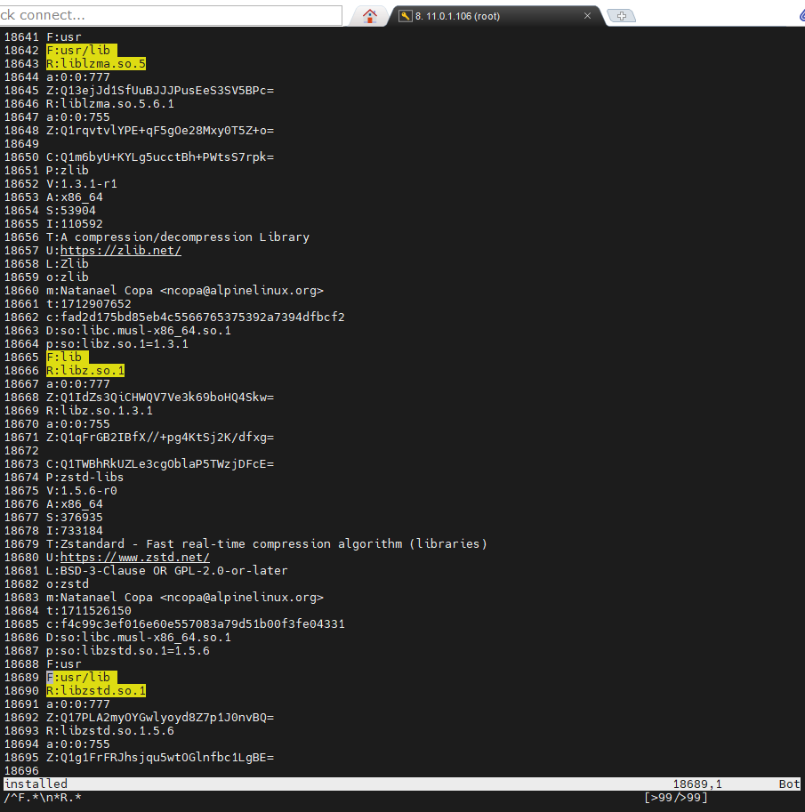
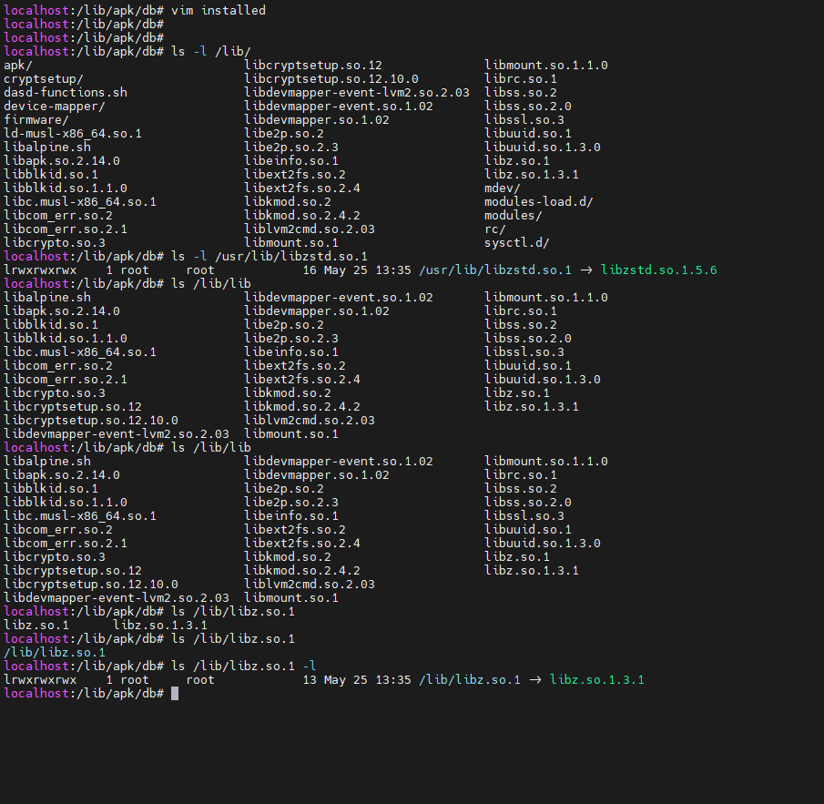

# Alpine的apk数据库解释

> apk对于已安装文件用于跟踪已安装的软件包以及这些软件包对系统所做的修改。
>
> 该文件位于/lib/apk/db/installed

## 文件示例

```txt
localhost:/lib/apk/db# head -50 installed
C:Q1uFrSebP91NTnM7BIHm3YcRY7ih0=
P:alpine-base
V:3.20.0-r0
A:x86_64
S:1492
I:4096
T:Meta package for minimal alpine base
U:https://alpinelinux.org
L:MIT
o:alpine-base
m:Natanael Copa <ncopa@alpinelinux.org>
t:1716371157
c:1402388a3a746e9961791846350e35f1d4d4618d
D:alpine-baselayout alpine-conf alpine-release apk-tools busybox busybox-mdev-openrc busybox-openrc busybox-suid musl-utils openrc

C:Q1qKcZ+j23xssAXmgQhkOO8dHnbWw=
P:alpine-baselayout
V:3.6.5-r0
A:x86_64
S:8515
I:315392
T:Alpine base dir structure and init scripts
U:https://git.alpinelinux.org/cgit/aports/tree/main/alpine-baselayout
L:GPL-2.0-only
o:alpine-baselayout
m:Natanael Copa <ncopa@alpinelinux.org>
t:1714981135
c:66187892e05b03a41d08e9acabd19b7576a1c875
D:alpine-baselayout-data=3.6.5-r0 /bin/sh
r:alpine-baselayout
q:1000
F:dev
F:dev/pts
F:dev/shm
F:etc
R:motd
Z:Q1SLkS9hBidUbPwwrw+XR0Whv3ww8=
F:etc/crontabs
R:root
a:0:0:600
Z:Q1vfk1apUWI4yLJGhhNRd0kJixfvY=
F:etc/modprobe.d
R:aliases.conf
Z:Q1WUbh6TBYNVK7e4Y+uUvLs/7viqk=
R:blacklist.conf
Z:Q14TdgFHkTdt3uQC+NBtrntOnm9n4=
R:i386.conf
Z:Q1pnay/njn6ol9cCssL7KiZZ8etlc=
R:kms.conf
Z:Q1ynbLn3GYDpvajba/ldp1niayeog=

```

目录结构

```txt
localhost:/lib/apk/db# ls -lh
total 504K
-rw-r--r--    1 root     root      467.9K May 25 14:51 installed
-rw-------    1 root     root           0 May 25 13:35 lock
-rw-r--r--    1 root     root       30.0K May 25 14:51 scripts.tar
-rw-r--r--    1 root     root         438 May 25 14:51 triggers
localhost:/lib/apk/db# tree .
.
├── installed
├── lock
├── scripts.tar
└── triggers

0 directories, 4 files

```

## 解释说明

> 在源码中的定义
>
> https://gitlab.alpinelinux.org/alpine/apk-tools/-/blob/ff7c8f6ee9dfa2add57b88dc271f6711030e72a0/src/database.c#L937

- r: - 替换此软件包的软件包，以空格分隔的列表 
- q: - 替换优先级，整数，可选 
- s: - 存储库标签，可选，如果软件包已标记到世界文件中的存储库，则会设置此字段（例如：linux@testing） 
- f: - 指示损坏项，以空格分隔（f=文件，s=脚本，x=扩展属性，S=文件哈希）

以下字段重复出现，并且在组中包含对系统所做的一组更改。

ACL行被指定为uid、冒号、gid、冒号和模式。

- F: - 软件包创建的目录名称，重复 
- M: - 目录ACL，仅当与默认值0:0:0755不同时 
- R: - 文件名，相对于前面的目录名称 
- a: - 文件ACL 
- Z: - 文件校验和，如果软件包中的校验和不是none，则Q1前缀表示这将是以base64格式的SHA1哈希

更清晰的格式






在某个目录下的某个文件应该具有a开头的权限。

## 用途

如果是被恶意执行了下面的命令可以提取这个数据库文件进行恢复。

```bash
chmod 000 -R /
```

- 使用liveos引导进入临时系统
- 挂载root目录
- 设置整个root目录777的权限，把问题转化为从000权限到恢复777权限
- chroot进入系统
- 书写脚本，功能是提取apk数据库并且设置权限，这里权限恢复了90%
- 设置特殊权限的文件 `apk audit`里面的文件，手动设置正确权限
- 重启后系统即可正常工作

