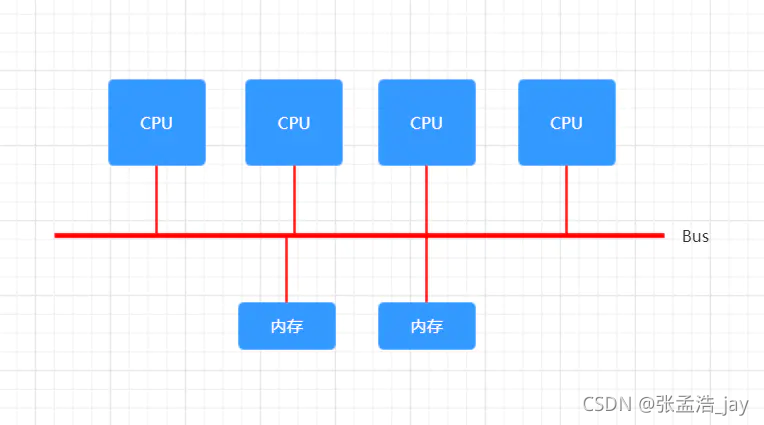
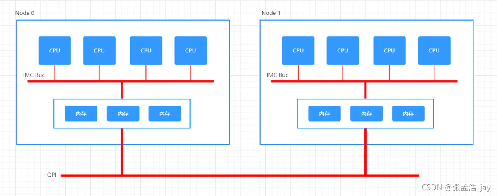

# CPU和内存之间的架构分为两种：

## 1、UMA

UMA全称为 Uniform Memory Access，叫做一致性内存访问

多个CPU通过同一根总线来访问内存。无论多个CPU是访问内存的不同内存单元还是相同的内存单元，同一时刻，只有一个CPU能够访问内存。

CPU之间通过总线串行的访问内存，所以会出现访问瓶颈！

## 2、NUMA

Non-Uniform Memory Access ,非一致性内存访问。每个CPU都分配了一块内存，这样的话，多个CPU可以同时并行访问各自的内存，这样的话，读写内存的效率就上来了。

但是当CPU读取其他CPU的内存的时候，需要通过QPI申请访问，是要慢于直接访问本地内存的。

UMA和NUMA的使用场景

如果一个CPU访问的数据量不大，本地内存就足够的话，那么NUMA的优势就可以发挥出来了，各个CPU可以并发的访问自己的内存。

如果CPU访问的数据量大的话，那么CPU需要频繁的访问其他CPU的内存，QPI的效率是要小于UMA总线的效率。所以NUMA的效率会低于UMA的。

# 总结

个人电脑大部分采用UMA，服务器采用NUMA。无论是UMA还是NUMA，对于同一块内存，在同一时间只能由一个CPU访问。
