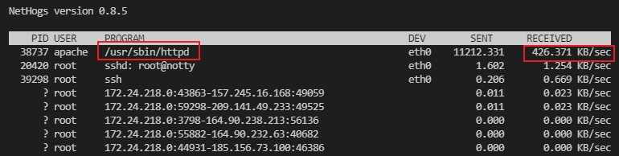
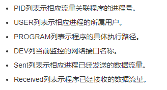
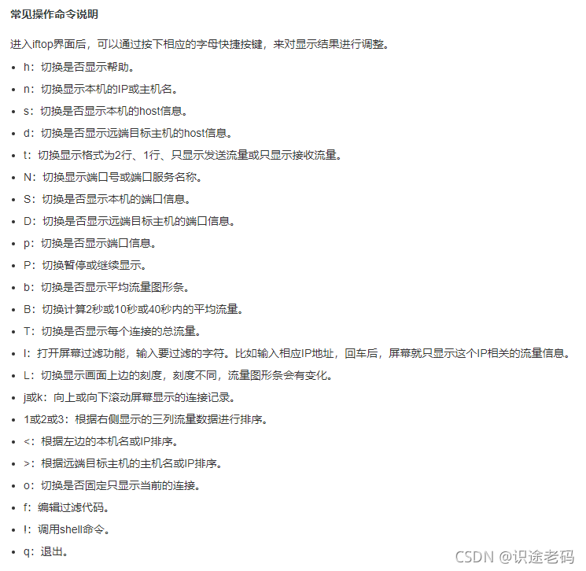
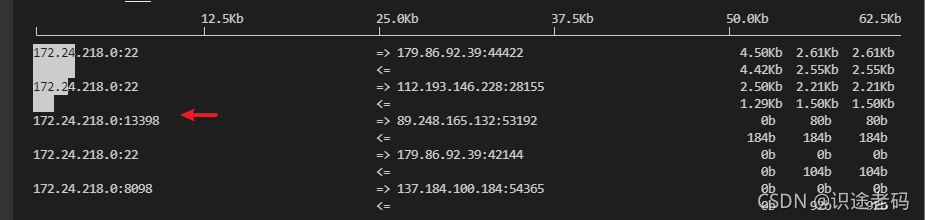
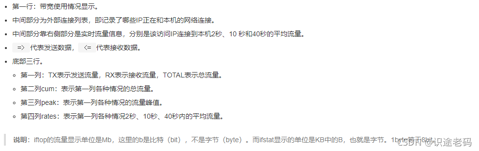
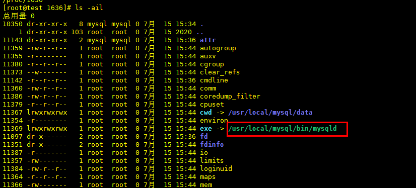

# Linux排查哪个进程在占用网速

本教程适用于Centos7,Centos8

## 使用NetHogs定位哪个进程在占用流量

### 安装NetHogs

    # 安装NetHogs。
    yum install nethogs -y   

### 查看进程流量

    # 执行以下命令，查看占用内网带宽的进程。
    nethogs eth0
    
    # 查询间隔(-d)5秒
    nethogs eth1 -d 5



### 显示界面说明

在nethogs监控界面，按s可以按照Sent列进行排序，按r可以按照Received列进行排序，按m可以切换不同的统计单位显示，例如kb/s、kb、b、mb。监控界面信息说明如下所示。


## 使用iftop定位哪个IP在占用流量

### iftop基本用法



### 查看哪个连接占用流量最多

    # 查看eth0哪个连接网络流量最多
    iftop -P

### 不解析域名,所有的网络连接都以ip显示

    iftop -n

指定监控网卡

```bash
# 不加i参数表示监控所有网卡
iftop

# 指定网卡且不解析dns
iftop -n -i eth0 

# 查看流量较高的是占用的端口(或服务)
iftop -i eth0 -P

# -N查看流量较高的是占用的端口
iftop -i eth0 -P -N
```






## 快速端口占用的pid

    # 使用fuser定位端口的pid
    
    fuser -v  -n tcp 3306
    
    结束掉占用的pid
    kill -s 9 pid

### 使用lsof定位端口的pid

参考: https://blog.csdn.net/flower_vip/article/details/80481258

    lsof -i:端口号
    
    [greg@node5 ~]$ sudo lsof -i:80
    COMMAND  PID    USER   FD   TYPE DEVICE SIZE/OFF NODE NAME
    haproxy 9521 haproxy    9u  IPv4  63613      0t0  TCP *:http (LISTEN)
    
    
    ##  -n 不要将端口号转换为端口名称。
    ## -P 不解析主机名，显示数字地址。
    ## -iTCP -sTCP:LISTEN -仅显示TCP状态为LISTEN的网络文件
    
    # 查看TCP22端口是哪个进程占用
    sudo lsof -nP -iTCP:22 -sTCP:LISTEN
    # 查看监听的所有TCP端口
    sudo lsof -nP -iTCP -sTCP:LISTEN
    

### 通过PID进程号查找启动程序全路径


    ls -ail /proc/pid进程号
    
- cwd是该进程的工作目录
- exe是启程序的启动路径
- fd包含进程打开文件的情况




## 结束进程

    # 停止进程
    kill -15 pid号
    或
    # 强制结束进程
    kill -9 pid号

## 日志分析

日志分析可以使用**logwatch**或**awstats**等工具进行.
