# 超全Linux网络内核参数优化秘籍

最近很多使用Linux系统的小伙伴在后台提问，老师呀，我好烦恼！

**你说企业服务器在进行网络通讯过程中，为了避免网络性能瓶颈对网络通讯的影响，我该如何对系统内核中网络参数进行优化调整从而提高网络的安全性和并发性！**

**具体来说是这样的要求：**

- **提高安全性：**避免恶意的网络攻击行为对系统网络资源造成影响；
- **提高并发性：**使服务器设备可以承载更多的客户端主机的访问；

从而提升网络性能，增加服务器中网络服务的稳定性与高效性。

**今天就带大家一次看个透，记住下面这句话！**

> **对系统网络性能做优化其实最根本的目的，就是保证服务端在各种条件情况下能更加稳定的运行，处理相关网络业务。**

## 三次握手过程状态变化

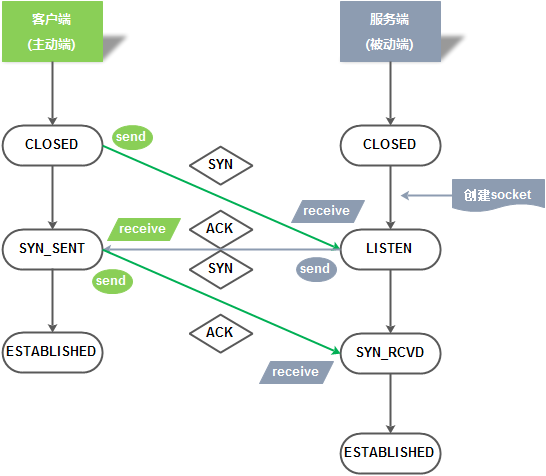

### 过程一：第一次握手

客户端主机向服务端主机发送建立TCP连接的请求报文

**握手后的状态变化：**

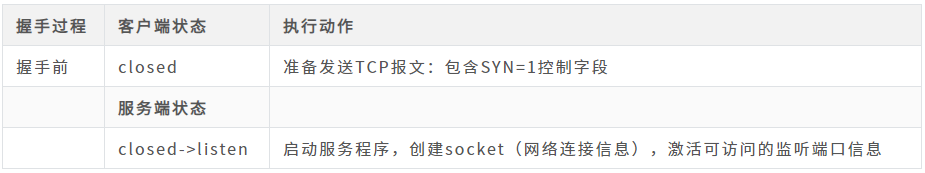

> socket就是网络连接的信息，会包含协议信息 源IP地址 源端口 目标IP地址 目标端口信息--五元组概念

**握手后的状态变化：**

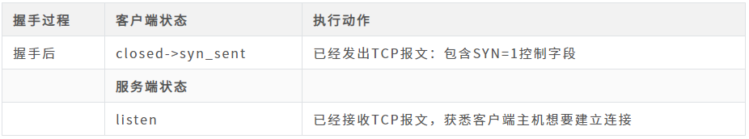

### 过程二：第二次握手

服务端主机向客户端主机发送的TCP连接的请求报文

**握手后的状态变化：**

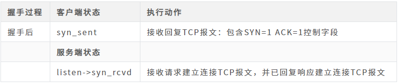

### 过程三：第三次握手

客户端主机收到服务端主机发送的TCP报文回复信息后，会再次发送确认的TCP报文信息。

**握手后的状态变化：**

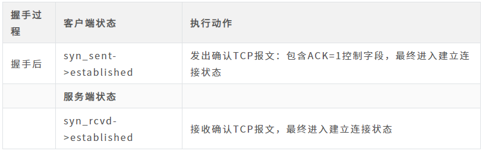

至此三次握手过程结束，作为建立连接的客户端和响应连接的服务端，总共出现5种状态的变迁，分别总结为：

- **客户端主机：**closed->syn_sent->established
- **服务端主机：**closed->listen->syn_rcvd->established

## 四次挥手过程状态变化

### 过程一：第一次挥手

客户端主机向服务端主机发送断开TCP连接请求的报文。

**挥手后的状态变化：**

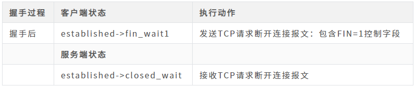

### 过程二：第二次挥手

服务端主机会回复客户端主机发送的TCP断开请求报文。

**挥手后的状态变化：**

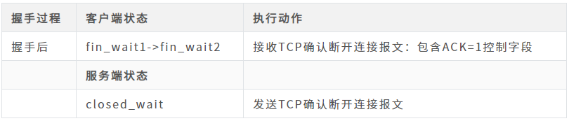

### 过程三：第三次挥手

服务端主机在回复完客户端主机的TCP断开请求确认控制字段后，不会马上就进行TCP连接的断开；

服务端主机会先确保断开前，所有传输到客户端主机的数据是否已经传输完毕，再向客户端主机发送断开连接的TCP报文；

**挥手后的状态变化：**

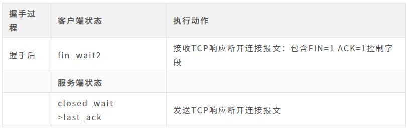

### 过程四：第四次挥手

客户端主机收到服务端主机的TCP断开请求后，会回复服务端主机的断开请求，发送最后一次的TCP确认报文

**挥手后的状态变化：**

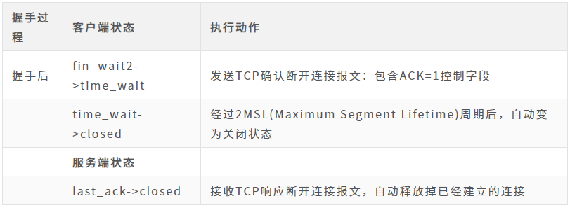

至此四次握手过程结束，作为连接断开的客户端和响应断开连接的服务端，总共出现5种状态的变迁，分别总结为：

- **客户端主机：**established->fin_wait1->fin_wait2->time_wait->closed
- **服务端主机：**established->closed_wait->last_ack->closed

## 特殊情况：三次挥手过程状态变化

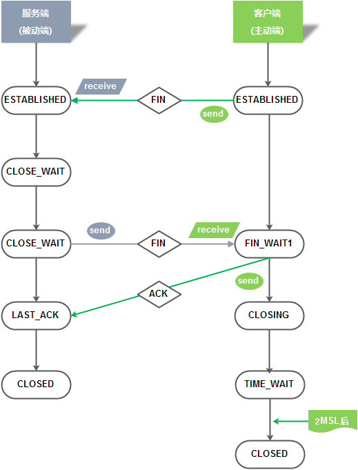

### 过程一：第一次挥手

客户端主机向服务端主机发送断开TCP连接请求的报文。

**挥手后的状态变化：**

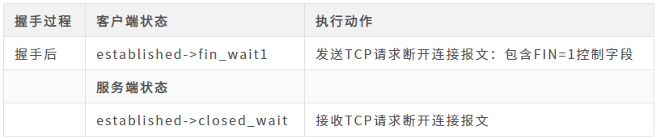

### 过程二：第二次挥手

服务端主机会回复客户端主机发送的TCP断开请求报文。

**挥手后的状态变化：**

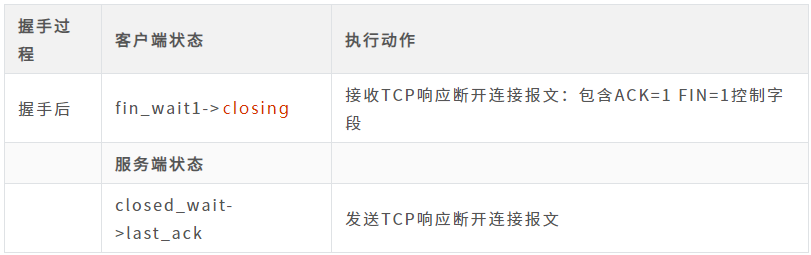

### 过程三：第三次挥手

客户端主机收到服务端主机的TCP断开请求后，会回复服务端主机的断开请求，发送最后一次的TCP确认报文

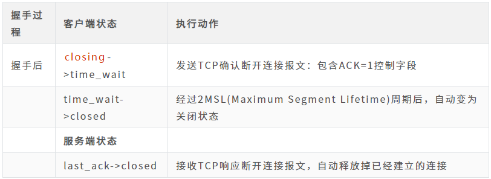

利用抓包工具抓取三次挥手过程：

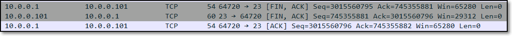

至此三次握手过程结束，作为连接断开的客户端和响应断开连接的服务端，总共出现5种状态的变迁，分别总结为：

- **客户端主机：**established->fin_wait1->closing->time_wait->closed
- **服务端主机：**established->closed_wait->last_ack->closed

整体从连接建立到连接断开的三次握手和四次挥手过程中，总共出现了十一种状态的变迁：

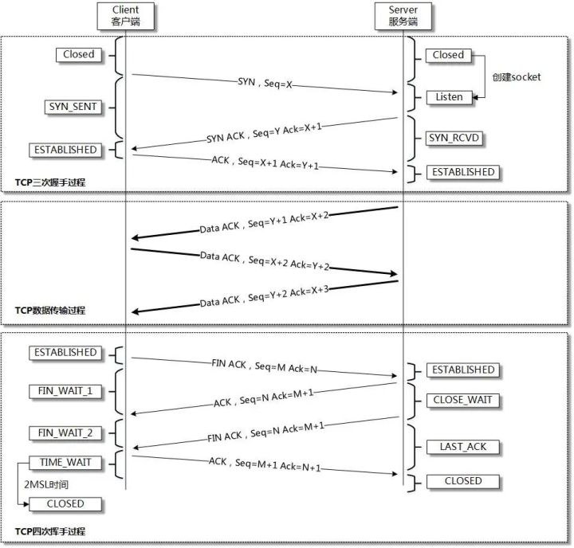

所谓Linux服务器内核参数优化，主要是指在Linux系统中针对业务服务应用而进行的系统内核参数调整，优化并无一定的标准；

下面以生产环境下Linux常见的网络资源的内核优化为例进行说明。

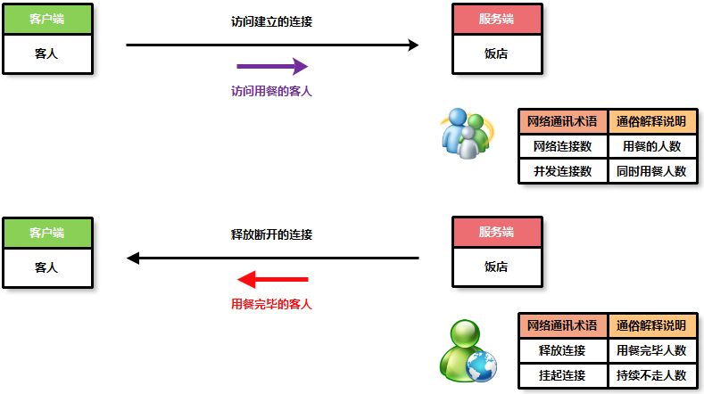

## **优化参数：net.ipv4.tcp_fin_timeout**

作用简述：表示套接字有本端要求关闭，这个参数决定了它保持在FIN_WAIT_2状态的时间，默认值是60s

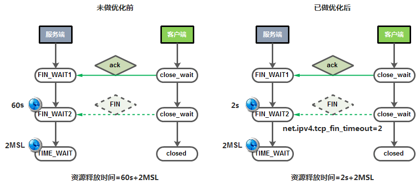

默认配置：

```text
# cat /proc/sys/net/ipv4/tcp_fin_timeout 
60
```

## 优化参数：**net.ipv4.tcp_tw_reuse**

作用简述：表示开启重用，允许将TIME_WAIT sockets重新用于新的TCP连接，默认值为0，表示关闭

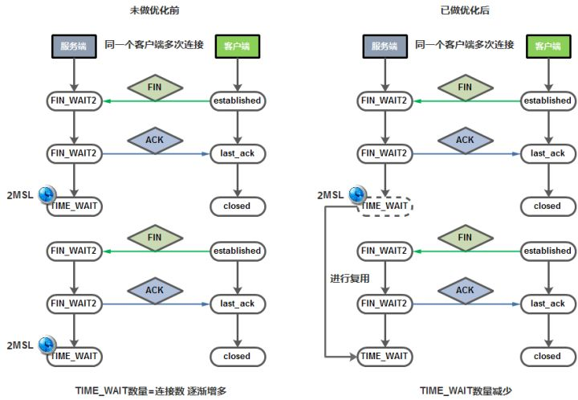

默认配置：

```text
# cat /proc/sys/net/ipv4/tcp_tw_reuse    
0
```

## 优化参数：**net.ipv4.tcp_tw_recycle**

作用简述：表示开启TCP连接中TIME_WAIT sockets的快速回收机制，默认为0表示关闭。

当开启了这个配置后，TIME_WAIT不用再等待2MSL的时间进行释放连接;

而是一个RTO（retransmission timeout，数据包重传的timeout时间）的时间，远小于2MSL时间长度。

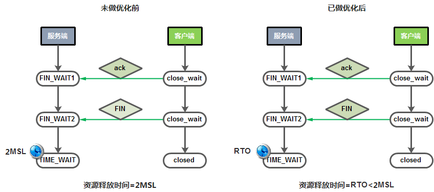

默认配置：

```text
# cat /proc/sys/net/ipv4/tcp_tw_recycle 
0
```

> reusers和recycle这两个参数都是为防止生产环境下web squid等业务服务器产生time_wait网络状态数量过多设置的。

## **优化参数：net.ipv4.tcp_keepalive_time**

作用简述：表示当keepalived启用时，TCP发送Keepalive消息的频度。默认是2小时，建议改为10分钟

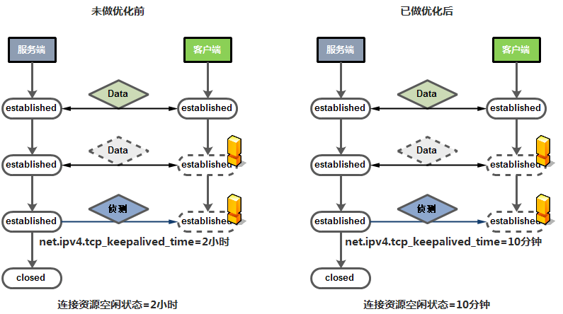

默认配置：

```text
# cat /proc/sys/net/ipv4/tcp_keepalive_time 
7200
```

## 优化参数：**net.ipv4.ip_local_port_range**

作用简述：该选项用来设定允许系统打开的端口范围，即用于向外连接的端口范围

服务器A ---> 服务器B

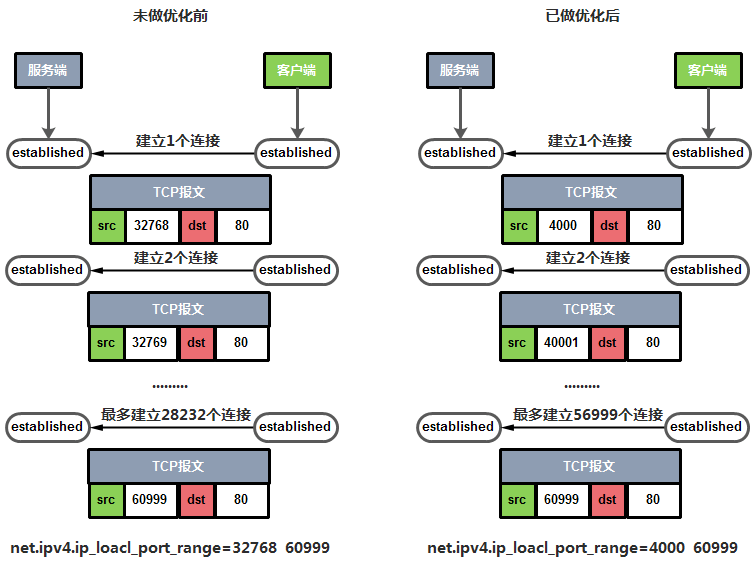

默认配置：

```text
# cat /proc/sys/net/ipv4/ip_local_port_range 
32768 60999
```

## 优化参数：**net.ipv4.tcp_max_syn_backlog**

作用简述：表示SYN队列的长度，默认为128，建议加大队列的长度为8192或更多，这样可以容纳更多等待连接的网络连接数；

该参数为服务器端用于记录那些尚未收到客户端确认信息的连接请求最大值。

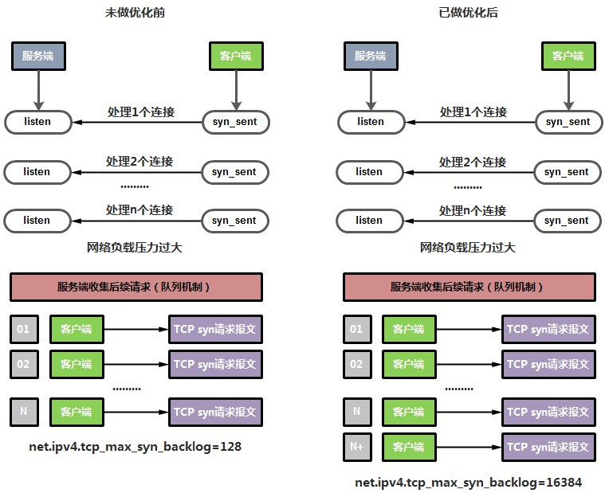

默认配置：

```text
# cat /proc/sys/net/ipv4/tcp_max_syn_backlog 
128
```

## 优化参数：**net.ipv4.tcp_max_tw_buckets**

作用简述：表示系统同时保持TIME_WAIT套接字的最大数量，如果超过这个数值，TIME_WAIT套接字将立刻被清除并打印警告信息。

默认为180000（早期系统版本），对于apache nginx等服务器来说可以将其调低一点，如果改为5000~30000；

不同业务的服务器也可以给大一点，比如LVS squid可以将其调高一点。

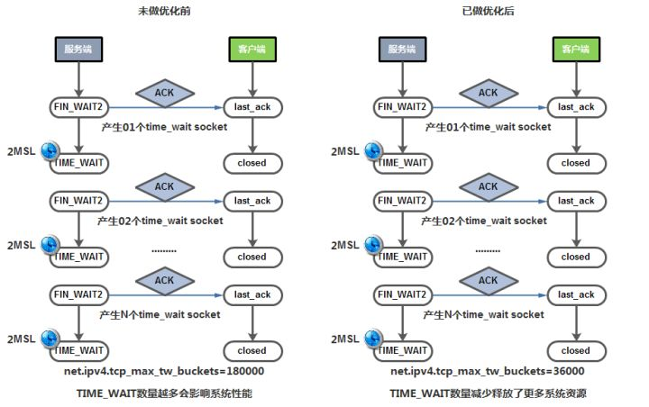

```text
# cat /proc/sys/net/ipv4/tcp_max_tw_buckets  
4096
```

## 优化参数：**net.ipv4.tcp_syn_retries**

作用简述：表示在内核放弃建立连接之前发送SYN包的数量，默认值是6次；

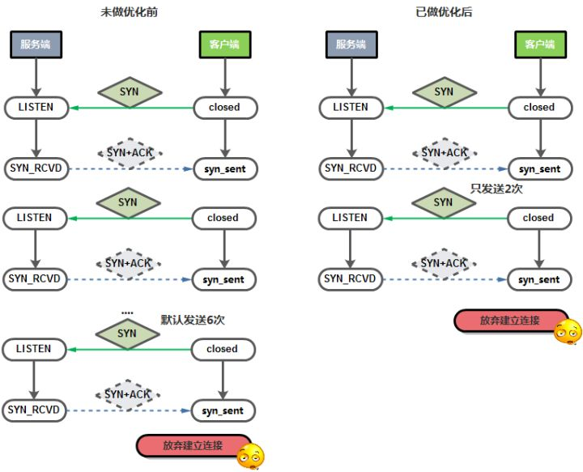

默认配置：

```text
# cat /proc/sys/net/ipv4/tcp_syn_retries    
6
```

## 优化参数：**net.ipv4.tcp_synack_retries**

作用简述：参数值决定了内核放弃连接之前发送SYN+ACK包的数量，默认值为5。

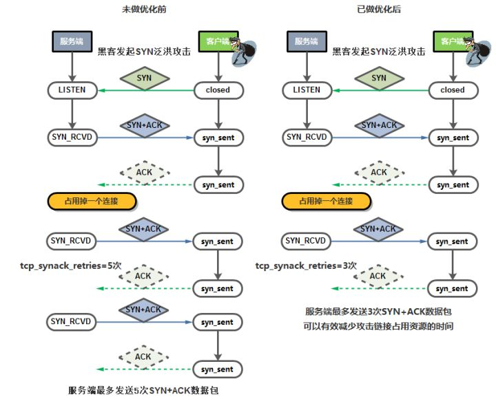

默认配置：

```text
# cat /proc/sys/net/ipv4/tcp_synack_retries 
5
```

## 优化参数：**net.ipv4.tcp_max_orphans**

作用简述：用于设定系统中最多有多少个TCP套接字不被关联到任何一个用户文件句柄上（系统所能处理不属于任何进程的TCP套接字最大数量）；

被动建立端发送了SYN+ACK后状态转为SYN_RCVD，这时TCP连接就不属于某个进程了；

如果超过这个数值，孤立连接将立即被复位并打印出警告信息；主要是为了抵御简单的DoS攻击，早期系统默认是 65536；

建议不能过分依靠这个限制缩减这个参数值，更多的情况是增加这个值。

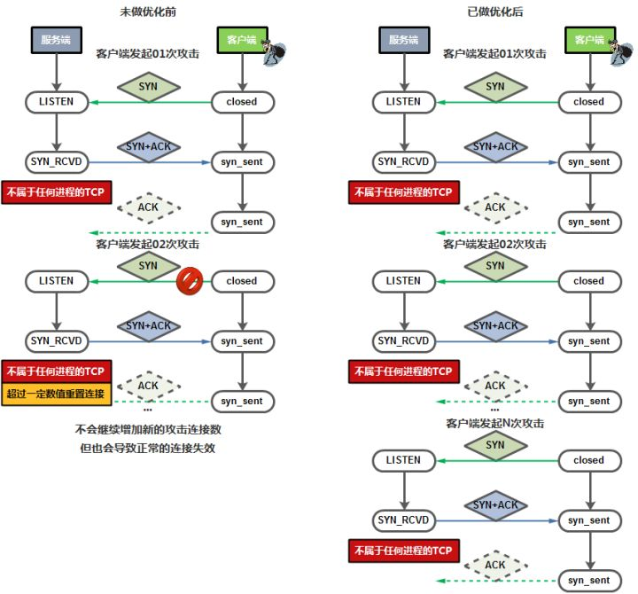

默认配置：

```text
# cat /proc/sys/net/ipv4/tcp_max_orphans 
4096
```

## 优化参数：**net.core.somaxconn**

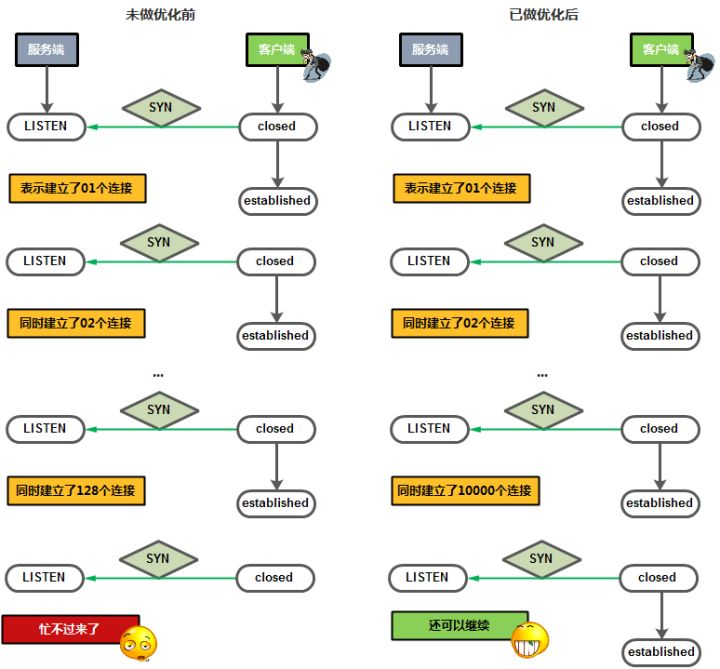

默认配置：

```text
# cat /proc/sys/net/core/somaxconn  
128
```

## 优化参数：**net.core.netdev_max_backlog**

作用简述：表示当每个网络接口接收数据包的速率比内核处理这些包的速率快时，允许发送到队列的数据包最大数；

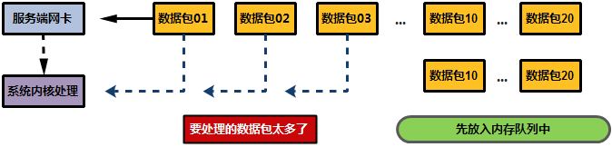

默认配置：

```text
# cat /proc/sys/net/core/netdev_max_backlog 
1000
```

以上内核优化参数具体优化方法：

```text
# 参数优化配置建议
[root@xiaoq ~]# cat /etc/sysctl.conf
net.ipv4.tcp_fin_timeout = 2
net.ipv4.tcp_tw_reuse = 1
net.ipv4.tcp_tw_recycle = 1
net.ipv4.tcp_keepalive_time = 600
net.ipv4.ip_local_port_range = 4000 65000
net.ipv4.tcp_max_syn_backlog = 16384
net.ipv4.tcp_max_tw_buckets = 36000
net.ipv4.tcp_syn_retries = 1
net.ipv4.tcp_synack_retries = 1
net.ipv4.tcp_max_orphans = 16384
net.core.somaxconn = 16384
net.core.netdev_max_backlog = 16384

# 加载内核配置信息
[root@xiaoq ~]# sysctl -p
net.ipv4.tcp_fin_timeout = 2
net.ipv4.tcp_tw_reuse = 1
net.ipv4.tcp_tw_recycle = 1
net.ipv4.tcp_keepalive_time = 600
net.ipv4.ip_local_port_range = 4000 65000
net.ipv4.tcp_max_syn_backlog = 16384
net.ipv4.tcp_max_tw_buckets = 36000
net.ipv4.tcp_syn_retries = 1
net.ipv4.tcp_synack_retries = 1
net.ipv4.tcp_max_orphans = 16384
net.core.somaxconn = 16384
net.core.netdev_max_backlog = 16384
```

> 以上配置优化信息只作为参考模板，理解优化参数作用后，需结合企业实际需求进行灵活调整。

学习这些内容还是需要有点运维基础的学员的，如果连基础的运维知识都没掌握，这篇文章你可能看不懂，当然如果你看懂了，你的待遇基本可以定位在15k了！