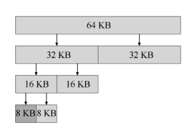

17 Free Space Management 空闲空间管理
===

**概述:**  
操作系统可通过维护一个空闲列表来管理维护空闲内存空间. 空闲列表相当于一个链表,每一个节点指向空闲空间,并指向下一空闲空间节点.当用户调用
malloc()申请内存时,操作系统根据策略分配空闲空间.分配空间时会按照申请内存大小对分配的空闲空间进行切分,返回申请大小的内存指针,剩余部分
作为新的空闲节点加入空闲列表中

1.  **几种分配策略**  
    *   最优匹配:匹配大小一样或最接近的节点,实现简单,但是遍历列表比较费时
    *   最差匹配:返回最大的节点,缺点是遍历费时和容易导致内存碎片
    *   首次匹配:匹配第一个能满足需求的节点,优点是不需要遍历全部节点,缺点还是会造成内存碎片
    
2.  **其它改进内存管理的方法**  
    *   分离空闲列表  
        用一个独立的列表管理经常被申请大小的内存空间.其它大小的分配交给通用的内存分配处理,比如锁和文件系统inode等.独立列表会在系统
        启动时初始化,减少了空闲列表初始化的开销,同时分配和销毁操作都比较快,可以提高空闲空间管理性能
    *   伙伴系统  
        伙伴系统通过将空闲空间抽象成2^N大小的抽象空间.通过递归将内存一分为二,直到刚好匹配内存申请大小(或大一点).这个系统的优点在于
        方便空闲节点的合并.释放空间时,通过检测旁边的空间节点是否空闲,如果空闲则合并为一个大的空闲空间节点  
        例:
        
        
