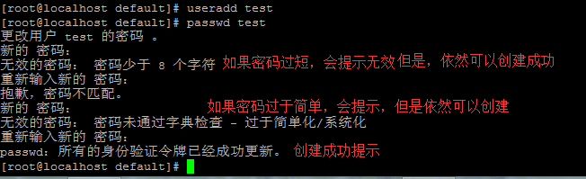
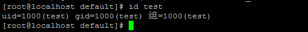
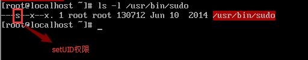

# CentOS7用户账户配置


**说明：**

这里记录的是CentOS 7 用户账户的配置，包括添加用户、添加用户组、删除用户、删除用户组等。其中包括分析用户的配置文件、目录以及对安全的思考。

用户配置方面CentOS 7与以往RHEL版本没有实际的差别。

## 认识用户

Centos 7 系统最小化安装，默认配置，是没有创建其他用户的。作为服务器操作系统，为了安全起见，一般是使用一般用户。这就牵涉到用户、用户组的创建以及删除。

CentOS 7 和其他版本的Linux一样，都具有相应用户的配置文件及目录，如下：

```bash
/etc/passwd 　　      //用户账户信息，可以看出用户名称 
/etc/shadow          //用户账户加密后信息，包括但不限于/etc/passwd中的信息 
/etc/group           //组账户信息，可以看出组名称 
/etc/gshadow   　　　 //组账户安全信息，包括但不限于/etc/group中的信息 
/etc/default/useradd //账户创建时默认值 
/etc/skel/           //创建用户时会拷贝这个模板
/etc/login.defs      //安全性的默认配置，与上面/etc/default/useradd有区别
```

比较重要的配置文件/etc/default/useradd，内容如下：

```bash
# useradd defaults file
GROUP=100                        //起始GID值
HOME=/home                       //家目录位置
INACTIVE=-1　　　　　　　　　　　　 //有效时间，负值为永久，正数代表天数
EXPIRE=
SHELL=/bin/bash                   //shell路径
SKEL=/etc/skel                    //默认配置文件路径
CREATE_MAIL_SPOOL=yes             //是否创建邮件池，具体作用待以后学习
```

看一下/etc/login.defs文件，重点内容如下：

```bash
MAIL_DIR        /var/spool/mail
...

# Password aging controls:           密码期限配置
#
#       PASS_MAX_DAYS   Maximum number of days a password may be used.
#       PASS_MIN_DAYS   Minimum number of days allowed between password changes.
#       PASS_MIN_LEN    Minimum acceptable password length.
#       PASS_WARN_AGE   Number of days warning given before a password expires.
#
PASS_MAX_DAYS   99999
PASS_MIN_DAYS   0
PASS_MIN_LEN    8
PASS_WARN_AGE   7
...

# Min/max values for automatic uid selection in useradd      最小/最大UID设置
#
UID_MIN                  1000              //我们创建的用户的UID从1000开始
UID_MAX                 60000
....

# Min/max values for automatic gid selection in groupadd
#
GID_MIN                  1000
GID_MAX                 60000
....
CREATE_HOME     yes                   //是否创建家目录
...

# Use SHA512 to encrypt password.        //采用SHA512加密
ENCRYPT_METHOD SHA512
```

从文件内容可见，/etc/login.defs 是比较宏观的进行偏重安全方面的配置。

下面是一些实际过程中常用的命令：

```bash
useradd         //添加用户
passwd          //为用户设置密码   
userdel         //删除用户
usermod         //修改用户信息
groupadd       //添加用户组
groupdel        //删除用户组
groupmod        //修改用户组信息
groups          //显示当前进程用户所属的用户组
    
```

## 创建用户

### 例子一： 最简单的创建用户

执行如下命令：

```bash
useradd test
passwd test
```

实例如图，并且系统会对密码做限制，比如长度、复杂度，但是不影响创建。可以理解为“温馨提示”。



这样一个用户名为test的用户已经创建好了。我们看一下属性。

执行命令：id test  //查看用户信息



我们发现test的uid=1000,gid=1000,位于test用户组，说明缺参数的新建用户，会默认新建一个与用户名同名的用户组并加入其中，我们也注意到UID、GID的值与默认的配置文件中保持一致，可见配置文件是生效的，同样也可以再新建一个用户，看一下UID、GID的值,会看到是1001.可以尝试一下。我们可以切到/home目录下，会看到用户目录，与配置文件设定一致。

### 例子二：带参数的创建账户

上个例子我们采用默认配置，只是设置了用户名和密码。这次我们手动设置UID、GID等。首先我们看一下，useradd的参数，如下：


```bash
　-b, --base-dir BASE_DIR       新账户的主目录的基目录
  -c, --comment COMMENT         新账户的 GECOS 字段
  -d, --home-dir HOME_DIR       新账户的主目录
  -D, --defaults                显示或更改默认的 useradd 配置
 -e, --expiredate EXPIRE_DATE  新账户的过期日期
  -f, --inactive INACTIVE       新账户的密码不活动期
  -g, --gid GROUP               新账户主组的名称或 ID
  -G, --groups GROUPS   新账户的附加组列表
  -h, --help                    显示此帮助信息并推出
  -k, --skel SKEL_DIR   使用此目录作为骨架目录
  -K, --key KEY=VALUE           不使用 /etc/login.defs 中的默认值
  -l, --no-log-init     不要将此用户添加到最近登录和登录失败数据库
  -m, --create-home     创建用户的主目录
  -M, --no-create-home          不创建用户的主目录
  -N, --no-user-group   不创建同名的组
  -o, --non-unique              允许使用重复的 UID 创建用户
  -p, --password PASSWORD               加密后的新账户密码
  -r, --system                  创建一个系统账户
  -R, --root CHROOT_DIR         chroot 到的目录
  -s, --shell SHELL             新账户的登录 shell
  -u, --uid UID                 新账户的用户 ID
  -U, --user-group              创建与用户同名的组
  -Z, --selinux-user SEUSER             为 SELinux 用户映射使用指定 SEUSER
```


新建一个UID=501，GID=600，30天有效期，家目录为/home/test5的用户test4.

命令 :

```bash
groupadd -g 600  test3                //创建GID=600的用户组test3            
useradd -u 501 -g 600 -f 30 -m   -d /home/test5 test4                 
```

当我们再次打开用户文件/etc/passwd或者id test4会看到我们自己的配置。

```bash
uid=501(test4) gid=600(test3) 组=600(test3)
```


## 更改用户设置

不同的 用户需要不同的权限，拥有不同的SHELL，是否允许登录。这个部分，就需要用到usermod命令修改用户配置。我们上个例子中创建过一个test账户，默认SHELL是/bin/bash，是可以登录的。

禁止登录：

```bash
usermod -s /sbin/nologin test //-s 指定shell 
```

修改用户名：

```bash
 usermod -l test88 test //-l 新的用户名
```

此外还可以家目录、过期天数、更换组、锁定用户、解锁用户等功能，可以查看参数实践。

## 删除用户/组

当我们创建用户/组有错误时，可能会删除用户/组，然后再重新创建。我们使用userdel命令来删除用户。

执行命令：

```bash
[root@localhost home]# userdel test
[root@localhost home]# useradd test
useradd：警告：此主目录已经存在。
不从 skel 目录里向其中复制任何文件。
正在创建信箱文件: 文件已存在
```

出现这个问题是因为我们删除用户时，系统为了安全起见并没有删除相关的文件以及目录。我们查看一下userdel参数：

```bash
用法：userdel [选项] 登录

选项：
  -f, --force                   force some actions that would fail otherwise
                                e.g. removal of user still logged in
                                or files, even if not owned by the user
  -h, --help                    显示此帮助信息并推出
  -r, --remove                  删除主目录和邮件池
  -R, --root CHROOT_DIR         chroot 到的目录
  -Z, --selinux-user            为用户删除所有的 SELinux 用户映射
```

我们可以使用参数-rf 来删除相关文件目录，这一步具有危险性，是否有回滚操作，不是特别清楚。

执行命令：

```bash
[root@localhost home]# userdel -rf test
[root@localhost home]# useradd test
```

这样，就不会出现提示了。

## 用户安全配置

在操作系统安全中，用户权限、文件权限也是非常重要。现在就几个小点记录一下。这次目的主要有禁止root用户连接、一般用户使用sudo命令提权。我们在上个步骤中，创建了一个test用户，当我们输入sudo命令时，会提示如下：

```bash
test不在 sudoers 文件中。此事将被报告。
```

解决这个问题，我们只需要在/etc/sudoers 中添加用户test即可，代码如下：

```bash
//找到如下一行，在下面添加即可
.....
root    ALL=(ALL)       ALL
test    ALL=(ALL)       ALL          //这一行是添加的
```

到这里应该就可以解决问题了。

**新增：在虚拟机里面重新安装了一个CentOS 7，实验了一下，确实可以成功。下面是/etc/sudoers 属性：**





**可以看到拥有setUID权限，任何用户都有x（执行）权限，故可以执行sudo命令。下面的内容就当作是对setUID权限的理解。**

ps.因为之前按照网上的资料对其他部分进行了设置，但是感觉并不影响，下面贴出修改的部分及其目的

```bash
//修改文件 /usr/bin/sudo 用户及用户组
chown  root：root /usr/bin/sudo
//修改权限为4755，其中4代表以文件所有者执行
chmod 4755 /usr/bin/sudo
```

上面的命令意思是，将文件/usr/bin/sudo拥有者改为root，当执行时以root身份执行，这也是‘4’的含义。如果设置权限时，勿把“4755” 配置为755，就会出现这个错误。

```
sudo：有效用户 ID 不是 0，sudo 属于 root 并设置了 setuid 位吗？
```

解决方法呢，就是刚才说的以root（uid=0）身份运行。bash

在实际环境中，为了防止黑客对root账户进行暴力破解，我们通常禁止root账户SSH远程连接。操作如下：

```bash
//修改 /etc/ssh/sshd.config 文件，将
#PermitRootLogin yes
修改为
PermitRootLogin no

//重启sshd服务
systemctl restart sshd.service
```

备注：CentOS 7 取消了service 用法，尽管部分情况下还可以使用，但是我就先使用systemctl吧。