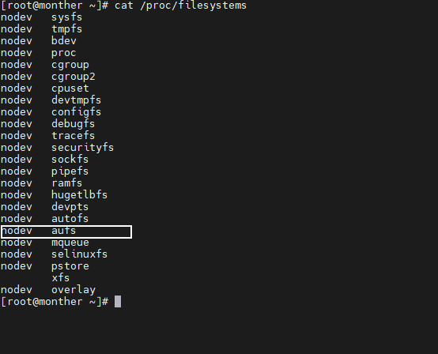

# CentOS7配置支持AUFS文件系统

>  使得内核支持AUFS

CentOS7 默认不支持`aufs`文件系统, 有时候我们需要使用, 就必须自己去安装内核了

1. 添加`yum`源

```bash
# 进入repo目录
cd /etc/yum.repos.d/
yum install wget -y
# 下载文件
wget https://yum.spaceduck.org/kernel-ml-aufs/kernel-ml-aufs.repo
# 安装
yum install kernel-ml-aufs
```

修改内核启动

```csharp
vim /etc/default/grub
# 修改参数, 表示启动时选择第一个内核
###################################
GRUB_DEFAULT=0
###################################

# 重新生成grub.cfg
grub2-mkconfig -o /boot/grub2/grub.cfg

# 重启计算机
reboot
```

> `GRUB_DEFAULT`为`saved`，`saved`表示下次启动时`默认启动上次的内核`，这里我们需要更改`GRUB_DEFAULT=0`, 表示启动时选择第一个内核

查看是否支持

```undefined
cat /proc/filesystems
```

