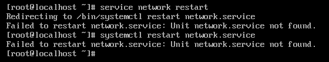

# Centos8 重启网卡方法

## 问题情况：

1、虚机centos8 修改为静态ip后，由于网卡网段变更，无法上网

2、最小化安装，没有ifconfig

3、firewalld，selinux关闭

4、ping 不通物理机

根本原因：

静态路由配置错误

## 解决方案：

1、linux命令==> ip:ip addr　　查看网络配置

nmcli:　　　查看网络配置

2、修改为DHCP或修改默认路由为正确的默认路由地址

修改配置文件：vi /etc/sysconfig/network-scripts/ifcfg-ens160

将BOOTPROTO修改为DHCP

如果配置IPADDR和GATEWAY，需要删去或修改为正确的默认路由地址，如果不知道，可以使用DHCP

3、重启网卡

不能使用service和systemctl



方法：nmcli c reload +网卡名

    例：nmcli c reload ens160

如果不行，可尝试以下命令

# 重载所有ifcfg或route到connection（不会立即生效）

```
nmcli c reload  ifcfg-xxx
```

# 重载指定ifcfg或route到connection（不会立即生效）

```
nmcli c load /etc/sysconfig/network-scripts/ifcfg-ethX
nmcli c load /etc/sysconfig/network-scripts/route-ethX
```

# 立即生效connection，有3种方法

```
nmcli c up ethX
nmcli d reapply ethX
nmcli d connect ethX
```

