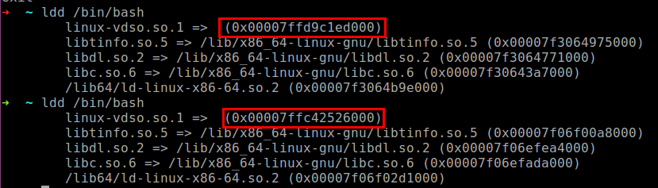
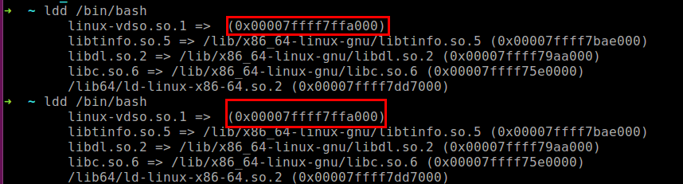

# 0x00 背景知识
ASLR(Address Space Layout Randomization)在2005年被引入到Linux的内核 kernel 2.6.12 中，当然早在2004年就以patch的形式被引入。随着内存地址的随机化，使得响应的应用变得随机。这意味着同一应用多次执行所使用内存空间完全不同，也意味着简单的缓冲区溢出攻击无法达到目的。

GDB从版本7开始，第一次在Ubuntu 9.10（Karmic）上，被调试的程序可以被关闭ASLR（通过标记位ADDR_NO_RANDOMIZE ）。

此处有坑，笔者有一个Ubuntu 9.10的虚拟机，用了下面将要介绍的全部姿势，死活关闭不了ASLR，后来换成Ubuntu 10.04就没问题了，说明Ubuntu 9.10的版本控制ASLR的方法还不成熟，需要重源码层面确认是否可以关闭开启，真是坑到家了。

## 0x01 查看ASLR设置

查看当前操作系统的ASLR配置情况，两种命令任你选择

    $ cat /proc/sys/kernel/randomize_va_space
    2
    $ sysctl -a --pattern randomize
    kernel.randomize_va_space = 2

## 0x02 配置选项

    0 = 关闭
    1 = 半随机。共享库、栈、mmap() 以及 VDSO 将被随机化。（留坑，PIE会影响heap的随机化。。）
    2 = 全随机。除了1中所述，还有heap。

后面会详细介绍ASLR的组成，不关心的同学可以简单理解为ASLR不是一个笼统的概念，而是要按模块单独实现的。当然，在攻防对抗的角度上，应为不是所有组件都会随机，所以我们就可以按图索骥，写出通用的shellcode调用系统库。

## 0x03 查看地址空间随机效果

使用ldd命令就可以观察到程序所依赖动态加载模块的地址空间，如下下图所示，被括号包裹。在shell中，运行两次相同的ldd命令，即可对比出前后地址的不同之处，当然，ASLR开启时才会变化：

ASLR开启时，动态库的加载地址不同



ASLR关闭时，动态库的加载地址相同


## 0x04 关闭ASLR

方法一： 手动修改randomize_va_space文件

诚如上面介绍的randomize_va_space文件的枚举值含义，设置的值不同，linux内核加载程序的地址空间的策略就会不同。比较简单明了。这里0代表关闭ASLR。

```bash
echo 0 > /proc/sys/kernel/randomize_va_space
```

注意，这里是先进root权限，后执行。不要问为什么sudo echo 0 > /proc/sys/kernel/randomize_va_space为什么会报错
方法二： 使用sysctl控制ASLR

```bash
$ sysctl -w kernel.randomize_va_space=0xxxxxxxxxx1 1$ sysctl -w kernel.randomize_va_space=01
```

这是一种临时改变随机策略的方法，重启之后将恢复默认。如果需要永久保存配置，需要在配置文件 /etc/sysctl.conf 中增加这个选项。
方法三： 使用setarch控制单个程序的随机化

如果你想历史关闭单个程序的ASLR，使用setarch是很好的选择。setarch命令如其名，改变程序的运行架构环境，并可以自定义环境flag。

```bash
setarch `uname -m` -R ./your_program
```

-R参数代表关闭地址空间随机化（开启ADDR_NO_RANDOMIZE)
方法四： 在GDB场景下，使用set disable-randomization off

在调试特定程序时，可以通过set disable-randomization命令开启或者关闭地址空间随机化。默认是关闭随机化的，也就是on状态。

当然，这里开启，关闭和查看的方法看起来就比较正规了。

```bash
关闭ASLR：
set disable-randomization on
开启ASLR：
set disable-randomization off
查看ASLR状态：
show disable-randomization
```


## 0x05 ASLR与PIE的区别

ASLR有一个模糊的值（1），既不是全开启也不是全关闭，而是部分关闭，那这部分到底是什么，很容易产生歧义。

ASLR 不负责代码段以及数据段的随机化工作，这项工作由 PIE 负责。但是只有在开启 ASLR 之后，PIE 才会生效。

## 0x06 一些没有用的感想

写这篇文章的原点是在调试一个简单的ROP利用没有成功弹shell，但是出了一些莫名其妙的sh报错。冥冥中感觉里成功不远了。随着翻阅资料的积累，和相关writeup的release date接近2018年，越来越坚定了这份信心。终于找到了ASLR的影响导致ROP不成功的原因。

最近工作也很累，不是量大，而是心累。希望LP越来越漂亮，越来越美丽～
