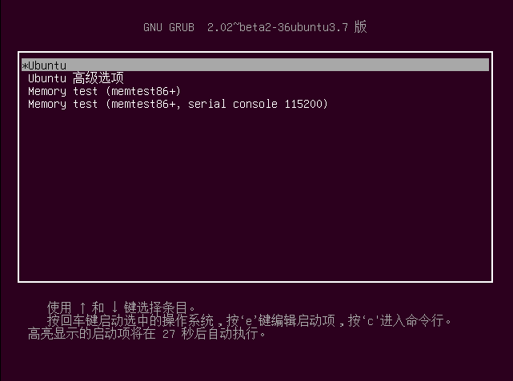
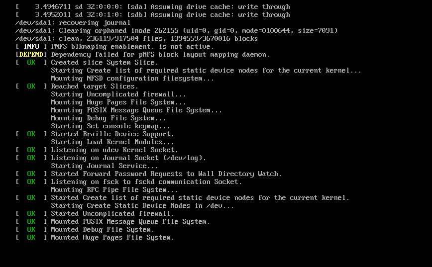
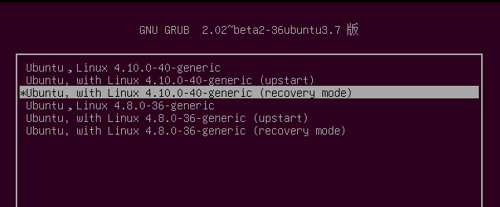
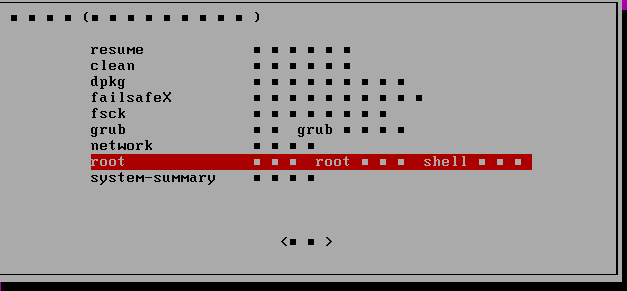
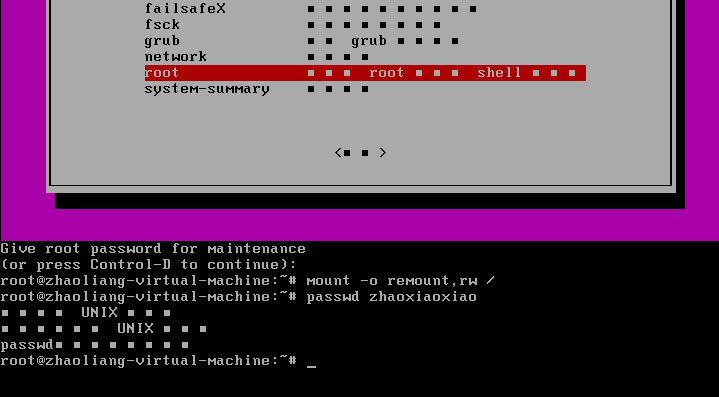
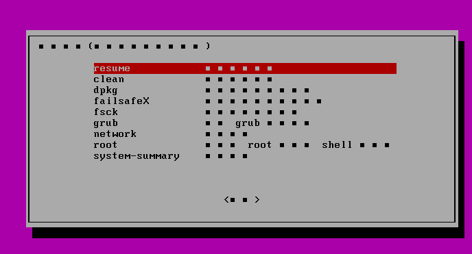

#  ubuntu14.04忘记用户登录密码

1.在VMware Workstatiom中点击“开启此虚拟机”，注意，进入系统自启时随即先点击一下屏幕，目的是让鼠标从VM切换到ubuntu启动（否则下面长按shift时可能不会进入GNU GRUN界面）；

2.点击屏幕后随即长按shift，系统会进入GUN GRUB界面（对此界面的操作可看界面下面的说明），如图 1所示；如果进入图 2 所示的界面则此步骤的操作失败，不要着急再试一下。

​                               图 1

​                                        图 2

 3.在GNU GRUB界面中选中ubuntu 高级选项，回车 ，进入图 3所示界面；选择一个括号里是recovery mode的系统发行编号，我试了一下，图 3中两个都可以成功修改密码；

​                             图 3 

4.等会。。。会见到图 4 所示的界面，选择root项，回车；

​                              图 4

5.在图 5中最下方输入root密码，回车，便会切换到root用户；此时需要输入此条命令~# mount -o remount,rw /  回车，再用passwd 用户名便可以修改密码了；

​                                   图 5

6.继续输入 exit 返回图 6的界面，选中resume，回车，此时会跳出一个确认界面，再回车即可。然后。。。。静静等待登录界面，哈哈哈，预祝大家成功。

​                                图 6