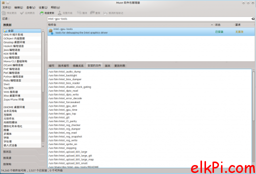
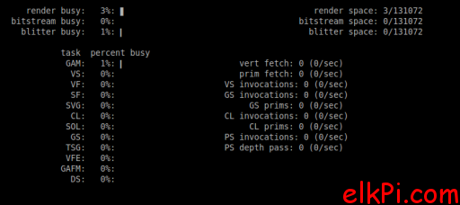

# ubuntu查看intel GPU使用情况

最近搞个东西，涉及到intel核显的问题，因此需要知道核显目前运行情况如何。在ubuntu下，可以直接安装intel-gpu-tools来查看核显的运行情况。

```
sudo apt-get install intel-gpu-tools
```

安装后，用muon看看。可使用的工具列表还是很多的。



不过其实我也就用一用gpu top而已。

```
sudo intel_gpu_top
```



显示的信息量还是很完整的！算是够用了。如果做这方面相关的开发的话。很方便跟踪一些使用信息。