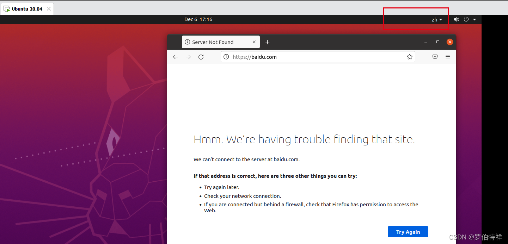
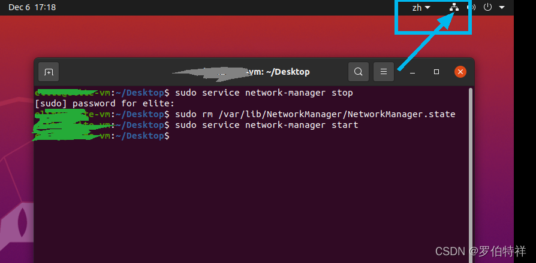

# Ubuntu20.04无法连接网络（网络图标丢失）的解决方案

> from csdn: 罗伯特祥

## 问题复述：

Ubuntu 20.04无法连接到网络，网络连接图标丢失，网络设置中无网络设置选项。

## 解决方案

    sudo service network-manager stop
    
    sudo rm /var/lib/NetworkManager/NetworkManager.state
    
    sudo service network-manager start

## 参考文献：

    https://www.cnblogs.com/shiyueyangne/p/14260820.html
    https://www.freesion.com/article/3238793033/