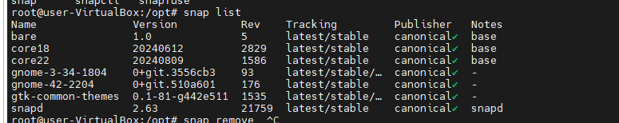
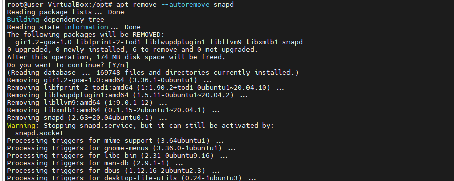
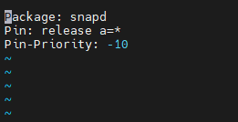
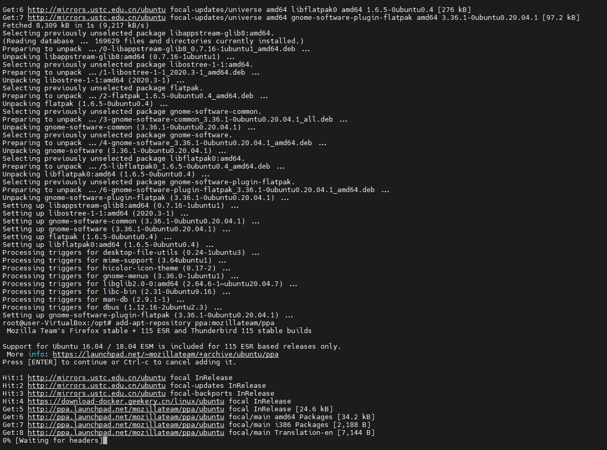

# Ubuntu中移除Snap软件包

## Ubuntu中移除Snap软件包

1、在你的系统中打开一个终端，使用以下命令查看已经安装的 Snap 软件包的列表。它显示了 Snap 软件包，比如 Firefox，软件商店，主题以及其它默认已经安装的核心软件包。

```text
snap list
```



Ubuntu Snap 包列表


2、按照以下的顺序移除 Snap 软件包。首先移除 Firefox。然后是软件商店，和用以上命令看到的你的系统中的其它软件包。

```text
sudo snap remove --purge firefox
sudo snap remove --purge snap-store
sudo snap remove --purge gnome-3-38-2004
sudo snap remove --purge gtk-common-themes
sudo snap remove --purge snapd-desktop-integration
sudo snap remove --purge bare
sudo snap remove --purge core20
sudo snap remove --purge snapd
```

3、最后，通过 `apt` 命令移除 Snap 服务。

```text
sudo apt remove --autoremove snapd
```



移除 Snap 包和其它


这还没完，即使你用以上命令移除了 Snap 软件包，但是如果你没有关闭 apt 触发器，`sudo apt update` 命令会再一次将 Snap 安装回来。

4、所以，要关闭它，我们需要在 `/etc/apt/preferences.d/` 目录下创建一个 apt 设置文件 `nosnap.pref` 来关闭 Snap 服务。

```text
vim /etc/apt/preferences.d/nosnap.pref
```

5、添加以下的命令行，并保存该文件。

```text
Package: snapd
Pin: release a=*
Pin-Priority: -10
```



创建设置文件


如果你知道如何使用它，那么这个 apt 设置文件是一个潜在的工具。举个例子，在以上的状态中，`Pin-Priority -10` 意思就是阻止 Snap 软件包的安装。

与这个教程不相关的，举个例子，如果你想给所有发行版代号为 “bulleye” 的软件包超高优先权的话，那么就可以查看这些设置文件。如果你想了解更多，你可以访问 [apt 手册页](https://manpages.ubuntu.com/manpages/focal/man5/apt_preferences.5.html)。

```text
Package: *
Pin: release n=bullseye
Pin-Priority: 900
```

6、回到我们的主题，一旦你已经保存和关闭以上文件，从终端中再次运行以下命令。

```text
sudo apt update
```

7、最后，从 Ubuntu 中移除 Snap 的步骤全部完成。

## 从 Ubuntu 移除 Snap 后使用 deb 文件安装软件商店和 Firefox

你已经移除了 Firefox 和软件商店，但是你的工作还需要它们。

要安装 apt 版的 GNOME 软件商店，你可以使用以下命令。确保使用 `--install-suggests` 参数。否则，将会再次安装上 Snap 版本的软件包管理器！

```text
apt install --install-suggests gnome-software
```

要安装 Firefox，通过以下命令使用官方 PPA 仓库。

```text
add-apt-repository ppa:mozillateam/ppa
apt update
apt install -t 'o=LP-PPA-mozillateam' firefox

```

添加 PPA 仓库




从 PPA 仓库以 deb 文件形式安装 Firefox


一旦你已经安装完 Firefox，使用以下命令开启自动更新。要了解更多，[访问此页](https://www.debugpoint.com/2021/09/remove-firefox-snap-ubuntu/)。

```text
echo 'Unattended-Upgrade::Allowed-Origins:: "LP-PPA-mozillateam:${distro_codename}";' | sudo tee /etc/apt/apt.conf.d/51unattended-upgrades-firefox
```

最后但同样重要，当运行 `apt` 时，为 Firefox 创建另一个设置文件给予以上 PPA 仓库超高优先权。如果你不这么做，`apt update` 命令会再次安装 Snap 版本 Firefox，并把它的“ Snap 朋友们”带回来    。

```text
sudo gedit /etc/apt/preferences.d/mozillateamppa
```

最后，添加这些命令行并保存文件。

```text
Package: firefox*
Pin: release o=LP-PPA-mozillateam
Pin-Priority: 501
```

完成。