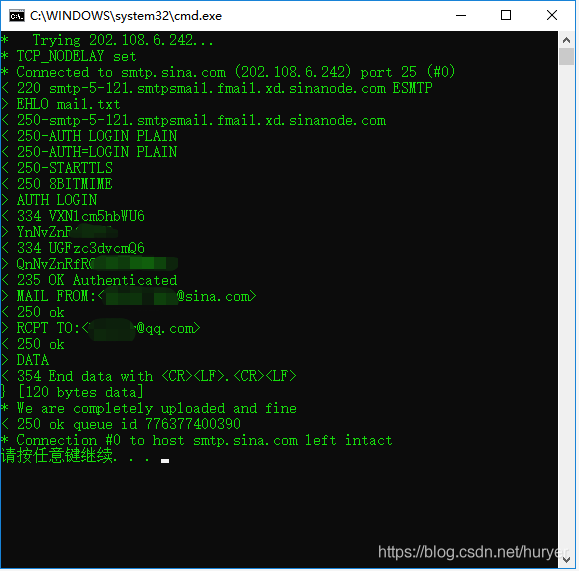
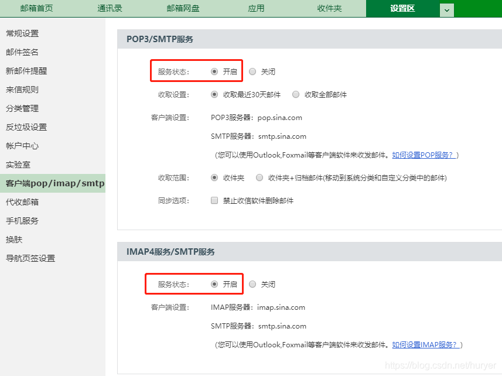

# 使用curl实现邮件发送

# 概述

本文讲解如何通过curl实现邮件发送功能，通过此功能，可以将一些配置信息自动发送到指定邮箱，满足自动运维要求。
测试发件邮箱：sina
测试收件邮箱：qq

# 脚本实例

curl_send_mail.bat


```bash
@echo off
rem 使用curl实现邮件发送
rem -------------------------------------------
rem 参数
set smtp="smtp://smtp.sina.com"
set mail_from=发件地址@sina.com
set mail_to=收件地址@sina.com
set data=mail.txt
set user="发件人用户名:发件人密码"
rem -------------------------------------------
rem 编写邮件头消息
echo From:%mail_from% > %data%
echo To:%mail_to% >> %data%
echo Subject:邮件内容标题 %date%>> %data%
echo.>> %data%

echo 这里填写具体的邮件内容 >> %data%
rem 例如：获取当前的外网地址信息
rem curl ifconfig.me >> %data%
rem -------------------------------------------
rem 发送邮件
curl --verbose -s --url "%smtp%" --mail-from %mail_from% --mail-rcpt %mail_to% --upload-file %data% --user %user%

rem 删除临时文件
del %data%
pause

```

# 执行结果



# 邮箱配置

新浪邮箱配置：

