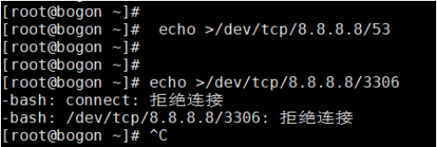
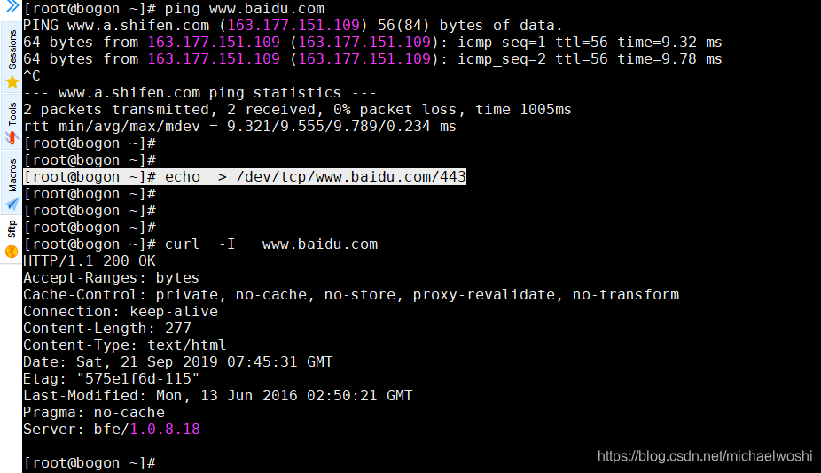
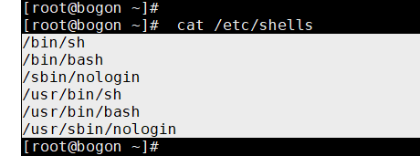

# 关于 /dev/(tcp|udp)/${HOST}/${PORT}

# 一、背景

Linux中的一个特殊文件： /dev/tcp  打开这个文件就类似于发出了一个socket调用，建立一个socket连接，读写这个文件就相当于在这个socket连接中传输数据。

我们可以通过重定向实现基于tcp/udp协议的软件通讯，/dev/tcp/host/port  只要读取或者写入这个文件，相当于系统会尝试连接:host 这台机器，对应port端口。

如果主机以及端口存在，就建立一个socket 连接，将在 /proc/self/fd 目录下面，有对应的文件出现。

```bash
echo >/dev/tcp/8.8.8.8/53
```

这条命令的意思是向8.8.8.8的53端口建立一个连接，会把连接返回的东西丢弃，查看连接是否成功，成功代表端口开放状态。



如果相应的域名能够被解析，host可以是域名



# 二、How does it work?

印象中/dev/这个文件夹中保存着系统的设备文件，就以为 /dev/tcp/${HOST}/${PORT} 为一个存在在操作系统文件系统中的像设备一样的文件，但是这个文件并不存在的！

/dev/tcp/host/port 其实是一个 bash 的 feature，由于是 bash的 feature，因此在别的 shell下就不能生效，所以需要注意使用shell类型。

```bash
cat /etc/shells
```



虽然：/dev/tcp/${HOST}/${PORT} 这个字符串看起来很像一个文件系统中的文件，并且位于 /dev 这个设备文件夹下

但是：这个文件并不存在，而且并不是一个设备文件。这只是 bash 实现的用来实现网络请求的一个接口，其实就像我们自己编写的一个命令行程序，按照指定的格式输入 host port参数，就能发起一个 socket连接完全一样。

其实很奇怪的是为什么这个接口的调用方式和访问文件系统是一样的，这会让很多人误以为这是一个文件，感觉不是特别合理。那么如果有这样的需求：如果真的有一个/dev/tcp/host/port文件该如何重定向？ 可能 bash 的设计者在设计这个命令的调用方式的时候就默认不会存在 /dev/tcp 这个文件夹吧，里面也不会有文件。还是感觉这种设计不是很合理，哪怕设计成额外的命令行参数也比现在设计成一个伪文件要对使用者的理解更友好一点。

# 三、Bash Shell中的TCP / UDP套接字使用示例


如果想要在Linux服务器上打开TCP / UDP套接字，例如检查特定的地址/端口是否可达、获取远程网页、调试一个restful API、连接到远程IRC服务器等。但是如果所在的Linux服务器是非常严格的，以致于没有任提供何标准工具，如netcat，curl或wget可能可用，这时候只能通过bash shell去完成上述的工作。

事实上，bash shell 的内置功能之一是通过/ dev / tcp（和/ dev / udp）设备文件打开TCP / UDP套接字。，我们来了解如何打开TCP / UDP套接字，并从bash shell中的套接字读取和写入。

1、在Bash Shell中打开或关闭TCP / UDP套接字

简而言之，您可以使用bash shell 中的以下语法打开TCP / UDP套接字。

```bash
$ exec ${file-descriptor} </dev/${protocol}/${host}/${port}
```

“文件描述符”是与每个套接字相关联的唯一的非负整数。文件描述符0,1和2分别保留给stdin，stdout和stderr。因此，你必须指定3或更高（以未使用者为准）作为文件描述符。

“<>”意味着套接字对于读写都是打开的，根据你的需要，你可以打开只读（<）或只写（>）的套接字。

“协议”字段可以是tcp或udp，“主机”和“端口”字段是不言自明的。

例如，要打开www.example.com的双向TCP套接字，使用HTTP端口和文件描述符3：

```bash
$ exec 3 <> / dev/tcp /www.example.com/80
```

打开后，可以使用以下语法关闭读/写套接字，第一个命令关闭输入连接，后者关闭输出连接：

```bash
$ exec ${file-descriptor} <＆ - 
$ exec ${file-descriptor}>＆ -
```

2、在Bash Shell中读取或写入TCP / UDP套接字

打开套接字后，你可以向套接字写入消息或从套接字读取消息。

要将存储在$MESSSAGE中的消息写入套接字：

```bash
$ echo -ne $MESSAGE >＆3

$ printf  $MESSAGE  >＆3
```

要从套接字读取消息并将其存储在$MESSAGE中：

```bash
$ read -r -u -n $MESSAGE <＆3

$ MESSAGE=$(dd bs=$NUM_BYTES count=$COUNT <＆3  2> / dev / null）
```

3、Bash Shell中的TCP / UDP套接字示例

这里我介绍几个打开和使用TCP套接字的shell脚本示例。

(1)获取远程网页并打印其内容

```bash
###############################################################

#!/bin/bash

exec 3<>/dev/tcp/www.baidu.com/80

echo -e "GET /HTTP/1.1\r\nhost:www.baidu.com/\r\nConnection:close\r\n\r\n" >&3

##################################################################
```


(2)显示远程SSH服务器版本

```bash
#############################

#!/bin/bash

exec 3</dev/tcp/192.168.1.104/22

timeout 1 cat <&3

###############################
```


(3)从nist.gov显示当前时间

```bash
######################

#!/bin/bash

cat </dev/tcp/time.nist.gov/13

########################
```


(4)检查Internet连接

```bash
###################################

#!/bin/bash

HOST=www.mit.edu
PORT=80

(echo >/dev/tcp/${HOST}/${PORT}) &>/dev/null
if [ $? -eq 0 ]; then
    echo "Connection successfully!"
else
    echo "Connection failed!"
fi

####################################
```


(5)对远程主机执行TCP端口扫描

```bash
#######################################################

#!/bin/bash

host=$1
port_first=1
port_last=65535

for ((port=$port_first; port<=$port_last; port++))
do
  (echo >/dev/tcp/$host/$port) >/dev/null 2>&1 && echo "$port open"
done

##########################################################
```


# 四、参考

How to use /dev/tcp/host/port command 

http://tcspecial.iteye.com/blog/2128381 

http://fibrevillage.com/scripting/603-dev-tcp-examples-and-trouble-shooting

 https://www.cnblogs.com/chengmo/archive/2010/10/22/1858302.html

Bash Shell 下打开一个TCP / UDP SOCKET

https://jingyan.baidu.com/article/636f38bb6166c3d6b84610d1.html

Bash /dev/(tcp|udp)/${HOST}/${PORT} 分析

https://www.jianshu.com/p/80d6b5a61372
