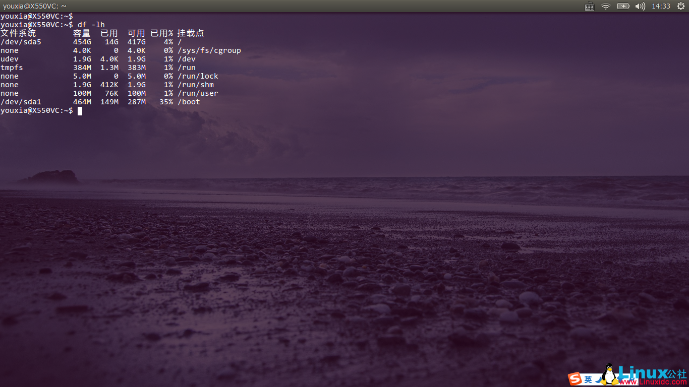
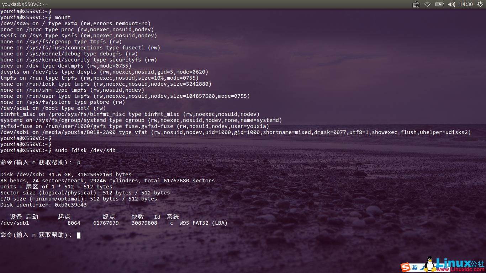
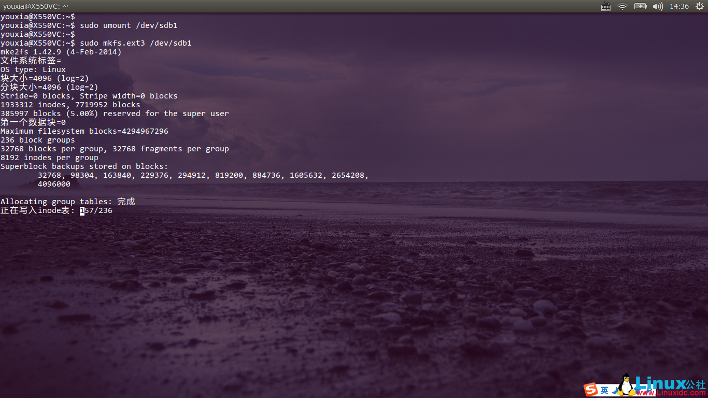
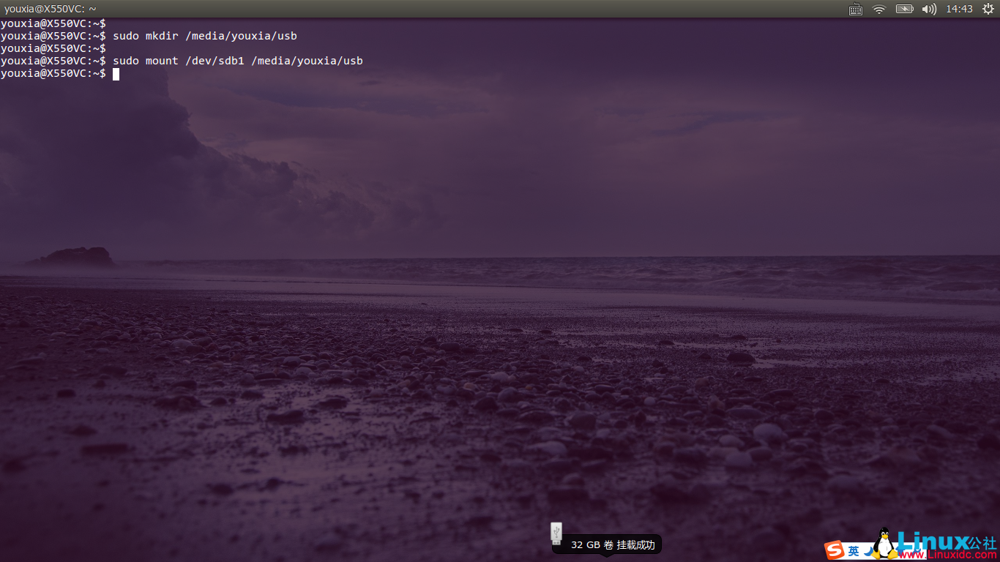
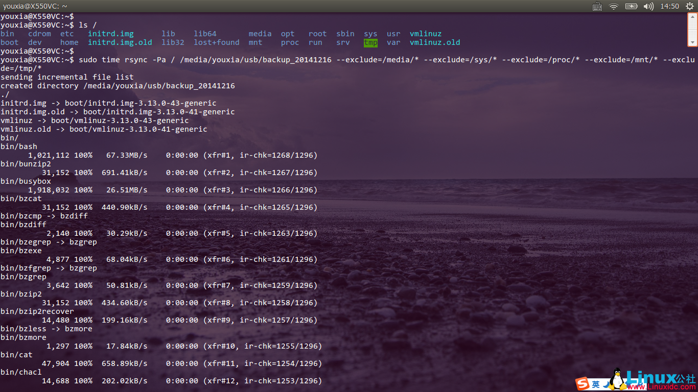
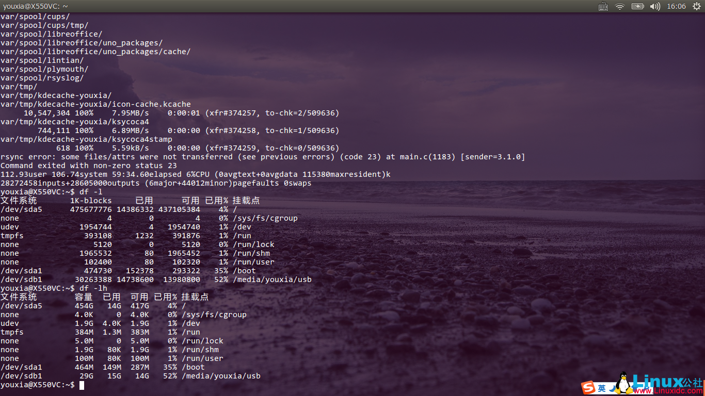

# 备份Linux系统

在前面的一些文章中，我反复提到经常会把Linux系统搞崩溃，所以备份系统就是一件不容忽视的事情。由于Linux系统本身的优越性，系统的备份和还原还是比较容易的。主要表现在以下方面：

- Linux系统所有的数据都以文件的形式存在，所以备份就是直接拷贝文件；硬盘分区也被当成文件，所以可以直接克隆硬盘数据。 
- Linux系统自带很多实用工具，比如tar、dd、rsync等，备份还原系统不需要购买或下载第三方软件。 
- Linux系统在运行时其硬盘上的文件可以直接被覆盖，所以还原系统的时候不需要另外的引导盘。（当然，系统完全挂掉到无法启动这种情况还是需要另外的引导盘的。） 

备份Linux系统的策略有很多，比如使用dd命令直接克隆硬盘分区：

```
sudo dd if=/dev/sda1 of=/dev/sdb1
```

或者，使用tar将硬盘上的文件打包：

```
cd /
sudo tar cvpzf backup.tgz --exclude=/proc --exclude=/mnt --exclude=/sys --exclude=/backup.tgz /
```

还原系统的命令是：

```
sudo dd if=/dev/sdb1 of=/dev/sda1
或
tar xvpfz backup.tgz -C /
```

但是我最终选择的是rsync命令。rsync是一个非常优秀的文件同步工具，从它的名字可以看出，它支持远程同步。当然，在备份我的桌面系统时，只需要用到它的本地同步功能就行了。之所以选择rsync，是因为它具有如下优点：

- 在备份还原过程中，可以保存文件原有的时间、权限、软硬链接等信息； 
- 首次备份时，需要复制所有文件，但是再次备份或还原系统时，只需要复制修改过的文件。 

关于rsync的使用方法，其主要参考文档是`man rsync`，另外，rsync也可以作为守护进程运行用来建立文件备份服务器，可以参考文档`man rsyncd.conf`。

## 桌面系统备份实战

对于我的桌面系统，我选择的备份策略是使用rsync命令将硬盘上的所有文件(当然要排除/proc和/sys目录下的内容）复制到U盘上。首先使用`df -lh`命令查看一下我电脑的系统占多大空间，如下图：


从上图可以看出，根目录所在的分区占用了14G，而/boot目录所在的分区才占用100多M。其实Linux系统本来不用这么臃肿，只是因为我安装了太多的软件包，比如一整套的texlive啊什么的，才占用了这么多的空间。不过这都不是事儿，反正现在U盘也便宜，所以找个32G的USB 3.0的U盘来备份我这个系统，肯定是很轻松愉快的。

新U盘插到电脑上会被自动识别，使用不带参数的`mount`命令可以查看U盘的设备文件和挂载路径，使用`fdisk`命令了解U盘的大小和分区情况。如下图：


整个U盘分成一个区我没什么意见，不过我不喜欢它的vfat文件系统，万一碰到超过4G的巨型文件怎么办？so，先`umount`它，然后使用`mkfs.ext3`为它重新建立一个文件系统，如下图：


再把U盘`mount`起来，挂载的路径为`/media/youxia/usb`。如下图：


然后，可以开始备份了，我备份的命令是：

```
sudo rsync -Pa / /media/youxia/usb/backup_20141216 --exclude=/media/* --exclude=/sys/* --exclude=/proc/* --exclude=/mnt/* --exclude=/tmp/*
```

如下图：


下图是备份完成后的效果，可以看到整个备份过程花了59分多钟，U盘被占用15G，如下图：


如果哪天系统再崩溃了的话，只需要使用`sudo rsync -Pa /media/youxia/usb/backup_20141216 /`即可恢复系统。