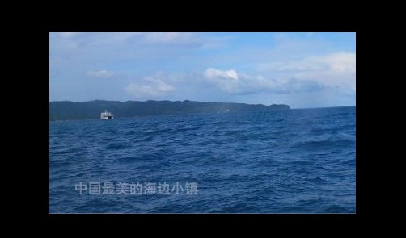
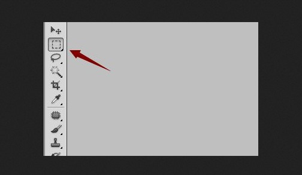
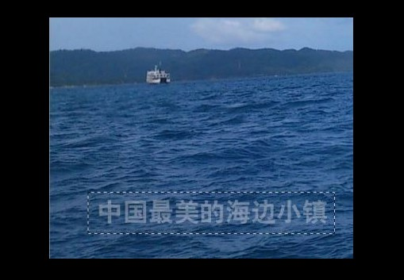
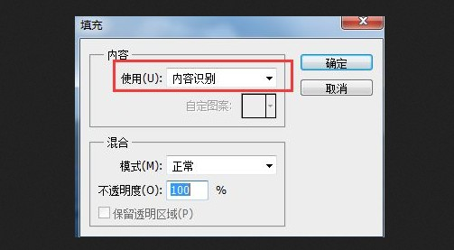
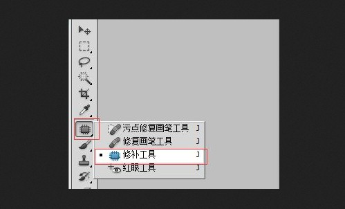
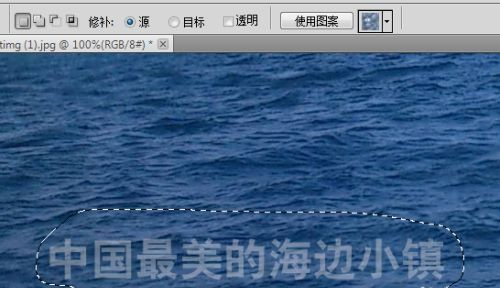
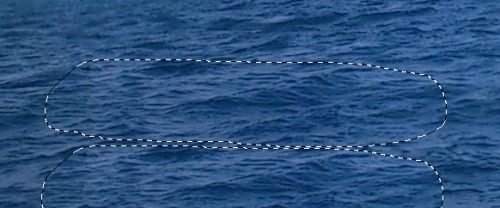
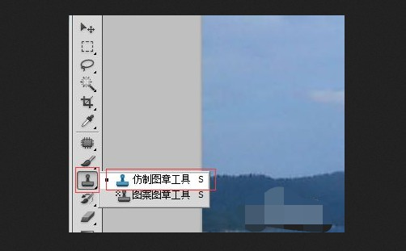
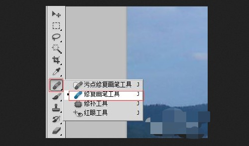

# PhotoShop如何去水印的4个方法

## 方法一：

1、 双击打开photoshop软件，导入含有水印的图片

2、 然后，在左侧工具栏中选择矩形选框工具，如图所示，框中水印部分

3、 接着，执行编辑-填充，也可以直接按下Shift+F5，选择内容识别

4、 点击确定并识别后，直接按Ctrl+D取消选区，你就会发现图片的水印不见了。

## 方法二：

1、 同样打开photoshop软件，导入含有水印的图片，如图所示，选择修补工具

2、 然后，选取水印位置，也就是把水印部位圈出来并设置参数

3、 接着，我们圈出来的水印位置，拉到内容相似的位置，如图所示，ps就会自动识别修补，最后图片的水印也就去除了

## 方法三：

1、 用ps打开含水印的图片之后，点击左侧仿制图章工具

2、 然后，把鼠标移至类似内容的位置，按一下Alt仿制吸取，接着再次按鼠标左键在水印位置涂抹，如图所示，涂抹完成之后，你的图片水印也就去除了

## 方法四：

1、 我们用ps打开含有水印的图片，点击左侧修复画笔工具

2、 然后，和方法三一样，选取一个合适的位置，按住Alt并左键吸取，最后涂抹水印，ps就会自动识别修复，图片的水印就可以去掉了

​    以上就是小编教你ps如何去水印的4个方法。其实，使用PS也就是PhotoShop来去除水印，还是比较简单的，你可以通过矩形选框、修补工具、仿制图章以及修复画笔等方法，来去除图片水印!