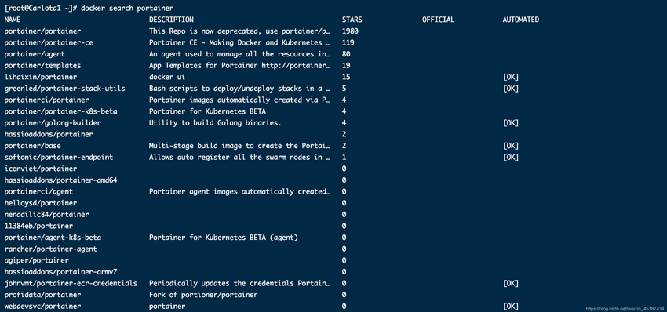
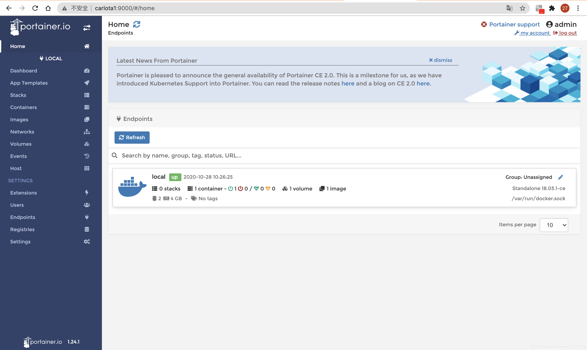

# Portainer 单机部署

# 一、介绍

Portainer是Docker的图形化管理工具，提供状态显示面板、应用模板快速部署、容器镜像网络数据卷的基本操作（包括上传下载镜像，创建容器等操作）、事件日志显示、容器控制台操作、Swarm集群和服务等集中管理和操作、登录用户管理和控制等功能。功能十分全面，基本能满足中小型单位对容器管理的全部需求。

# 二、本地模式部署

## 1、查询当前有哪些Portainer镜像

    docker search portainer



## 2、下载镜像

上图就是查询出来的有下载量的portainer镜像，我们下载第一个镜像：docker.io/portainer/portainer。

    docker pull docker.io/portainer/portainer

## 3、运行容器

如果仅有一个docker宿主机，则可使用单机版运行，Portainer单机版运行十分简单，只需要一条语句即可启动容器，来管理该机器上的docker镜像、容器等数据。


```bash
docker run -d -p 9000:9000 \
--restart=always \
-v /var/run/docker.sock:/var/run/docker.sock \
--name prtainer-test \
docker.io/portainer/portainer
```

## 4、单机版运行

访问方式：http://IP:9000
单机版这里选择local即可，选择完毕，点击Connect即可连接到本地docker:


