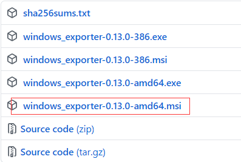
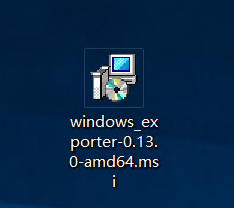
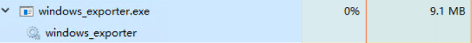
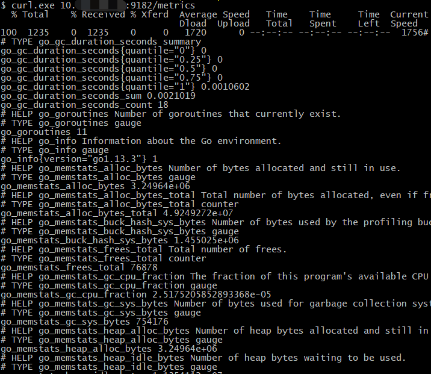
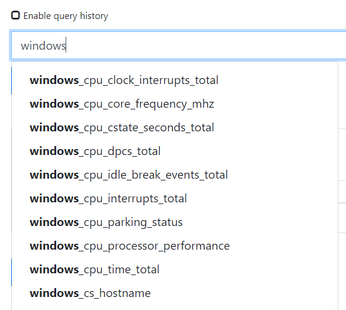
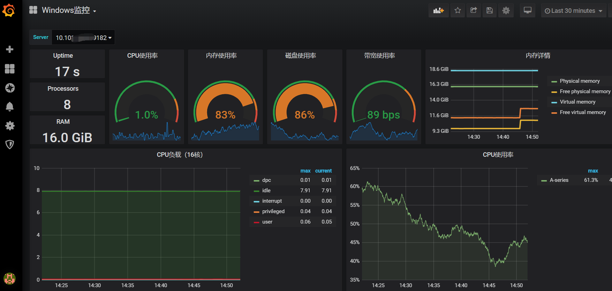
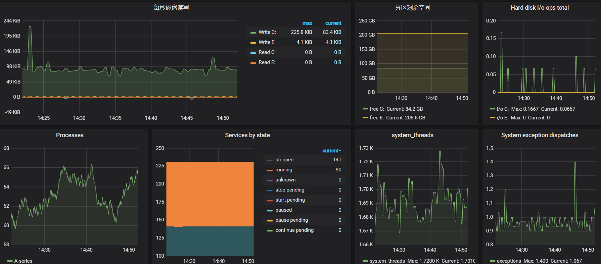

# [Prometheus监控Windows主机]

**1. 基本说明**

　　使用Prometheus监控Windows主机和Linux主机并无太大区别，都是使用社区的Exporter进行采集数据，之后暴露一个接口，可以让Prometheus采集到主机的数据。

　　其中监控Linux的Exporter是：https://github.com/prometheus/node_exporter

　　监控Windows主机的Exporter是：https://github.com/prometheus-community/windows_exporter

**2. 安装Windows Exporter**

　　无论是监控Linux还是Windows，对应的exporter都提供了二进制文件和msi文件，Windows可以直接下载最新的msi文件，然后安装到对应的Windows主机上即可。

　　MSI文件下载地址：https://github.com/prometheus-community/windows_exporter/releases

　　下载对应的msi即可：

　　

 

 　下载完成后，双击打开即可完成安装：

　　

 

 　之后可以在任务管理器上看到对应的进程：

　　

 

 　测试是否有数据产生，默认的端口为9182，path为metrics：

　　

 

 

**3. 配置Prometheus采集数据**

 

 　在Prometheus的配置文件中添加如下配置：

```
- job_name: 'WindowsServerMonitor'
  static_configs:
    - targets:
      - "10.101.3.3:9182"
      labels:
        server_type: 'windows'
  relabel_configs:
    - source_labels: [__address__]
      target_label: instance
```

　　检查Prometheus是否有数据产生：

　　

 

 

**4. 配置Grafana展示数据**

　　下载模板：https://grafana.com/grafana/dashboards/12566

　　数据展示如下：



 

 

 

 

　　