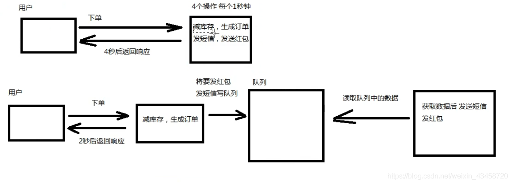
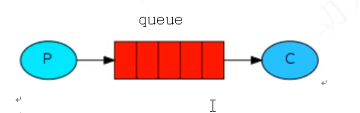
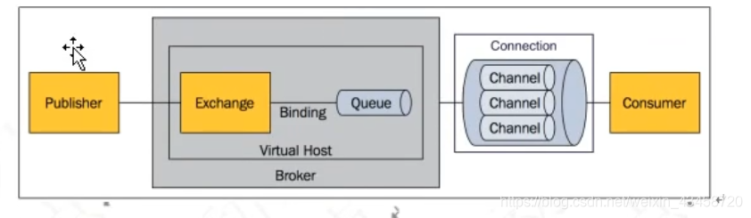
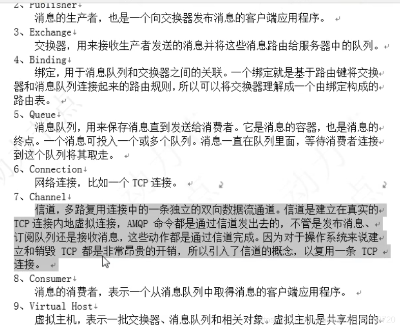
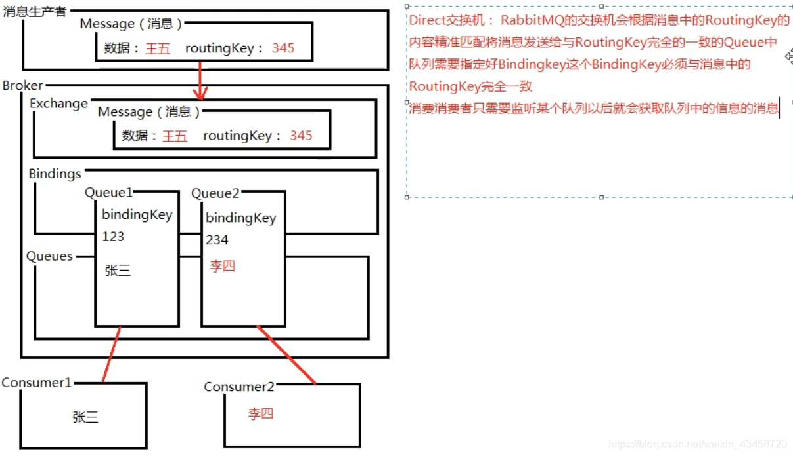

# RabbitMQ基础概念篇

## 消息队列简介

消息队列是一种用于应用程序间通信的方法，其中“消息”指的是应用程序之间传输的数据包。“消息队列”则是这种数据传输机制的核心组件，它提供了异步处理、解耦和负载均衡的能力。

  - 消息  指的是应用之间传输的数据
  - 消息队列  应用之间通信的一种方式
## 为什么要用消息队列 异步协作机制

消息队列允许发送者和接收者之间实现松散耦合，即发送者无需等待接收者的响应即可继续执行后续逻辑，而接收者可以独立于发送者的时间线处理消息。这种机制类似于快递员与菜鸟驿站的关系，快递员只需将包裹送至驿站，而无需知道包裹何时会被收件人领取。

>  消息的发布者不知道谁接受的，消息的接收者不需要知道谁发出的，两者都不需要知道互相之间的存在

异步协作机制


就像是，快递员与菜鸟驿站

## RabbitMQ特性

RabbitMQ是一个由Erlang语言编写的开源消息代理软件，它实现了高级消息队列协议（AMQP）。AMQP是一种开放标准的应用层协议，为消息代理的设计提供了统一的框架，不受特定编程语言或平台的限制。

AMQP：Advanced Message Queue ，高级消息队列协议。应用层。方便中间件设计。（一种标准，不受语言限制，符合标准就可以）

- **集群能力**：支持多节点集群，提高可用性和扩展性。
- **高可用性**：通过镜像队列和其他机制确保即使在部分节点故障时，消息依然可以被处理。
- **灵活的路由**：提供丰富的路由策略，使得消息可以根据预定义的规则被定向到不同的队列。
- **管理界面**：提供图形化的管理界面，便于监控和管理。
- **跟踪机制**：可以追踪消息的流转过程，便于调试和问题排查。
- **可靠性**：保证消息的持久存储和可靠投递。


## RabbitMQ安装启动关闭

### 安装步骤

1. **安装Erlang**：RabbitMQ依赖于Erlang运行环境。
2. **安装RabbitMQ**：通过包管理器或官方源进行安装。

### RabbitMQ的启动和关闭
#### 启动RabbitMQ

```bash
[root@rabbit1 ~]# rabbitmq-server start &
[1] 1732
[root@rabbit1 ~]# 
              RabbitMQ 3.3.5. Copyright (C) 2007-2014 GoPivotal, Inc.
  ##  ##      Licensed under the MPL.  See http://www.rabbitmq.com/
  ##  ##
  ##########  Logs: /var/log/rabbitmq/rabbit@rabbit1.log
  ######  ##        /var/log/rabbitmq/rabbit@rabbit1-sasl.log
  ##########
              Starting broker... completed with 0 plugins.

[root@rabbit1 ~]# 
```
##### 报错处理

```bash
这里如果出现报错 可能是/var/lib/rabbitmq/.relang.cookie无权限
解决方案，chown或者chmod
```
#### 关闭RabbitMQ

```bash
rabbitmq-server stop
```


## RabbitMQ插件管理

RabbitMQ通过插件系统提供了丰富的扩展性。常用的操作包括：

### 添加插件

```
rabbitmq-plugins enable {插件名}
```
### 删除插件

```
rabbitmq-plugins disable {插件名}
```
### 开启浏览器控制面板

```
rabbitmq-plugins enable rabbit_management

访问地址 http://IP:15672
但登录不进去，因为没用户
```
## RabbitMQ用户和权限管理


### 添加用户

```bash
rabbitmqctl add_user <username> <password>
[root@rabbit1 ~]# rabbitmqctl add_user root root
Creating user "root" ...
...done.
```

### 删除用户

```bash
rabbitmqctl delete_user <username>
```

### 更改密码

```bash
rabbitmqctl change_password <username> <new_password>
```

### 设置用户角色

```bash
rabbitmqctl set_user_tags <username> <tags>
[root@rabbit1 ~]# rabbitmqctl set_user_tags root administration
Setting tags for user "root" to [administration] ...
...done.
```

tag可以取的值: management monitoring policymarker administator

```text
FROM : https://www.cnblogs.com/iiwen/p/5287790.html
RabbitMQ各类角色描述：
none
不能访问 management plugin

management
用户可以通过AMQP做的任何事外加：
列出自己可以通过AMQP登入的virtual hosts  
查看自己的virtual hosts中的queues, exchanges 和 bindings
查看和关闭自己的channels 和 connections
查看有关自己的virtual hosts的“全局”的统计信息，包含其他用户在这些virtual hosts中的活动。

policymaker 
management可以做的任何事外加：
查看、创建和删除自己的virtual hosts所属的policies和parameters

monitoring  
management可以做的任何事外加：
列出所有virtual hosts，包括他们不能登录的virtual hosts
查看其他用户的connections和channels
查看节点级别的数据如clustering和memory使用情况
查看真正的关于所有virtual hosts的全局的统计信息

administrator   
policymaker和monitoring可以做的任何事外加:
创建和删除virtual hosts
查看、创建和删除users
查看创建和删除permissions
关闭其他用户的connections
```
## RabbitMQ权限管理

### 授权

```bash
rabbitmqctl set_permissions [-p <vhost>] <user> <conf> <write> <read>
-p vhostpath : 一个命名空间 ，eg: -p / 表示根命名空间
{user} 用户名
{conf} 一个正则表达式match ，哪些资源能够被用户配置
{write} 一个正则表达式match，哪些资源能够被用户读取
{read} 一个正则表达式match，哪些资源能够被用户访问
```

### 查看权限

```bash
rabbitmqctl list_permissions <vhost>
查看根路径下的用户权限
rebbitmqctl list_permissions 
查看指定命名空间下的所有用户权限
rabbirmqctl list_permissions /abc
```

### 查看指定用户的权限

```bash
rabbitmqctl list_user_permissions {username}
```

### 清空指定用户的权限

```
rabbitmqctl clear_permissions <username>
[root@rabbit1 ~]#  rabbitmqctl clear_permissions  root
Clearing permissions for user "root" in vhost "/" ...
...done.
```
## 虚拟主机（Virtual Hosts）

虚拟主机类似于隔离的容器，可以用来组织和隔离不同的消息队列和交换器。

### 添加虚拟主机

```bash
rabbitmqctl add_vhost <vhost_name>
```

### 删除虚拟主机

```bash
rabbitmqctl delete_vhost <vhost_name>
```


## RabbitMQ消息订阅和发送机制
消费者订阅队列，生产者发送消息，然后发布到队列，最后将消息发送给消费者，




