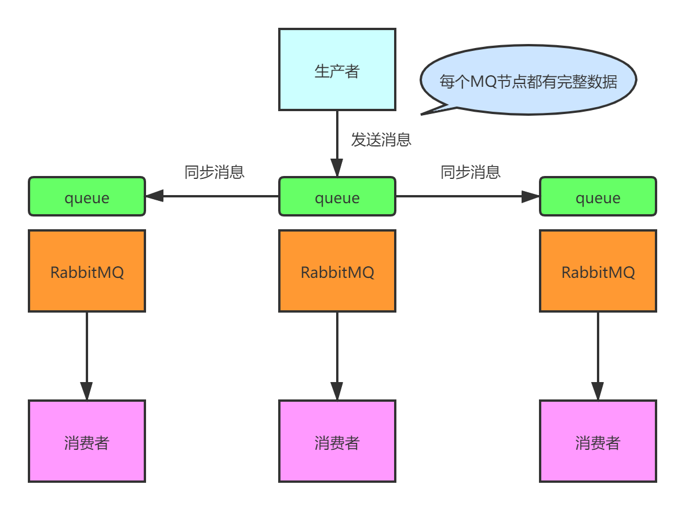
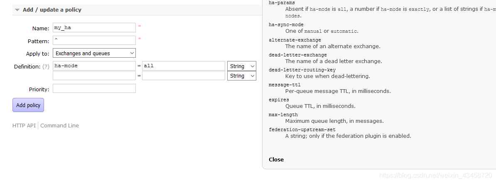
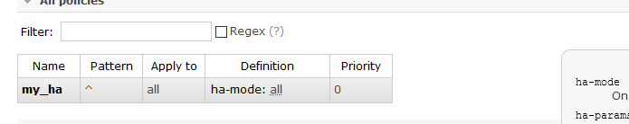
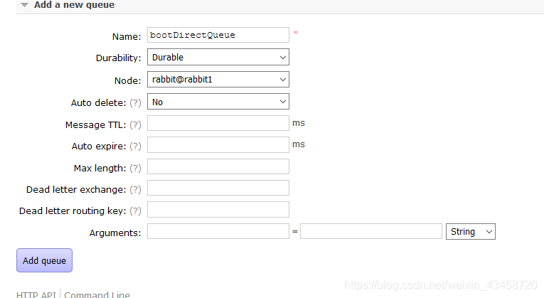

# RabbitMQ镜像集群搭建指南

## 概述

RabbitMQ是一个开源的消息代理和队列服务器，提供多种传输协议，如AMQP 0-9-1，MQTT，STOMP等。当需要构建高可用和高吞吐量的系统时，RabbitMQ的集群功能变得尤为重要。本文档将指导你如何在三台服务器上设置RabbitMQ镜像集群。

这种模式，才是所谓的 RabbitMQ 的高可用模式。跟普通集群模式不一样的是，在镜像集群模式下，你创建的 queue，无论元数据还是 queue 里的消息都会存在于多个实例上，就是说，每个 RabbitMQ 节点都有这个 queue 的一个完整镜像，包含 queue 的全部数据的意思。然后每次你写消息到 queue 的时候，都会自动把消息同步到多个实例的 queue 上。

## 环境准备

采用3节点rabbit1、rabbit2、rabbit3进行搭建。



### 安装与配置

确保在所有节点上已经安装了RabbitMQ，并且版本相同。

## 步骤

### 创建管理员用户

在每个节点上创建一个具有管理员权限的用户：

```bash
rabbitmqctl set_user_tags root administrator
rabbitmqctl set_permissions -p / root ".*" ".*" ".*"
```

### 分享Erlang Cookie

为了保证节点之间的安全通信，你需要在所有节点上分享相同的Erlang Cookie。例如，在Node1上查看并复制Cookie：

```bash
cat /var/lib/rabbitmq/.erlang.cookie
```

然后，使用`scp`命令将Cookie文件复制到其他节点：

```bash
scp /var/lib/rabbitmq/.erlang.cookie rabbit2:/var/lib/rabbitmq/
scp /var/lib/rabbitmq/.erlang.cookie rabbit3:/var/lib/rabbitmq/
```

### 停止并重启RabbitMQ服务

在进行集群配置前，确保停止RabbitMQ服务：

```bash
rabbitmq-server stop
```

然后重新启动服务：

```bash
rabbitmq-server -detached
```

启动app

```bash
# rabbitmqctl stop_app
rabbitmqctl start_app
```

### 配置集群

在Node2和Node3上使用以下命令加入Node1的集群：

```bash
rabbitmqctl join_cluster rabbit@rabbit1
```

### 5. 验证集群状态

在每个节点上使用以下命令检查集群状态：

```bash
rabbitmqctl cluster_status
```

预期输出如下所示：

```bash
[root@rabbit1 ~]# rabbitmqctl cluster_status
Cluster status of node rabbit@rabbit1 ...
[{nodes,[{disc,[rabbit@rabbit1,rabbit@rabbit2,rabbit@rabbit3]}]},
 {running_nodes,[rabbit@rabbit3,rabbit@rabbit2,rabbit@rabbit1]},
 {cluster_name,<<"rabbit@rabbit1">>},
 {partitions,[]}]
...done.
```

```bash
[root@rabbit2 ~]# rabbitmqctl cluster_status
Cluster status of node rabbit@rabbit2 ...
[{nodes,[{disc,[rabbit@rabbit1,rabbit@rabbit2,rabbit@rabbit3]}]},
 {running_nodes,[rabbit@rabbit3,rabbit@rabbit1,rabbit@rabbit2]},
 {cluster_name,<<"rabbit@rabbit1">>},
 {partitions,[]}]
...done.
[root@rabbit2 ~]# 
```

```bash
[root@rabbit3 ~]# rabbitmqctl cluster_status
Cluster status of node rabbit@rabbit3 ...
[{nodes,[{disc,[rabbit@rabbit1,rabbit@rabbit2,rabbit@rabbit3]}]},
 {running_nodes,[rabbit@rabbit1,rabbit@rabbit2,rabbit@rabbit3]},
 {cluster_name,<<"rabbit@rabbit1">>},
 {partitions,[]}]
...done.
[root@rabbit3 ~]# 
```

### 6. 配置高可用队列


#### 添加高可用规则






确保在所有节点上配置镜像队列策略，所有节点策略保持一致，这样即使某个节点宕机，消息仍能在集群内传递。


#### 配置队列





## 结论

现在你已经成功搭建了一个由三个节点组成的RabbitMQ镜像集群，该集群能够提供高可用性和容错能力，适合生产环境部署。