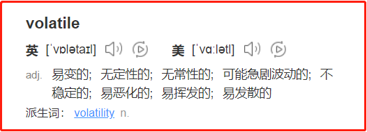
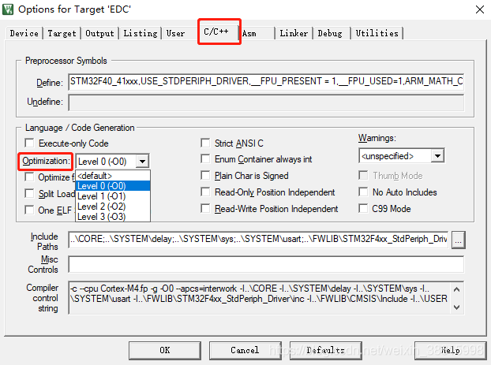

1.volatile和什么有关

百度翻译是这样子翻译volatile的：



volatile属于C语言的关键字，《C Primer Plus》 是这样解释关键字的：关键字是C语言的词汇，由于编译器不具备真正的智能，所以你必须用编译器能理解的术语表示你的意图。开发者告诉编译器该变量是易变的，无非就是希望编译器去注意该变量的状态，时刻注意该变量是易变的，每次读取该变量的值都重新从内存中读取。（ahhhh，是不是一脸蒙蔽，举个例子吧）

    int i = 10;
    int main(void){
     
        int a, b;
     
        a = i;
        ...//伪代码，里面不含有对 a 、 b 以及 i的操作
        b = i;
     
        if(a == b){
            printf("a = b");
        }
        else {
            printf("a != b");
        }
        
        return 0;
    }

如上代码，如果选择编译器优化，可能会被编译成如下代码（当然不是在C语言层面上优化，而是在汇编过程优化，只是使用C程序举例）：

    int i = 10;
    int main(void){
     
        int a, b;
     
        a = i;
        ...//伪代码，里面不含有对 a 、 b 以及 i的操作
        b = i;
     
        printf("a = b");
       
        return 0;
    }

因为在仅仅从main主函数来看，a == b是必然的，那么在什么情况，a 和 b不是必然相等呢？

    1. i 是其他子线程与主线程共享的全局变量，其他子线程有可能修改 i 值；
    
    2. i 是中断函数与主函数共享的全局变量，中断函数有可能修改 i 值；
    
    3. i 属于硬件寄存器，CPU可能通过硬件直接改变 i 的值（例如寄存器的标志位）

但是仔细想一想，好像我们都遇到过上述情况，也没有对相对应的变量使用volatile修饰呀？也没出现奇怪的问题呀？本小白猜测，大佬您是不是没有开启编译器优化，编译器其实是默认不优化的，这对入门者是友好的，但是当进入企业开发中，我们可能就会遇到 leader 在编译源码时，选择了编译器优化，以减少可执行程序大小和提高性能，这时候我们就不得不去考虑编译器优化问题，如何启动编译器优化，我们结合 GCC 编译器和 keil 开发软件讲解。
```
使用GCC编译器时，在编译脚本命令加入 -On  ; n: 0 ~ 3，数字代表优化等级，数字越大，优化级别越高。

例如：

gcc -O2 -O hello hello.c

使用 O2 优化级别编译 hello.c 
```

使用keil 软件，我们可以通过如下操作选择优化级别：



2.volatile关键字什么情况下要用

    此博文为了限幅，达到更好的阅读效果，仅仅对如下几个方面进行简单分析，如需更加深入了解，可以访问实验博文进行查看。

2.1自定义延时函数

    #include <stdio.h>
     
    void delay(long val);
    int main(){
    					
    	delay(1000000);
     
    	return 0;
    }
     
    void delay(long val){
     
    	while(val--);
    }

相信大佬们对如上程序都挺熟悉的，特别是玩过单片机的同学，主要是通过CPU不断进行无意义的操作达到延时的效果，这种操作如果不启用编译器优化是可以达到预期效果的，但是启用编译器优化就会被优化成如下效果（当然不是在C语言层面上优化，而是在汇编过程优化，只是使用C程序举例）：

    #include <stdio.h>
     
    void delay(long val);
    int main(){
    					
    	delay(1000000);
     
    	return 0;
    }
     
    void delay(long val){
     
    	;
    }

这个时候，delay函数就起不了效果了，需要使用 volatile 修饰 val ；具体可见：
编译器优化对自定义延时程序的影响(volatile详解实验一)


2.2多线程共享的全局变量

    多线程数据安全问题一直是计算机领域十分常见的问题，为了解决这类问题，衍生出互斥锁、条件变量、临界区以及自旋锁等解决办法，如上都是为了线程数据同步，但是要做到线程数据同步，我们还需要注意一个编译器优化问题。
    
    我们都知道，每一个线程虽然共享一个进程的资源，但是每个线程同样拥有自己的私有堆栈，保证每个线程函数中定义的局部变量相互之间不可见；线程间通信是十分简单的，其中一个十分常见的方式就是通过共享全局变量，全局变量对于每一个线程都是可见的，但是线程的每一次读写全局变量都是对全局变量直接操作吗，答案是否定的。
    
    例如下面这个操作（伪代码）：
    
        //一个全局变量a
        int a = 1;
         
        int main(){
         
            int b,c,d,e,f;
            
            //多次赋值
            b = a;
            c = a;
            d = a;
            e = a;
            f = a;
            ....
        }
         
        void *child_pth_fun{
         
            //子线程修改a值
            a = 2;
            ......
         
        }
    
    如果每次赋值都去内存中读入 a , 对于程序来说开销实在太大了，这时候编译器优化会引入一个中间变量，加快程序执行效率，也正是因为优化原因，如果这个全局变量是多线程共享的，子线程可能在任意时刻改变a的值，但是主程序引入的中间变量值确实过去a的值，就可能出现数据未同步问题。

会出现什么问题、怎么解决此类问题、怎么去复现数据不同步问题、想看看博主有多傻逼 都看看   
编译器优化对多线程数据同步的影响(volatile详解实验二）
2.3中断函数与主函数共享的全局变量

    中断函数和主函数共享的全局变量需要使用 volatile 修饰的情况是相似的。大家可以感受实验二，去做一个中断的实验。（对于只学过stm32，没有接触linux的同学可以在下面评论，博主按照需求去开实验三）

编译器优化对中断数据同步的影响(volatile详解实验三）
2.4硬件寄存器

    什么叫硬件寄存器，学过硬件的同学应该不陌生，我们在做按键检测的时候是不是下面这种流程：
    
    1.设置GPIO对应的寄存器配置成输入模式 
    
    2.不断地去访问GPIO电平标志寄存器（或者是一个寄存器的标志位）
    
    3.根据寄存器值的某个二进制位确定当前引脚电平
    
    那么有没有想过一个问题，是什么去改变硬件寄存器的值？其实，硬件寄存器上的值的是和底层电路相关的，硬件寄存器的值会影响电路，电路也会反过来影响硬件寄存器的值。
    
    所以在这种情况下，编译器更不应该拷贝副本，而应该每次读写都从内存中读写，保证数据正确，声明成volatile可以防止出现数据出错问题。

例如：

    //GPIOE13 ---->LEDD7
    //GPIOA28 ----> KEY2
    //注意：裸机程序是直接在硬件上运行的程序，是不能使用标准C库。
     
    #define GPIOEALTFN0 (*(volatile unsigned int *)0xC001E020)
    #define GPIOEOUTENB (*(volatile unsigned int *)0xC001E004)
    #define GPIOEOUT	(*(volatile unsigned int *)0xC001E000)
     
    #define GPIOAALTFN1 (*(volatile unsigned int *)0xC001A024)
    #define GPIOAOUTENB (*(volatile unsigned int *)0xC001A004)
    #define GPIOAPAD	(*(volatile unsigned int *)0xC001A018)
     
    void _start(void) //gcc编译器中，裸机程序的入口是start，不是main
    {
    	GPIOEALTFN0 &= ~(3<<26);
    	GPIOEOUTENB |= (1<<13);
    	
    	GPIOAALTFN1 &= ~(3<<24);
    	GPIOAOUTENB &= ~(1<<28);


​     
​    	while(1)
​    	{
​    		//读取GPIO引脚电平
​    		if(!(GPIOAPAD & (1<<28)))
​    			GPIOEOUT &= ~(1<<13);
​    		else
​    			GPIOEOUT |= (1<<13);
​    	}
​    }

这种情况加volatile的情况是最多的，比如stm32函数库底层的寄存器定义就是加了volatile的：

所以，也没有实验ahhh！
编译器优化对硬件寄存器数值的影响(volatile详解实验四）