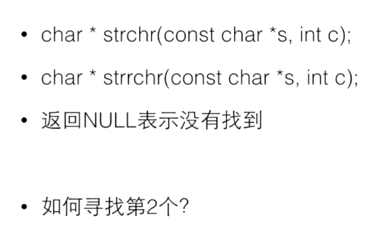

# C语言学习 翁恺教程
## 目录和文件说明
### note-1

- 1.c 
  - 嵌入式赋值
    - 不利于阅读
    - 容易出现错误
  - 猜数字游戏
    - 100以内的数字最多7次会被猜出来 2^7
    - rand() % 100 + 1 是1-100 的数字
  - 算最简分数
    - 基础算法
    - 欧几里得算法

### note-2

- [include/function.h](note-2/include/function.h  "title" ) [1.c](note-2/1.c);
  - 求素数
  - 数组与大小计算问题
  - 搜索数组问题

### note-3

- [1.c](note-3/1.c)
  - 数字计数器

### note-4

- [1.c](note-4/1.c) [1.h](note-4/1.h)
  - //swap
  - //min max
  - //指针应用2，函数返回运行状态，指针返回结果
  - 内存分配
  - 释放内存
  - 内存分配实验，最大,可以测试内存+虚拟内存最大
  - 申请了没有free->长时间运行内存逐渐下降
  - 新手： 忘了
  - 老手： 找不到合适的free时机
  - free过了再free是不行的
  - 地址变过了，直接去free

### note-5

```bash
 不能用运算符对字符串进行运算
 通过数组的方式可以遍历字符串
 唯一特殊的地方是字符串字面量可以用力啊初始化字符数组
 
 s是一个指针，初始化为指向一个字符串变量
 由于这个变量所在的地方，所以实际上s是const char * s ，但是由于历史原因，编译器接受不带const的写法
 但是试图对s所指的字符串做写入会导致严重后果
 
 两处相同的东西会指向同一个地方
 
 指针还是数组？
 数组： 这个字符串就在这里 作为本地变量空间自动回收
 指针： 这个字符串不知道在哪里 处理参数 动态分配空间
```


#### 字符串的输入和输出


字符串的不安全性


```bash
正确写法
printf("%7s",string1);
```


#### 安全的字符串输入


#### 常见错误


#### 空字符串


#### 细节

```c
**a 和 a[][]
```


[][]


#### 字符串的应用


```c
int main(int argc, char const *argv[]) {
    int i ;
    for ( i= 0; i< argc;i++){
        printf("%d:%s",i,argv[i]);
    }
    return 0;
}

I:\note-book\Markdown-notebook\RD\C_Language\cmake-build-debug\C_Language.exe
0:I:\note-book\Markdown-notebook\RD\C_Language\cmake-build-debug\C_Language.exe
进程已结束,退出代码0

  
PS I:\note-book\Markdown-notebook\RD\C_Language\cmake-build-debug> .\C_Language.exe 123
0:I:\note-book\Markdown-notebook\RD\C_Language\cmake-build-debug\C_Language.exe
1:123
```

#### 单字符输入输出putchar


```c
int main(int argc,char const *argv[]){
    int ch;
    while ((ch = getchar()) != EOF) {
        putchar(ch);
    }
    return 0;
}
```


#### 字符串处理函数strlen


```c
//strlen
#include "string.h"
int main(int argc,char *argv[]){
    char line[] = "Hello";
    printf("strlen=%u\n", strlen(line));
    printf("sizeof=%u\n", sizeof(line));
    return 0;
}


I:\note-book\Markdown-notebook\RD\C_Language\cmake-build-debug\C_Language.exe
strlen=5
sizeof=6

进程已结束,退出代码0
  
  

  
```


```c
//strcmp
int main(int argc,char * argv[]){
    char s1[ ] = "abc";
//    char s2[ ] = "abc";
    char s2[ ] = "Abc";
    // 因为地址永远不同，所以输出为0
    printf("%d\n",s1 == s2);
    printf("%d\n", strcmp(s1,s2));

    if (strcmp(s1,s2) == 0 ){

    }
    return 0;
}

I:\note-book\Markdown-notebook\RD\C_Language\cmake-build-debug\C_Language.exe
0
1

进程已结束,退出代码0

```

#### 字符串函数strcpy


```c
//初级版本
char *mycpy(char *dst, const char *src) {
    int idx = 0;
    while (src[idx] != '\0') {
        dst[idx] = src[idx];
        idx++;
    }
    dst[idx] = '\0';
    return dst;
}

int main(int argc, char *argv[]) {
    char s1[] = "abc";
    char s2[] = "abc";
    mycpy(s1,s2);
    return 0;
}
//高级版本
char *mycpy1(char *dst, const char *src) {
    char * ret = dst;
    while (*src) *dst++ = *src++;
    *dst = '0';
    return ret;
}

int main(int argc, char *argv[]) {
    char s1[] = "abc";
    char s2[] = "abc";
    mycpy(s1, s2);
    return 0;
}
```

复制字符串的过程


```bash
先申请内存+1，再cp
```

#### 字符串处理函数strcat


```c
\\strcpy和strcat，strcmp 是不安全的，如果目的地址没有内存空间
增加size_t n参数;
```


#### 字符串搜索函数



```c
int main(int argc, char *argv[]) {
    char s[] = "hello";
    char *p = strchr(s, 'l');
    char c = *p;
    *p = '\0';
    p = strchr(p + 1, 'l');
    printf("p=%s\n", p);
    // 将搜索的结果复制到另外的地方去
    char *t = (char *) malloc(strlen(p) + 1);
    strcpy(t, p);
    printf("t=%s\n", t);
    free(t);
    // 找到除了搜索外的其他的
    char *e = (char *) malloc(strlen(s) + 1);
    strcpy(e, s);
    printf("e=%s\n", e);
    free(e);
    *p = c;
    return 0;
}
```

#### 字符串中找字符串

```c
char * strstr(const char * s1,const char *s2);

char * strcasestr(const char * s1,const char *s2);
```

## 枚举

常量符号化

### 普通写法

```c
#include "stdio.h"


//const int red = 0;
//const int yellow = 1;
//const int green =2;

#define red 0
#define yellow 1
#define green 2


int main(int argc, char *argv[]) {
    int color = -1;
    char *colorName = NULL;

    printf("Input Color Code");
    scanf("%d", &color);
    switch (color) {

        case red :
            colorName = "red";
            break;
        case yellow:
            colorName = "yellow";
            break;
        case green:
            colorName = "green";
            break;
        default:
            colorName = "unKnown";
            break;
    }
    printf("Your favourite color is %s", colorName);
    return 0;
}
```

### 使用枚举来写

```c
enum COLOR {RED, YELLOW, GREEN};

int main(int argc, char *argv[]) {
    int color = -1;
    char *colorName = NULL;

    printf("Input Color Code");
    scanf("%d", &color);
    switch (color) {

        case RED :
            colorName = "red";
            break;
        case YELLOW:
            colorName = "yellow";
            break;
        case GREEN:
            colorName = "green";
            break;
        default:
            colorName = "unKnown";
            break;
    }
    printf("Your favourite color is %s", colorName);
    return 0;
}

```

### 枚举实例

```c
enum COLOR {
    RED, YELLOW, GREEN, NumCOLORS // NumCOLORS的表示数字就是在它之前有几个类型 计数枚举
};
//enum COLOR {
//    RED=1, YELLOW, GREEN, NumCOLORS=5 // 可以做离散定义，中间空缺
//};

void f(enum COLOR c);

int main(int argc, char *argv[]) {
    enum COLOR t;
    t = YELLOW;
//    scanf("%d", &t);
    f(t);
    return 0;
}

void f(enum COLOR c) {
    printf("%d\n", c);
}
```

## 数据结构

### 结构体和定义方式

```c
//结构体和定义方式
int main(int argc, char * argv[]){

    struct date {
        int month;
        int day;
        int year
    };
  
    // struct  {
    //     int x;
    //     int y;
    //     int z;
    // } p1, p2;
  
    // struct point {
    //     int x;
    //     int y;
    //     int z;
    // } p1, p2;
  
    struct date today;
  
    today.month = 05;
    today.day = 06;
    today.year = 2022;
    printf("Today's date is %i-%i-%i",today.month,today.day,today.year);
    return 0;
}
```

### 结构的初始化

```c
//结构的初始化
//结构变量无初始值为0
struct date {
    int month;
    int day;
    int year
};

int main(int argc, char *argv[]) {


//    struct date today;
//    today.month = 05;
//    today.day = 06;
//    today.year = 2022;
    struct date today = {05, 06, 2022};
    struct date thisMonth = {.month=5, .year=2022};

    printf("Today's date is %i-%i-%i\n", today.month, today.day, today.year);
    printf("Month's date is %i-%i-%i\n", thisMonth.month, thisMonth.day, thisMonth.year);
    return 0;
}


I:\note-book\Markdown-notebook\RD\C_Language\cmake-build-debug-mingw\C_Language.exe
Today's date is 5-6-2022
Month's date is 5-0-2022

进程已结束,退出代码0
```

### 结构运算

- 要访问整个结构，直接用结构变量名字
- 对于整个结构，可以做赋值、取地址，也可以传递给函数参数
  - p1 = (struct point ) {5, 10}; //相当于 p1.x = 5; p1.y = 10;
  - p1 = p2; //相当于p1.x = p2.x; p1.y = p2.y;
  - ✨数组不能这样运算

```c
int main(int argc, char *argv[]) {


//    struct date today;
//    today.month = 05;
//    today.day = 06;
//    today.year = 2022;
    struct date today = {05, 06, 2022};
//    struct date thisMonth = {.month=5, .year=2022};
    struct date thisMonth;
    thisMonth = today;

    printf("Today's date is %i-%i-%i\n", today.month, today.day, today.year);
    printf("Month's date is %i-%i-%i\n", thisMonth.month, thisMonth.day, thisMonth.year);
    return 0;
}


I:\note-book\Markdown-notebook\RD\C_Language\cmake-build-debug-mingw\C_Language.exe
Today's date is 5-6-2022
Month's date is 5-6-2022

进程已结束,退出代码0

```

### 结构指针

- 和数组不同，结构变量的名字并不是结构变量的地址，必须使用&运算符
- struct date * pDate = &today;

```c
struct date {
    int month;
    int day;
    int year
};

int main(int argc, char *argv[]) {


//    struct date today;
//    today.month = 05;
//    today.day = 06;
//    today.year = 2022;
    struct date today = {05, 06, 2022};
    struct date * pDate = &today;

    printf("Today's date is %i-%i-%i\n", today.month, today.day, today.year);
    printf("Day's date is %i-%i-%i\n", pDate->month, pDate->day, pDate->year);
    return 0;
}
```

### 结构作为函数参数

`int numberOfDays(struct date d)`

- 整个结构可以作为参数的值传入函数
- 这时候是在函数内新建一个结构变量，并复制调用者的结构的值

```c
struct date {
    int month;
    int day;
    int year;
};

bool isLeap(struct date d);

int numberOfDays(struct date d);

int main(int argc, char *argv[]) {
    struct date today, tomorrow;

    printf("Enter today's date [mm dd yyyy]:");
    scanf("%i %i %i", &today.month, &today.day, &today.year);
    if (today.day != numberOfDays(today)) {
        tomorrow.day = today.day + 1;
        tomorrow.month = today.month;
        tomorrow.year = today.year;
    } else if (today.month == 12) {
        tomorrow.day = 1;
        tomorrow.month = 1;
        tomorrow.year = today.month + 1;

    } else {
        tomorrow.day = 1;
        tomorrow.month = today.month + 1;
        tomorrow.year = today.year;
    }
    printf("Tomorrow date is %i-%i-%i\n", tomorrow.month, tomorrow.day, tomorrow.year);
    return 0;
}

int numberOfDays(struct date d) {
    int days;
    const int daysPerMonth[12] = {31, 28, 31, 30, 31, 30,
                                  31, 31, 30, 31, 30, 31};
    if (d.month == 2 && isLeap(d)) days = 29;
    else days = daysPerMonth[d.month - 1];
    return days;
}

bool isLeap(struct date d) {
    bool leaps = false;
    if ((d.year % 4 == 0 && d.year % 100 != 0) || d.year % 400 == 0) {
        return true;
    } else {
        return false;
    }
}


I:\note-book\Markdown-notebook\RD\C_Language\cmake-build-debug-mingw\C_Language.exe
Enter today's date [mm dd yyyy]:05 06 2022
Tomorrow date is 5-7-2022

进程已结束,退出代码0

```

### 输入结构

- 没有直接的方式可以一次scanf一个结构
- 如果我们打算写一个函数读入结构
  - `->`

```c
struct point {
    int x;
    int y;
};


void getStruct(struct point p);

void output(struct point p);

int main(int argc, char *argv[]) {
    struct point y = { 0, 0 };
    printf("%d %d\n",y.x,y.y);
    getStruct(y);
    printf("%d %d\n",y.x,y.y);
    output(y);
    return 0;
}

void output(struct point p) {
    printf("%d %d\n",p.x,p.y);
}

void getStruct(struct point p) {
    scanf("%d",&p.x);
    scanf("%d",&p.y);
    printf("%d %d\n",p.x,p.y);
}


I:\note-book\Markdown-notebook\RD\C_Language\cmake-build-debug-mingw\C_Language.exe
0 0
1 2  //输入
1 2
0 0
0 0

进程已结束,退出代码0
```


```c
// 初等解决方案
struct point {
    int x;
    int y;
};

struct point getStruct(void);

void output(struct point p);


int main(int argc, char *argv[]) {
    struct point y = { 0, 0 };
    printf("%d %d\n",y.x,y.y);
    y = getStruct();  //
    printf("%d %d\n",y.x,y.y);
    output(y);
    return 0;
}

void output(struct point p) {
    printf("%d %d\n",p.x,p.y);
}

struct point getStruct(void ){//
    struct point p ;
    scanf("%d",&p.x);
    scanf("%d",&p.y);
    return p;
}

// 高级解决方案

如下 👇
```

### 指向结构的指针

```bash
// 用->表示指针所指的结构变量中的成员
struct date {
    int month;
    int day;
    int year;
} myDay;

int main(int argc,char * argv[]){
    struct date * p = &myDay;
    (*p).month = 12;
    printf("%d",p->month);
    return 0;
}


struct point {
    int x;
    int y;
};


struct point *getStruct(struct point *pPoint);  // 常用套路

void output(const struct point point1);

int main(void) {
    struct point y = {0, 0};
//    getStruct(&y);
//    printf("%d-%d\n", y.x, y.y);
//    output(y);

    output(*getStruct(&y));
    return 0;
}

void output(const struct point point1) {
    printf("%d-%d\n", point1.x,point1.y);

}

struct point *getStruct(struct point *pPoint) {
    printf("%d-%d\n", pPoint->x, pPoint->y);
    scanf("%d", &pPoint->x);
    scanf("%d", &pPoint->y);
    printf("%d-%d\n", pPoint->x, pPoint->y);
    return pPoint;
}

I:\note-book\Markdown-notebook\RD\C_Language\cmake-build-debug-mingw\C_Language.exe
0-0
1 2 //
1-2
1-2
1-2
1-2
2 4 //
2-4
2-4

进程已结束,退出代码0

```


## 结构中的结构

### 结构数组

> struct date dates [100];
>
> struct date dates[] = {
>
> ​    {4,5,2005},
>
> ​    {2,4,2005}
>
> };
>

```c
struct time {
    int hour;
    int minutes;
    int seconds;
};


struct time timeUpdate(struct time now);

int main(void) {
    struct time testTimes[5] = {
            {11, 59, 59},
            {12, 0,  0},
            {1,  29, 59},
            {23, 59, 59},
            {19, 12, 27}
    };
    int i;
    for (i = 0; i < 5; ++i) {
        printf("Time is %.2d-%.2d-%.2d\n",
               testTimes[i].hour, testTimes[i].minutes, testTimes[i].seconds);

        testTimes[i] = timeUpdate(testTimes[i]);
        printf("... One second later is %.2d-%.2d-%.2d\n",
               testTimes[i].hour, testTimes[i].minutes, testTimes[i].seconds);
    }
    return 0;
}

struct time timeUpdate(struct time now) {
//    struct time result;
    if (now.seconds == 59 && now.minutes != 59) {
        now.minutes += 1;
        now.seconds = 0;
    } else if (now.seconds == 59 && now.minutes == 59) {
        now.hour += 1;
        now.minutes = 0;
        now.seconds = 0;
    } else {
        now.seconds += 1;
    }
    return now;
}


I:\note-book\Markdown-notebook\RD\C_Language\cmake-build-debug-mingw\C_Language.exe
Time is 11-59-59
... One second later is 12-00-00
Time is 12-00-00
... One second later is 12-00-01
Time is 01-29-59
... One second later is 01-30-00
Time is 23-59-59
... One second later is 24-00-00
Time is 19-12-27
... One second later is 19-12-28

进程已结束,退出代码0
```

### 结构中的结构

> struct dateAndTime {
>
> ​    struct daste sdate;
>
> ​     struct time stime;
>
> };


## 自定义数据类型（typedef）

> 例如： `typedef int Length`
>
> - 使得Length成为int类型的别名
>
> - 这样Length这个名字就可以代替int出现在变量定义和参数声明的地方了
>
>   ```c
>   Length a,b,len;
>   Length number[10];
>   ```
>
>   


```c


struct time {
    int hour;
    int minutes;
    int seconds;
};

struct date {
    int day;
    int month;
    int year;
};

struct point {
    int x;
    int y;
};

typedef struct dataAndTime {
    struct date sdata;
    struct time stime;
} dataAndTime;

typedef struct rectangle {
    struct point pt1;
    struct point pt2;
} rectangle;

typedef struct node {
    int data;
    struct node *next;

} aNode;

int main(void) {


    return 0;
}

```


## 联合union

> ```c
> union AnElt {
>     int i;
>     char c;
>     
> } elt1, elt2;
> 
> int main(void ){
>     elt1.i = 4;
>     elt2.c = 'a';
>     elt2.i = 0xDEADBEEF;
>     printf("123");
>     return 0;
> }
> ```
>
> 选择：
>
> 成员是 
>
> - 一个int i 
> - 还是一个char c
>
> sizeof(union ...) = sizeof(每个成员)的最大值

> - 存储
>   - 所有成员共享一个空间
>   - 同一时间只有一个成员是有效的
>   - ubion的大小是其对打的成员
> - 初始化
>   - 对第一个成员做初始化

Example

```c
typedef union {
    int i;
    char ch[sizeof(int)];
} CHI;

int main(int argc,char const * argv[]){
    CHI chi;
    int i;
    chi.i = 1234;
    for (i = 0; i< sizeof(int ); i++ ) {
        printf("%02hhX",chi.ch[i]);
    }
    printf("\n");
    return 0;
}
```

## 宏

> ① __ FILE __: 表示当前源文件编译的目录; 
>
>
> ② __ TIME __: 文件被编译的时间； 
>
>
> ③ __ DATE __: 文件被编译的日期； 
>
>
> ④ __ LINE __: 当前文件所在的行号； 
>
> ⑤ __ STDC__ 如果此[编译器](https://so.csdn.net/so/search?q=编译器&spm=1001.2101.3001.7020)遵循ANSI  C，其值为一，否则未定义； 

```c
#include<stdio.h>
#include<windows.h>
int main()
{
	printf("%d\n",__LINE__);
	printf("%s\n",__FILE__);
  printf("%s\n",__DATE__);
	printf("%s\n",__TIME__);
	printf("%d\n",__STDC__);
	system("pause");
	return 0;
}
```

### 带参数的宏

- #define cube (x) ((x)\*(x)\* (x))
- 宏可以带参数

```c
#define cube(x) ((x)*(x)*(x))
int main(int argc, char const * argv[]){
    printf("%d\n", cube(5));

    return 0;
}
```

### 错误定义的宏

- #define RADTODEG(x)  (x * 57.29578)
- #define RADTODEG(x)  (x) * 57.29578

```c

#define RADTODEG1 (x)  (x * 57.29578)
#define RADTODEG2 (x)  (x) * 57.29578


int main(int argc, char const *argv[]) {
    printf("%f\n", RADTODEG1(5 + 2));
    printf("%f\n", 180 / RADTODEG2(1));
    return 0;
}
```

- 也可以带多个参数
  - #define MIN(a,b) ((a)>(b)?(b):(a))
- 也可以嵌套使用其他宏


- 在大型程序的代码中使用非常普遍
- 可以非常复杂，如“产生”函数
  - 在# 和 ## 这两个运算符的帮助下
- 存在中西方文化的差异
- 部分宏会不inline函数替代

### #define中的 #与##

```c
 在#define中，标准只定义了#和##两种操作。#用来把参数转换成字符串，##则用来连接两个前后两个参数，把它们变成一个字符串。 
```


在#define中，标准只定义了#和##两种操作。

#用来把参数转换成字符串，

##则用来连接两个前后两个参数，把它们变成一个字符串。

```c
#include <stdio.h>
#define paster(n) printf("token"#n"=%d\n",token##n)
 
int main()
{
	int token9=10;
	paster(9);
	getchar();
	return 0;
}

```

输出：

token9=10

再举一例：

 __SOCKADDR_COMMON (sin_);

实际上为：

sa_family_t sin_family;

由于做了宏定义：

```c
#define	__SOCKADDR_COMMON(sa_prefix) \
  sa_family_t sa_prefix##family
```

## 多个源代码文件

- 多个.c文件
  - main()里的代码太长了适合分成几个函数
  - 一个源代码文件太撑了适合分成几个文件
  - 两个独立的源代码文件不能编译形成可执行的程序

### 条件定义

- ifndef  __MAX_H\_    ---  define \_\_MAX_H\_

## 文件的输入输出

- 用 > 和 < 做重定向

### 文件的输入输出

示例代码

```c
FILE * fp = fopen("file", r);


int main(void ) {
    if (fp) {
        fscanf(fp,...);
        fclose(fp);
    } else {
        ...
    }
}


// FILE fopen(const char * restrict path, const char * restrict mode)
// int fclose(FILE * stream)
// fscanf(FILE * , ...)
// fprintf(FILE * , ...)

int main(void ) {
    FILE * fp = fopen("I:\\note-book\\Markdown-notebook\\RD\\C_Language\\note-6\\12.ini", "r");
    if (fp) {
        int num;
        fscanf(fp, "%d", &num);
        printf("%d ",num);
        fclose(fp);
    } else {
        printf("Can not open The File\n");
    }
    return 0;
}
```

#### fopen

| 方式 | 含义                                                 |
| ---- | ---------------------------------------------------- |
| r    | 只读打开                                             |
| r+   | 打开读写，从文件头开始                               |
| w    | 打开只写，不存在则新建，如果存在则清空               |
| w+   | 打开读写，如果不存在则新建，如果存在则清空           |
| a    | 打开追加，如果不存在则新建，如果存在则从文件尾部开始 |
| ..x  | 只新建，如果文件已存在则不能打开                     |


### 二进制文件

- 其实所有的文件最终都是二进制的
- 文本文件无非是用最简单的方式可以读写的文件
  - more、tail
  - cat
  - vi 
- 而二进制文件是需要专门的程序来读写的文件
- 文本文件的输入输出是格式化，可能经过转码

### 文本VS二进制

- Unix喜欢用文本文件来做数据存储和程序配置

  - 交互式终端的出现使得人们喜欢用文本和计算机talk
  - Unix的shell提供了一些读写文本的小程序

- Windows喜欢用二进制文件

  - DOS是草根文化，并不继承和熟悉Unix文化

  - PC刚开始的时候能力有限，DOS的能力钢有限，二进制更接近底层

- 文本的优势是方便人类读写，而且跨平台
- 文本的缺点是程序输入输出要经过格式化，开销大
- 二进制的缺点是人类读写困难，而且不跨平台
  - int的大小不一致，大小端的问题……
- 二进制的优点是程序读写快

### 程序为什么要文件

- **配置**：Unix用文本，Windows用注册表
- **数据**：稍微有点量的数据都放数据库了
- **媒体**：这个只能是二进制的
- **现实是**，程序通过第三方库来读写文件，很少直接读写二进制文件了

### 二进制读写

- size_t fread(void *restrict ptr,size_t size,size_t nitems,FILE *restrict stream);
- size_t fwrite(const void *restrict ptr,size_t size,size_t nitems,FILE *restrict stream);
- 注意FILE指针是最后一个参数
- 返回的是成功读写的字节数

### 为什么nitem?

- 因为二进制文件的读写一般都是通过对一个结构变量的操作来进行的
- 于是nitem就是用来说明这次读写几个结构变量


```c
//
// Created by SuperNu1L on 2022/5/9.
//
#define STR_LEN 20
#ifndef C_LANGUAGE_1_H
#define C_LANGUAGE_1_H


//const int STR_LEN = 20;


typedef struct _student {
    char name[STR_LEN];
    int gender;
    int age;
} Student;

#endif //C_LANGUAGE_1_H


//
// Created by SuperNu1L on 2022/5/9.
//

#include <stdbool.h>
#include "1.h"
#include "stdio.h"


void getList(Student pStudent[], int number);

bool save(Student pStudent[], int number);

int main(int argc, char *argv[]) {
    int number = 0;
    printf("Number of student:");
    scanf("%d", &number);
    Student aStu[number];

    getList(aStu, number);
    if (save(aStu, number)) {
        printf("Save Success");
    } else {
        printf("Save Fail");
    }
    return 0;
}

bool save(Student aStu[], int number) {
    int ret = -1;
    FILE *fp = fopen("I:\\note-book\\Markdown-notebook\\RD\\C_Language\\note-7\\student.txt", "w");
    if (fp) {
        ret = fwrite(aStu, sizeof(Student), number, fp);
        fclose(fp);
    }
    return ret == number;
}

void getList(Student aStu[], int number) {
    char format[STR_LEN];
    sprintf(format, "%%%ds", STR_LEN - 1);
    for (int i = 0; i < number; ++i) {
        printf("The %d 's Student:\n",i + 1 );
        printf("\t Name:");
        scanf(format, aStu[i].name);
        printf("gender:(0-man,1-wenmon,2-other):\n");
        scanf("%d", &aStu[i].gender);
        printf("Age:");
        scanf("%d", &aStu[i].age);
    }
}


```


### 在文件中定位

- 知道现在处在文件的什么位置上，也可以直接跑到文件的某个地方去
- long ftell(FILE *stream);
- int fseek(FILE *stream,long offset,nt whence);
  - SEEK_SET:从头开始
  - SEEK_CUR:从当前位置开始
  - SEEK_END:从尾开始（倒过来）

```c
//
// Created by SuperNu1L on 2022/5/9.
//


#include <stdio.h>
#include "1.h"

void read(FILE *fp, int i);

int main(void) {
    FILE *fp = fopen("student.txt", "r");
    if (fp) {
        fseek(fp, 0L, SEEK_END);
        long size = ftell(fp);
        int number = size / sizeof(Student);
        int index = 0;
        printf("There are %d data,How the index number do you want? :", number);
        scanf("%d", &index);
        read(fp, index - 1);
        fclose(fp);
    }
    return 0;
}

void read(FILE *fp, int index) {
    fseek(fp, index*sizeof(Student), SEEK_SET);
    Student stu;
    if (fread(&stu, sizeof(Student) , 1, fp) == 1) {
        printf("The %d 's Student:\n",index + 1);
        printf("\t Name: %s\n",stu.name);

        printf("Age: %d", stu.age);
        switch (stu.gender) {
            case 0:
                printf("man\n");
                break;
            case 1:
                printf("wamen\n");
                break;
            case 2:
                printf("other\n");
                break;
            default:
                printf("%d\n",stu.gender);
        }

    }
}

```

### 可移植性

- 这样的二进制文件不具有可移植性
  - 在int为32位的机器上写成的数据文件无法直接在int为64位的机器上正确读出
- 解决方案之一是放弃使用int，二是typedef具有明确大小的类型
- 更好的方案是用文本

# 按位运算

## **按位运算**

**·**  C有这些按位运算的运算符：

·  &    按位的与

·  |    按位的或

·  ~    按位取反

·  ^    按位的异或

·  <<    左移

·  >>    右移

### 按位与  &


### 按位或  |


### 按位取反  ~


## 逻辑运算vs按位运算

**·**  对于逻辑运算，它只看到两个值：0和1

**·**  可以认为逻辑运算相当于把所有非0值都变成1，然后做按位运算

**·**  5 & 4 —>4而5 && 4 —> 1 & 1 —> 1

**·**  5 | 4 —> 5而 5 || 4 —> 1 | 1 —> 1

**·**  ~4 —> 3而 ！4 —> !1 —> 0

### 按位异或^


### 移位运算


### 左移  <<

·i  <<  j

·i中所有的位向左移动j个位置，而右边填入0

·所有小于int的类型，移位以int的方式来做，结果是int

·x  <<=  1  等价于 x  *=  2

·x  <<=  n  等价于 x  *=  2^n         （这是2的n次方）

### 右移  >>

·i  >>  j

·i中所有的位向右移j位

·所有小于int的类型，移位以int的方式来做，结果是int

·对于unsigned的类型，左边填入0

·对于signed的类型，左边填入原来的最高位（保持符号不变）

·x  >>=  1  等价于 x  /=  2

·x  >>=  n  等价于 x  /=  2^n

### "no zuo no die"

**·**  移位的位数不要用负数，这是没有定义的行为

​    x  <<  -2    //!!NO!!

## 位运算的例子

```c
// 输出一个数的二进制
#include "stdio.h"


int main(int argc, char const *argv[])
{
    int number;
    scanf("%d",&number);
    unsigned mask = 1u <<31;
    for ( ; mask ; mask >>=1 ) {
        printf("%d",number & mask?1:0);
    }
    printf("\n");

    return 0;
}
```

### MCU的SFR


**·**  const unsigned int SBS = 1u << 2;

**·**  const unsigned int PE = 1u << 3;

**·**  U0LCR |= SBS | PE;  //使得某些比特为1 实现了将SBS和PE加进U0LCR

**·**  U0LCR &= ~SBS;  // 使得某些比特为0 

**·**  U0LCR &= ~(SBS | PE);  //  使得某些比特为0


## 位段

###  位段

**·**  把一个int的若干位组合成一个结构

```c
struct {
    unsigned int leading  :  3;
    unsigned int FLAG1:  1;
    unsigned int FLAG2:  1;
    int trailing:  11;
};
```

**·**  可以直接用位段的成员名称来访问

**·**  比移位、与、或还方便

**·**  编译器会安排其中的位的排列，不具有可移植性c

**·**  当所需的位超过一个int时会采

```c
struct U0 {
    unsigned int leading: 3;
    unsigned int FLAG1: 1;
    unsigned int FLAG2: 1;
    int trailing: 32;
};

void printBin(unsigned int number);

int main(int argc, char *argv[]) {
    struct U0 uu;
    uu.leading = 2;
    uu.FLAG1 = 0;
    uu.FLAG2 = 1;
    uu.trailing = 0;
    printf("sizeof uu = %d\n", sizeof uu);
    printBin(*(int *) &uu);
    return 0;
}

void printBin(unsigned int number) {
    unsigned mask = 1u << 31;
    for (; mask; mask >>= 1) {
        printf("%d", number & mask ? 1 : 0);
    }
    printf("\n");
}


```


## 可变数组


### Resizable Array

**·**  Think about a set of functions that provide a mechanism of resizable array of int.

**·**  Growable

**·**  Get the current size

**·**  Access to the elements

### the Interface

**·**  Array array_create(int init_size);

**·**  void array_free(Array *a);

**·**  int array_size(const Array *a);

**·**  int *array_at(Array* a, int index);

**·**  void array_inflate(Array *a, int more_size);

### array_create()

```c
Array array_create(int init_size) {
    Array a;
    a.array = (int*)malloc(sizeof(int)*init_size);
    a.size = init_size;
    return a;
}
```

## 14.1-2 可变数组的数据访问

```c
#include "array.h"
#include<stdio.h>
#include<stdlib.h>

// typedef struct {
//  int *array;
//  int size;
// } Array;c

Array array_create(int init_size)
{
	Array a;
	a.size = init_size;
	a.array = (int*)malloc(sizeof(int)*a.size);
	return a;
}

void array_free(Array *a)
{
	free(a=>array);
	a->array = NULL;
	a->size = 0; 
}

//  封装  
int array_size(const Array *a)
{
	return a->size;
}
int* array_at(Array *a, int index);
{
	return a->array  
}

int array_get(Array *a, int index)
{
	return a->array[index];
}

void array_set(Array *a, int index, int value)
{
	a->array[index] = value;
}
void array_inflate(Array *a, int more_size);

int main(int argc, char const *argv[])
{
	Array a= array_create(100);
	printf("&d\n",array_size(&a);
	*array_at(&a, 0) = 10;
	printf("%d\n", *array_at(&a, 0));
	
	array_free(&a);
	
	return 0;
}
```

## 14.1-3 可变数组的自动增长

```c
#include "array.h"
#include<stdio.h>
#include<stdlib.h>

const BLOCK_SIZE = 20;
c
// typedef struct {
//  int *array;
//  int size;
// } Array;

Array array_create(int init_size)
{
	Array a;
	a.size = init_size;
	a.array = (int*)malloc(sizeof(int)*a.size);
	return a;
}

void array_free(Array *a)
{
	free(a=>array);
	a->array = NULL;
	a->size = 0; 
}

//  封装  
int array_size(const Array *a)
{
	return a->size;
}
int* array_at(Array *a, int index)
{
	if ( index >= a->size ) {
		array_inflate(a, (index/BLOCK_SIZE+1)*BLOCK_SIZE-a->size);
	}
	return &(a->array[index]);  
}

int array_get(Array *a, int index)
{
	return a->array[index];
}

void array_set(Array *a, int index, int value)
{
	a->array[index] = value;
}
void array_inflate(Array *a, int more_size)
{
	int *p = (int*)malloc(sizeof(int)(a->size + more_size));
	int i;
  // 可以使用库memcpy替代
	for ( i=0; i<a->size; i++ ) {
		p[i] = a->array[i];
	}
	free(a->array);
	a->array = p;
	a->size += more_size;
}

int main(int argc, char const *argv[])
{
	Array a= array_create(100);
	printf("&d\n",array_size(&a);
	*array_at(&a, 0) = 10;
	printf("%d\n", *array_at(&a, 0));
	int number = 0;
	int cnt = 0;
	while (number != -1) {
		scanf("%d",&number);
		if ( number != -1){
			*array_at(&a, cnt++) = number;
		}
	}
	array_free(&a);
	
	return 0;
}
```

## 14.2-1 可变数组的缺陷

### issues

**·**  Allocate new memory each time it inflates is an easy and clean way. But

**·**  It takes time to copy, and

**·**  may fail in memory restricted situation


### linked blocks

**·**  No copy


# 链表


## 链表的函数

```c
#include <stdio.h>
#include <malloc.h>
#include "main.h"

typedef struct _node {
    int value;
    struct _node *next;
} Node;

typedef struct _list {
    Node *head;
} List;

void add(List *pList, int number);

int main() {
    Node *head = NULL;
    List list;
    list.head = NULL;
    int number;
    do {
        scanf("%d", &number);
        if (number != -1) {
            add(&list, number);
        }
    } while (number != -1);
    printf("Hello, World!\n");
    return 0;
}

void add(List *pList, int number) {
    // add to linked-list
    Node *p = (Node *) malloc(sizeof(Node));
    p->value = number;
    p->next = NULL;
    // find the last
    Node *last = pList->head;
    if (last) {
        while (last->next) {
            last = last->next;
        }
        //attach
        last->next = p;
    }
}

```

## 链表的搜索

```c
#include <stdio.h>
#include <malloc.h>
#include "main.h"

typedef struct _node {
    int value;
    struct _node *next;
} Node;

typedef struct _list {
    Node *head;
//    Node *tail;
} List;

void add(List *pList, int number);

void print(List *pList);

int main() {
    Node *head = NULL;
    List list;
    list.head = NULL;
    int number;
    do {
        scanf("%d", &number);
        if (number != -1) {
            add(&list, number);
        }
    } while (number != -1);
    print(&list);


//    Node *p;
//    for (p = list.head; p; p = p->next) {
//        printf("%d\t", p->value);
//    }
//    printf("\n");

    Node *p;
    Node *q;
    q = NULL;
    int isFound = 0;
    for (p = list.head; p; q = p, p = p->next) {
        if (p->value == number) {
//            printf("found!!!\n");
//            isFound = 1;
            if (q) {
                q->next = p->next;
            } else {
                list.head = p->next;
            }
            free(p);
            break;
        } else {

//            printf("NotFount\n");
//            break;
        }
    }

    return 0;
}

void print(List *pList) {
    Node *p;
    for (p = pList->head; p; p = p->next) {
        printf("%d\t", p->value);
    }
    printf("\n");
}

void add(List *pList, int number) {
    // add to linked-list
    Node *p = (Node *) malloc(sizeof(Node));
    p->value = number;
    p->next = NULL;
    // find the last
    Node *last = pList->head;
    if (last) {
        while (last->next) {
            last = last->next;
        }
        //attach
        last->next = p;
    }
}


```

## 链表的清除

```c
#include <stdio.h>
#include <malloc.h>
#include "main.h"

typedef struct _node {
    int value;
    struct _node *next;
} Node;

typedef struct _list {
    Node *head;
//    Node *tail;
} List;

void add(List *pList, int number);

void print(List *pList);

void delete_node(List *pList);

void delete_linked_list(List *pList);

int main() {
    Node *head = NULL;
    List list;
    list.head = NULL;
    int number;
    do {
        scanf("%d", &number);
        if (number != -1) {
            add(&list, number);
        }
    } while (number != -1);
    print(&list);


//    Node *p;
//    for (p = list.head; p; p = p->next) {
//        printf("%d\t", p->value);
//    }
//    printf("\n");


    //删除一个节点
    delete_node(&list);
//    Node *p;
//    Node *q;
//    q = NULL;
//    int isFound = 0;
//    for (p = list.head; p; q = p, p = p->next) {
//        if (p->value == number) {
////            printf("found!!!\n");
////            isFound = 1;
//            if (q) {
//                q->next = p->next;
//            } else {
//                list.head = p->next;
//            }
//            free(p);
//            break;
//        } else {
//
////            printf("NotFount\n");
////            break;
//        }
//    }
    delete_linked_list(&list);
    Node *p;
    Node *q;
    for (p = head, p; p = q ) {
        q = q->next;
        free(p);
    }

    return 0;
}

void delete_linked_list(List *pList) {

}

void delete_node(List *pList) {
    Node *p;
    Node *q;
    q = NULL;
    int isFound = 0;
    int number;
    scanf("%d", &number);
    for (p = pList->head; p; q = p, p = p->next) {
        if (p->value == number) {
//            printf("found!!!\n");
//            isFound = 1;
            if (q) {
                q->next = p->next;
            } else {
                pList->head = p->next;
            }
            free(p);
            break;
        } else {

//            printf("NotFount\n");
//            break;
        }
    }
}

void print(List *pList) {
    Node *p;
    for (p = pList->head; p; p = p->next) {
        printf("%d\t", p->value);
    }
    printf("\n");
}

void add(List *pList, int number) {
    // add to linked-list
    Node *p = (Node *) malloc(sizeof(Node));
    p->value = number;
    p->next = NULL;
    // find the last
    Node *last = pList->head;
    if (last) {
        while (last->next) {
            last = last->next;
        }
        //attach
        last->next = p;
    }
}


```

