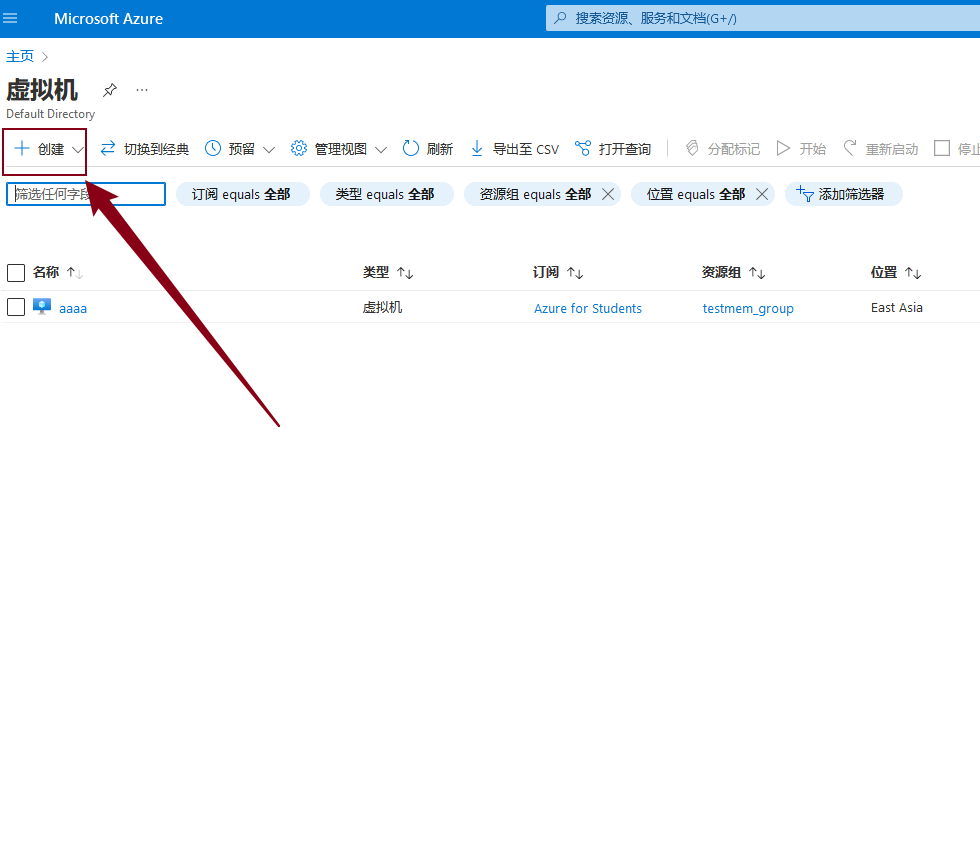
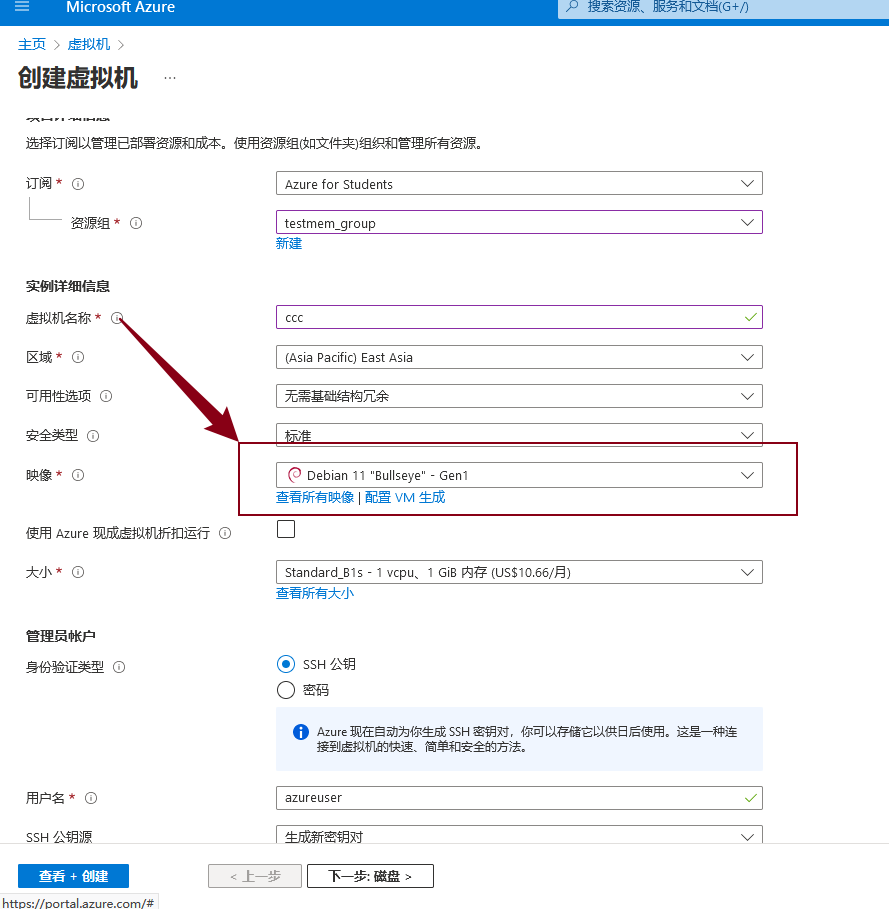
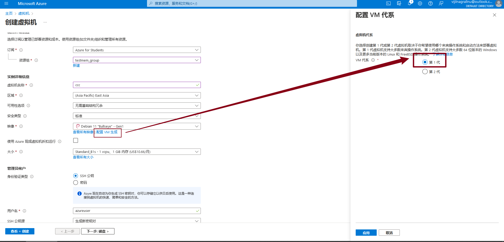
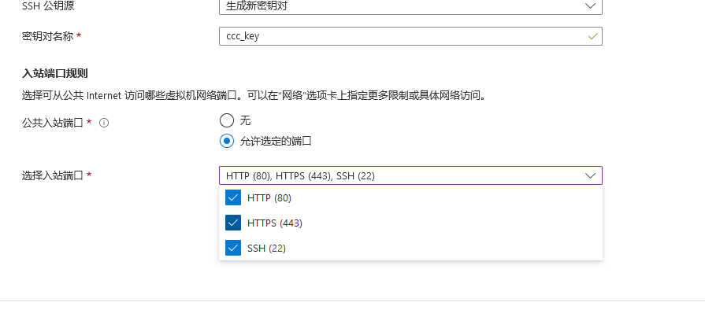
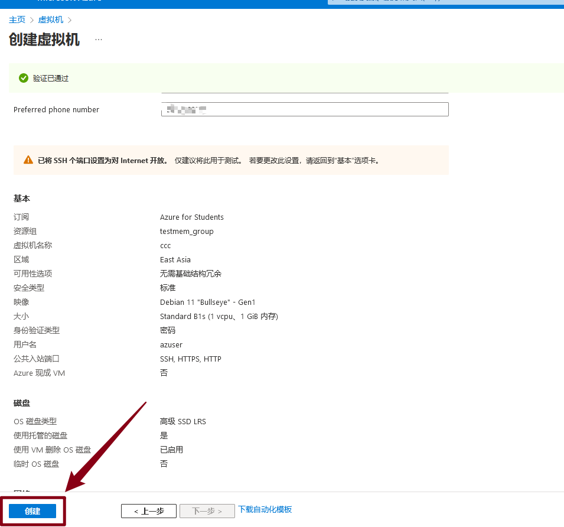
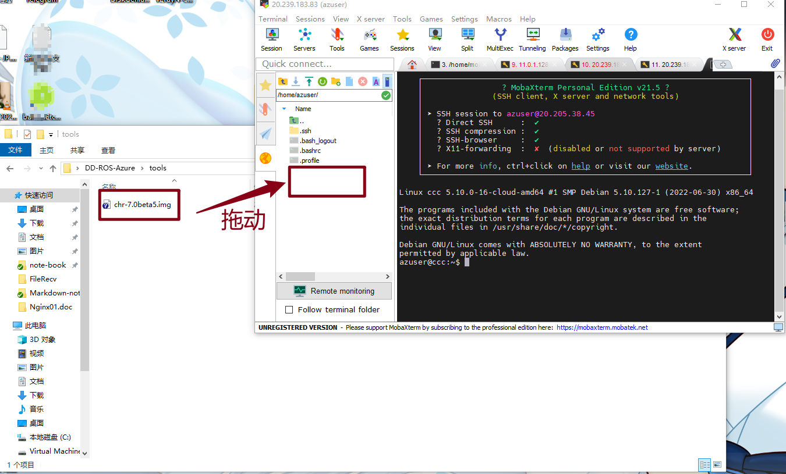
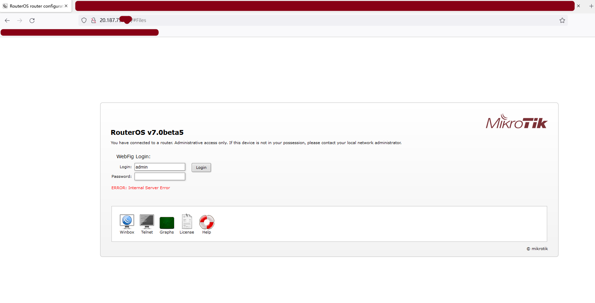

# Azure刷写ROS教程

## ①先决条件

- 必须为root身份
- 必须使用第一代VM虚拟机
- 必须使用 chr-7.0beta5.img 这个镜像（新版 chr-7.4.img 因为文件格式更改，刷写难度较高）

## ②刷写过程

### 1. 首先准备一个可以使用的Azure账户,创建虚拟机




### 2.在如图位置点击配置生成按钮，选择第一代（重要）

> - 需要选择第一代
> - 测试环境使用的Debian 11 Gen1（其他环境自测）






### 3.暴露你需要的端口（也可创建后全部暴露）





### 4.创建vm

> 其他选项无过分要求
>
> 随机选择即可
>
> - 点击创建按钮



### 5.上传在本教程[tools目录](tools/)的img文件

> 下载地址 https://download.mikrotik.com/routeros/7.0beta5/chr-7.0beta5.img.zip
>
> 因为网络原因，测试过程中下载速度极慢，建议上传使用


如果使用MobaXtream 这样上传，其他工具方法类似





然后输入命令 

```bash
azuser@ccc:~$ sudo su      # 切换root身份
root@ccc:/home/azuser# ls # 检查所需文件是否上传
chr-7.0beta5.img
root@ccc:/home/azuser# lsblk    # 查看系统所在的磁盘  有 / 的即为系统盘 ，这个系统为sdb（据测试，会变）
NAME    MAJ:MIN RM  SIZE RO TYPE MOUNTPOINT
sda       8:0    0    4G  0 disk
└─sda1    8:1    0    4G  0 part /mnt
sdb       8:16   0   30G  0 disk
├─sdb1    8:17   0 29.9G  0 part /
├─sdb14   8:30   0    3M  0 part
└─sdb15   8:31   0  124M  0 part /boot/efi
sr0      11:0    1  628K  0 rom
root@ccc:/home/azuser# dd if=chr-7.0beta5.img of=/dev/sdb # 刷写
131072+0 records in
131072+0 records out
67108864 bytes (67 MB, 64 MiB) copied, 71.6407 s, 937 kB/s
root@ccc:/home/azuser# reboot  # 重启


```

以上为手动刷写，一键脚本如下

```bash
sudo su
wget https://download.mikrotik.com/routeros/7.0beta5/chr-7.0beta5.img.zip -O chr.img.zip
gunzip -c chr.img.zip > chr.img
sysdiskIs=`df -h | grep efi | awk '{print $1}' | cut  -b 1-8`
dd if=chr.img of=${sysdiskIs} && reboot


```


## ③登录

打开浏览器输入服务器ip即可

