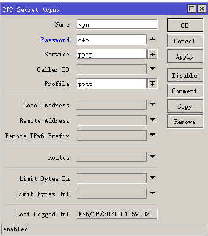

## RouterOS利用V-P-N（L2TP）实现多方异地组网

去年一个做网商的朋友找到我要搞定多方异地组网实现互通，还要实现在家办公。

当前环境是

A总部，RouterOS（ROS-A）当作主路由，使用的是CCR1009，100M专线；

B工厂，RouterOS（ROS-B）主路由，使用的是J1900软路由，200M商宽；

C办事处，RouterOS（ROS-C）主路由，使用的是J1900软路由，200M商宽，各自上网不互通。

 

### 一、新网络规划

经过和朋友的商量，需要不花钱的方案，对安全性也没太多的要求，只求能组网能用。

1、各个区域独自上网[break]

2、各个区域通过IP地址互通（L2TP）

3、外部用户通过VPN能连上内网（PPTP）


### 二、ROS基础配置

原来路由器上的一些配置，只列出了部分，保证各个地区都能上网。如果不会请看我以前的文章。

1、ROS-A配置

```
/ip address add address=1.1.1.2 interface=ether2
/ip address add address=10.1.0.1/22 interface=ether1 network=10.1.0.0
/ip pool add name=DHCP-Pool ranges=10.1.2.1-10.1.3.254
/ip dhcp-server add address-pool=DHCP-Pool disabled=no interface=ether1 name=DHCP-A
/ip dhcp-server network add address=10.1.0.0/22 dns-server=10.1.0.1 gateway=10.1.0.1
/ip dns set allow-remote-requests=yes cache-size=20480KiB servers="114.114.114.114,223.6.6.6"
/ip firewall nat add action=masquerade chain=srcnat
/ip route add distance=1 dst-address=0.0.0.0/0 gateway=1.1.1.1
```

 

2、ROS-B

```
/interface pppoe-client add add-default-route=yes disabled=no interface=ether2 name=pppoe-out1 password=myxzy user=myxzy
/ip address add address=10.2.0.1/24 interface=ether1 network=10.2.0.0
/ip pool add name=DHCP-Pool ranges=10.2.0.50-10.2.0.254
/ip dhcp-server add address-pool=DHCP-Pool disabled=no interface=ether1 name=DHCP-B
/ip dhcp-server network add address=10.2.0.0/24 dns-server=10.2.0.1 gateway=10.2.0.1
/ip dns set allow-remote-requests=yes cache-size=20480KiB servers="114.114.114.114,223.6.6.6"
/ip firewall nat add action=masquerade chain=srcnat
```

 

3、ROS-C

```
/interface pppoe-client add add-default-route=yes disabled=no interface=ether2 name=pppoe-out1 password=myxzy user=myxzy
/ip address add address=10.3.0.1/24 interface=ether1 network=10.3.0.0
/ip pool add name=DHCP-Pool ranges=10.3.0.50-10.3.0.254
/ip dhcp-server add address-pool=DHCP-Pool disabled=no interface=ether1 name=DHCP-C
/ip dhcp-server network add address=10.3.0.0/24 dns-server=10.3.0.1 gateway=10.3.0.1
/ip dns set allow-remote-requests=yes cache-size=20480KiB servers="114.114.114.114,223.6.6.6"
/ip firewall nat add action=masquerade chain=srcnat
```

 

### 三、L2TP服务器配置（ROS-A）

1、开启L2TP服务，PPP --> Interface --> L2TP Server，如图配置L2TP Server， Use IPsec选择yes，IPsec Secret填入一个复杂的密码，点击OK


 

2、配置L2TP账号，PPP --> Secrets --> +，分别为分厂添加账号

ROS-B使用账号：

Name：ppp1

Password：输入自己的密码

Service：l2tp

Profile：default

Local Address：10.0.0.1

Remote Address：10.0.0.2


ROS-C使用账号：

Name：ppp2

Password：输入自己的密码

Service：l2tp

Profile：default

Local Address：10.0.0.1

Remote Address：10.0.0.3

 

### 四、L2TP客户端配置（ROS-B，ROS-C）

1、ROS-B添加L2TP Client，如下图配置


2、ROS-C添加L2TP Client，如下图配置


 

### 五、静态路由

1、ROS-B访问ROS-A

在ROS-B路由器，IP --> Routes --> +,添加一条静态路由

Dst Address：10.1.0.0/22 （ROS-A的网段）

Gateway：10.0.0.1 （ROS-A L2TP IP地址）


通过Tracert追踪，可以看到已经可以到达ROS-A下的电脑10.1.3.254


2、ROS-C访问ROS-A（跟上面步骤一样）

在ROS-C路由器，IP --> Routes --> +,添加一条静态路由

Dst Address：10.1.0.0/22 （ROS-A的网段）

Gateway：10.0.0.1 （ROS-A L2TP IP地址）


3、ROS-A访问ROS-B

在ROS-A路由器，IP --> Routes --> +,添加一条静态路由

Dst Address：10.2.0.0/24 （ROS-B的网段）

Gateway：10.0.0.2 （ROS-B L2TP IP地址）


通过Tracert追踪，可以看到已经可以到达ROS-A下的电脑10.2.0.254


 

4、ROS-A访问ROS-C

在ROS-A路由器，IP --> Routes --> +,添加一条静态路由

Dst Address：10.3.0.0/24 （ROS-C的网段）

Gateway：10.0.0.3 （ROS-C L2TP IP地址）


 

5、ROS-B访问ROS-C

在ROS-B路由器，IP --> Routes --> +,添加一条静态路由

Dst Address：10.3.0.0/24 （ROS-C的网段）

Gateway：10.0.0.1 （因为通过ROS-A中转，所以要填写ROS-A L2TP IP地址）


通过Tracert追踪，可以看到已经可以到达ROS-C下的电脑10.3.0.254，中间通过了10.0.0.1，也就是ROS-A


 

6、ROS-C访问ROS-B

在ROS-C路由器，IP --> Routes --> +,添加一条静态路由

Dst Address：10.2.0.0/24 （ROS-B的网段）

Gateway：10.0.0.1 （因为通过ROS-A中转，所以要填写ROS-A L2TP IP地址）


通过Tracert追踪，可以看到已经可以到达ROS-B下的电脑10.2.0.254，中间通过了10.0.0.1，也就是ROS-A


 

### 六、PPTP服务器

1、ROS-A创建pptp的地址池

IP --> Pool --> + ，添加一个地址池

Name：pptp-pool（随便填）

Addresses：10.0.100.1-10.0.100.254


 

2、ROS-A创建PPP Profile配置

PPP --> Profiles --> +，添加一个配置

Name：pptp（随便填）

Local Address：10.1.0.1

Remote Address：pptp-pool（刚才建的VPN地址池）


 

3、ROS-A开启PPTP Server服务

PPP --> Interface--> PPTP Server，启动服务


 

4、ROS-A创建VPN账号

PPP --> Secrets--> +，添加一个账号

Name：账号名称（随便）

Password：账号密码

Service：pptp

Profile：填入刚才创建的pptp



 

外部电脑连接pptp vpn，通过Tracert追踪，可以看到已经可以到达ROS-C下的电脑10.3.0.254，中间通过了10.0.0.1，也就是ROS-A


 

如果ROS-C的电脑也要可以访问VPN的电脑，需要增加一个静态路由表，如果下图


 

到此教程已经完结。本文的重点是静态路由的配置使用。