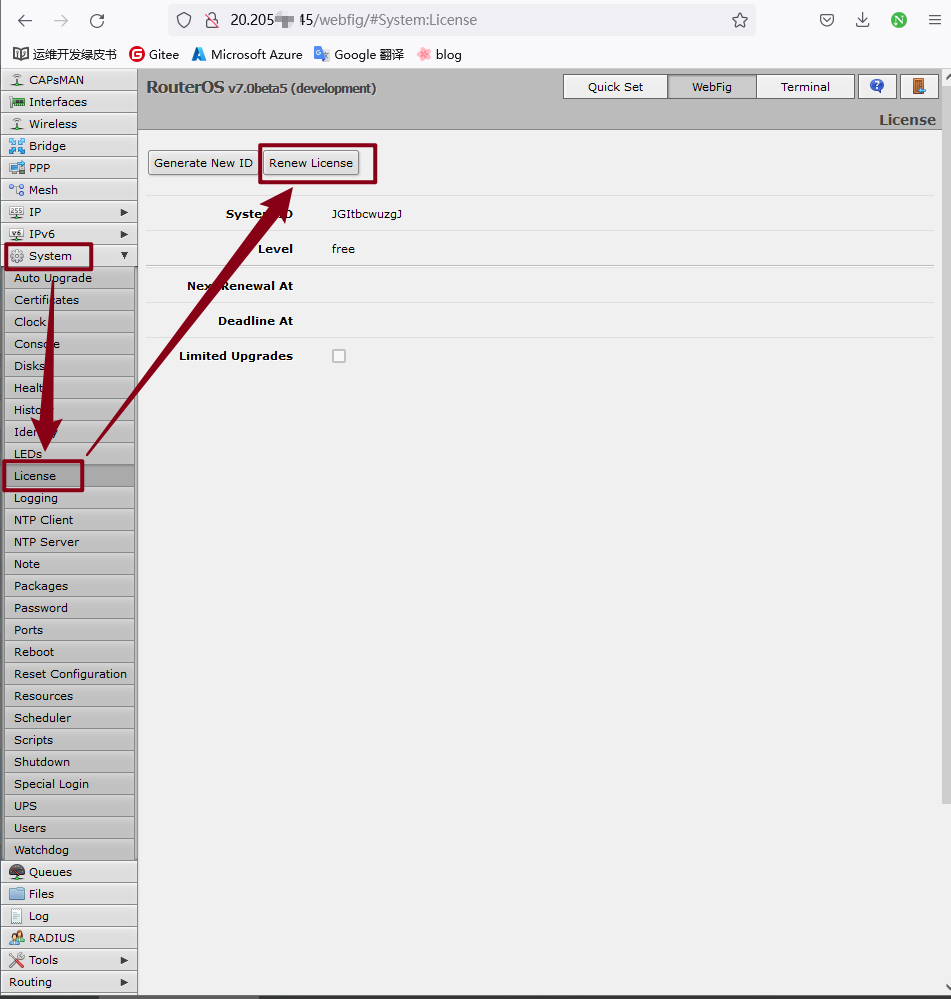
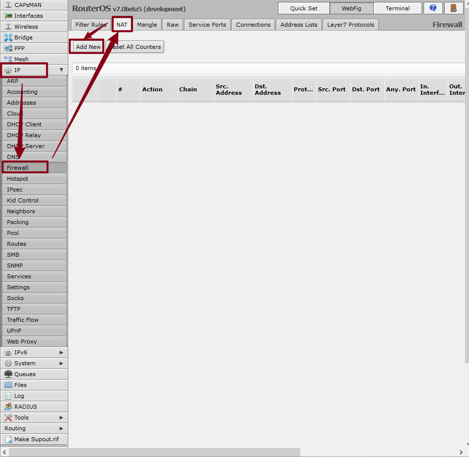
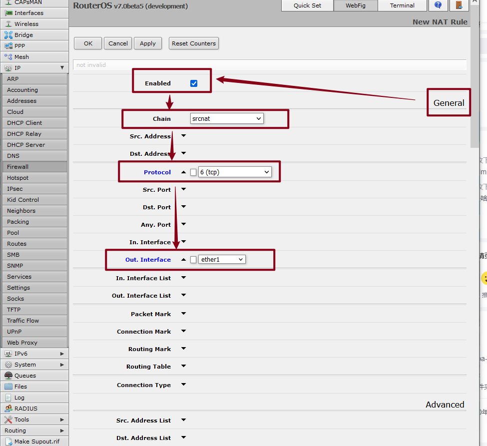
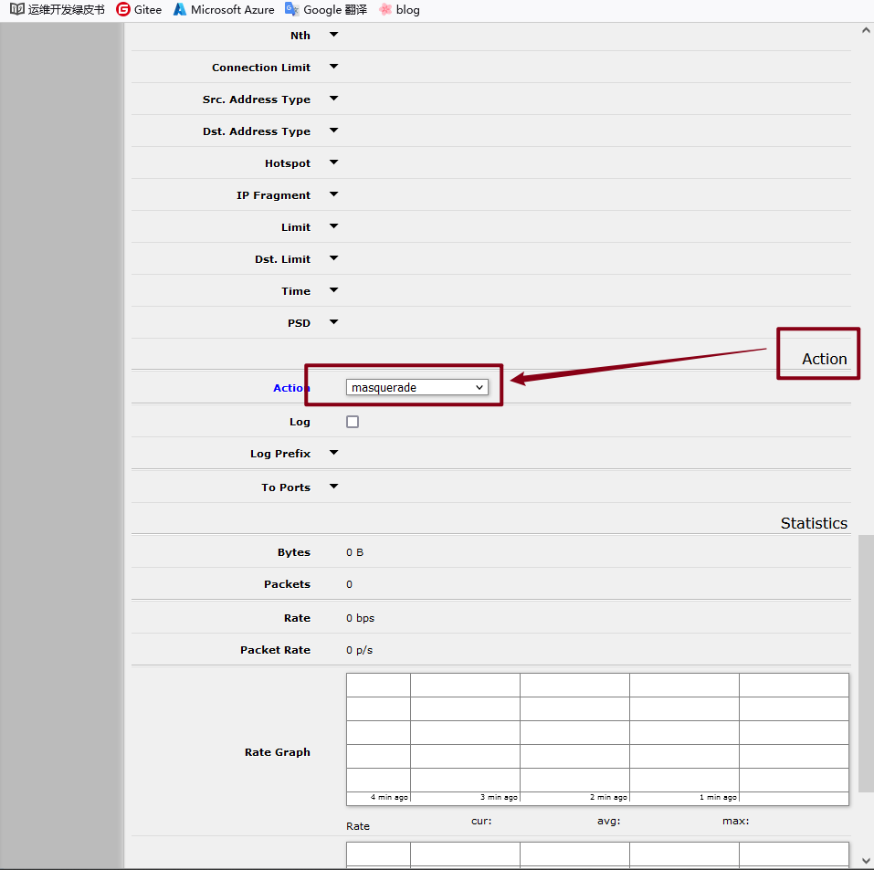
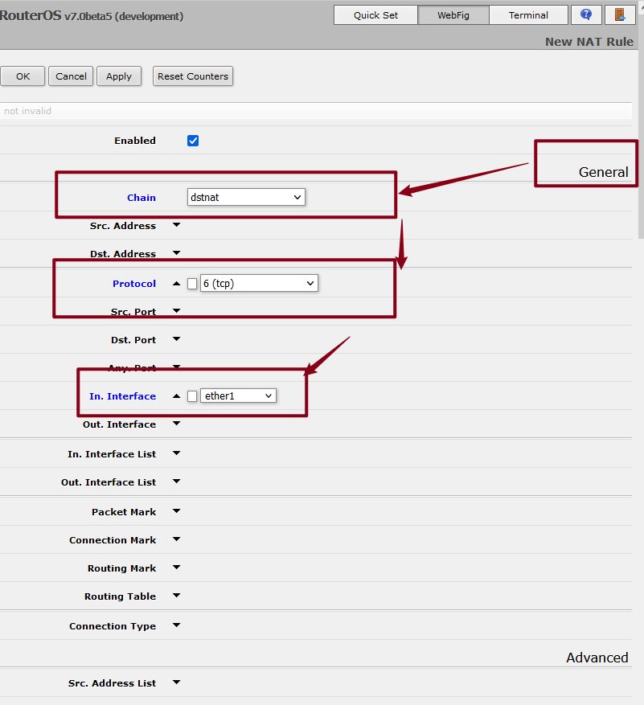
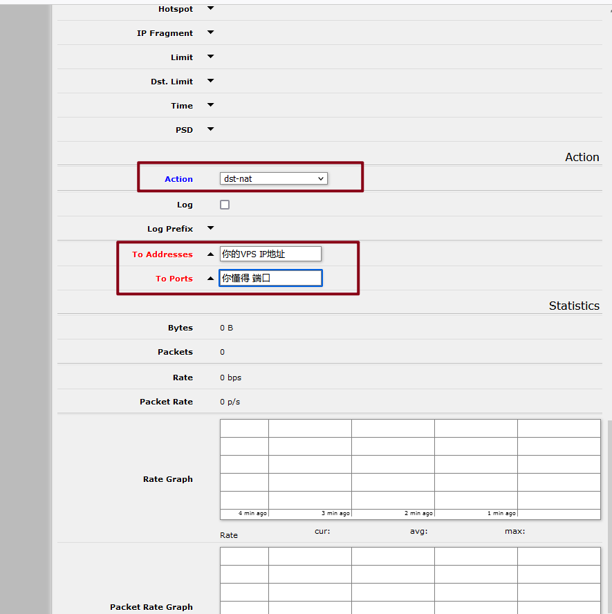
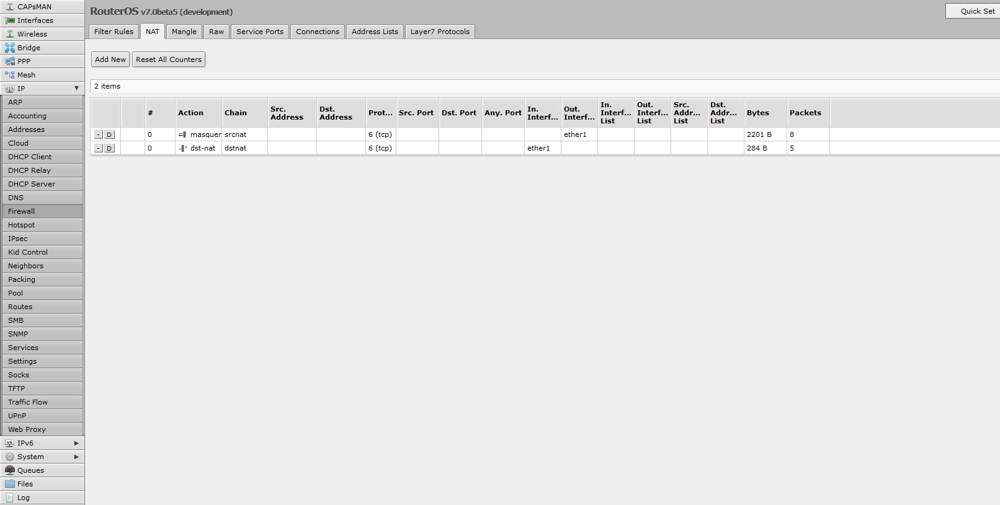

# 用ros路由作为中转教程

> ros路由相信对大佬级别很简单，对我们这群小白还是有点难度的，接触ros路由也有1年了，基本都是作为国内NAT小鸡中转用的，今天看有人需要就简单的说明一下，供MJJ们也能用上，减少折腾吧。


## 步骤一：注册试用账号

去ros官网注册个试用账号，不登录的话会被限速带宽1M，虽然试用一个月，但是到期后还是维持试用时期设置的配置。

ROS路由官网:https://mikrotik.com/client

## 步骤二：国内小鸡DD成ROS路由

把国内小鸡DD成ROS路由，这里感谢方总的教学，详细教学出于一位大佬，我只是搬运工。

dd前 使用fdisk -lu 注意查看下自己VPS的 磁盘路径  并不是所有VPS 都是 /dev/vda  这个路径   有些可能是   /dev/sda  /dev/xvda

执行：fdisk -ul chr.img，可以查看chr.img信息    查找 start 值 使用开始值 * 512  算出柱面位置 默认扇区大小为512  挂载时注意修改这个值

注意自己的网卡名字，有些VPS并不是eth0 需要修改脚本内的网卡名字与其对应

如果缺少 wget   使用命令：  yum install wget -y

此脚本只适应于CentOS 6.9  7.X  测试通过~

### 通用单网卡方案

​         (适应于绝大多数VPS)

```bash
wget https://download.mikrotik.com/routeros/6.45.8/chr-6.45.8.img.zip -O chr.img.zip && \
gunzip -c chr.img.zip > chr.img && \
mount -o loop,offset=512 chr.img /mnt && \
ADDR0=`ip addr show eth0 | grep global | cut -d' ' -f 6 | head -n 1` && \
GATE0=`ip route list | grep default | cut -d' ' -f 3` && \
mkdir -p /mnt/rw && \
echo "/ip address add address=$ADDR0 interface=[/interface ethernet find where name=ether1]
/ip route add gateway=$GATE0
" > /mnt/rw/autorun.scr && \
umount /mnt && \
echo u > /proc/sysrq-trigger && \
dd if=chr.img bs=1024 of=/dev/sda && reboot
```

### 阿里云经典双网卡 (注意分清 内外 网卡)

```bash
default via 202.5.30.254 dev eth0 proto static metric 100
10.0.0.0/8 dev eth1 proto kernel scope link src 10.0.122.21 metric 101              目标地址  <>  网关
202.5.30.0/24 dev eth0 proto kernel scope link src 202.5.30.231 metric 100          目标地址  <>  网关

wget https://download.mikrotik.com/routeros/6.45.8/chr-6.45.8.img.zip -O chr.img.zip
gunzip -c chr.img.zip > chr.img
mount -o loop,offset=512 chr.img /mnt
ADDR0=`ip addr show eth0 | grep global | cut -d' ' -f 6 | head -n 1`                       
ADDR1=`ip addr show eth1 | grep global | cut -d' ' -f 6 | head -n 1`                       
GATE0=`ip route list | grep default | cut -d' ' -f 3`
GATE1=`ip route list | grep '10.0.0.0/8' | cut -d' ' -f 9`
GATE2=`ip route list | grep '202.5.30.0/24' | cut -d' ' -f 9`
mkdir -p /mnt/rw

echo "/ip address add address=$ADDR0 interface=[/interface ethernet find where name=ether1]
/ip address add address=$ADDR1 interface=[/interface ethernet find where name=ether2]
/ip route add gateway=$GATE0
/ip route add dst-address=10.0.0.0/8 gateway=$GATE1
" > /mnt/rw/autorun.scr

umount /mnt
echo u > /proc/sysrq-trigger
dd if=chr.img bs=1024 of=/dev/vda && reboot
```


### 另一款 双网卡的样本 (注意分清 内外 网卡)

```bash
196.10.68.0/24 dev eth0  proto kernel  scope link  src 196.10.68.24
169.254.0.0/16 dev eth0  scope link  metric 1002
169.254.0.0/16 dev eth1  scope link  metric 1003
10.0.0.0/8 dev eth1  proto kernel  scope link  src 10.0.87.152
default via 196.10.68.1 dev eth0

wget https://download.mikrotik.com/routeros/6.45.8/chr-6.45.8.img.zip -O chr.img.zip
gunzip -c chr.img.zip > chr.img
mount -o loop,offset=512 chr.img /mnt
ADDR0=`ip addr show eth0 | grep global | cut -d' ' -f 6 | head -n 1`                       
ADDR1=`ip addr show eth1 | grep global | cut -d' ' -f 6 | head -n 1`                       
GATE0=`ip route list | grep default | cut -d' ' -f 3`
GATE1=`ip route list | grep '10.0.0.0/8' | cut -d' ' -f 9`
mkdir -p /mnt/rw

echo "/ip address add address=$ADDR0 interface=[/interface ethernet find where name=ether1]
/ip address add address=$ADDR1 interface=[/interface ethernet find where name=ether2]
/ip route add gateway=$GATE0
/ip route add dst-address=10.0.0.0/8 gateway=$GATE1
" > /mnt/rw/autorun.scr

umount /mnt
echo u > /proc/sysrq-trigger
dd if=chr.img bs=1024 of=/dev/vda && reboot
```


### 常见问题：

- 有些D完死活启不动连不上 是因为UEFI的缘故，跟脚本无关 请改用 ROS7.0Beta 版本 支持UEFI启动  
  - `wget https://download.mikrotik.com/routeros/7.0beta5/chr-7.0beta5.img.zip -O chr.img.zip	`

- aws Cloud DD完以后 要手动关机，再开机即可连接了

## 步骤三：配置主机网络

### 第一个方法

一般NAT小鸡DD完ros后会自动设置好网络这些，只需要重启机器，然后网页打开NAT的IP:SSH端口号：例如23.23.23.23:51000     这里的51000就是平时22端口被NAT小鸡转发端口后数字，登录到ros路由管理界面。

### 第二个方法

也是最好用，最常见的，用winbox登录ros路由，在登录前需要重新映射winbox端口为NAT小鸡给我指定的IP端口段内，例如NAT端口段51000-51020，因为51000被作为SSH使用了，那就用51001作为winbox端口，映射方法。连接NAT小鸡的VNC，输入ros登录名：admin  密码为空
进入控制台后输入：

```bash
/ip service set winbox port=映射端口   
```

这样就可以用NAT小鸡公共IP+51001端口登录winbox了，登录winbox后找到system-License菜单输入开始注册好的ros试用账号，给予授权，开启试用之路



## 步骤四：设置中转的端口转发

设置中转的端口转发， IP-Firewall,  选择NAT，点击+号  设置如图：









这是第一条规则，设置好后点击OK保存，

第二条规则现在添加国外VPS的IP和端口






最后点击OK，就完全搞定了，修改相应的中转IP和端口开启ros路由中转之旅吧。


