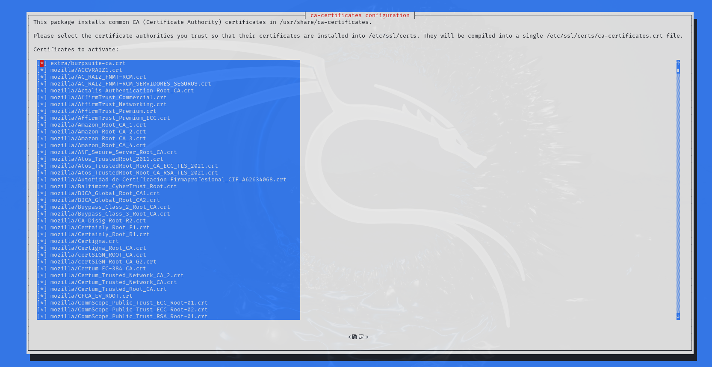

# Kali安装CA证书

## 准备证书文件

在进行任何操作之前，确保你拥有正确的证书文件。通常情况下，企业或组织会提供根证书，其扩展名可能为`.cer`。为了兼容性，我们需要将这些证书转换为`.pem`格式。

### 转换证书格式

对于`.cer`文件，使用OpenSSL将其转换为`.pem`格式：

```bash
openssl x509 -inform der -in burpsuite-cacert.der -out burpsuite-ca.crt
```

## 导入证书至Linux系统

### 创建额外证书目录

```bash
sudo mkdir /usr/share/ca-certificates/extra
```

### 拷贝证书文件

将转换后的`.crt`或`.pem`证书文件拷贝到`extra`目录下：

```bash
sudo cp burpsuite-ca.crt /usr/share/ca-certificates/extra/
```

### 配置证书

方法1： 更新证书配置文件以包含新的证书：

```bash
sudo dpkg-reconfigure ca-certificates
```



```bash
┌──(root㉿kali)-[/home/kali/Downloads]
└─# dpkg-reconfigure ca-certificates
Updating certificates in /etc/ssl/certs...
1 added, 0 removed; done.
正在处理用于 ca-certificates (20240203) 的触发器 ...
Updating certificates in /etc/ssl/certs...
0 added, 0 removed; done.
Running hooks in /etc/ca-certificates/update.d...
done.
正在处理用于 ca-certificates-java (20240118) 的触发器 ...
done.
           
```


方法2：或者手动编辑`/etc/ca-certificates.conf`文件，添加一行指向你的证书路径：

```bash
extra/burpsuite-ca.crt
```

然后运行：

```bash
sudo update-ca-certificates
```