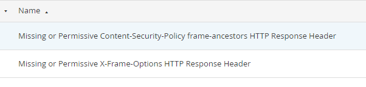
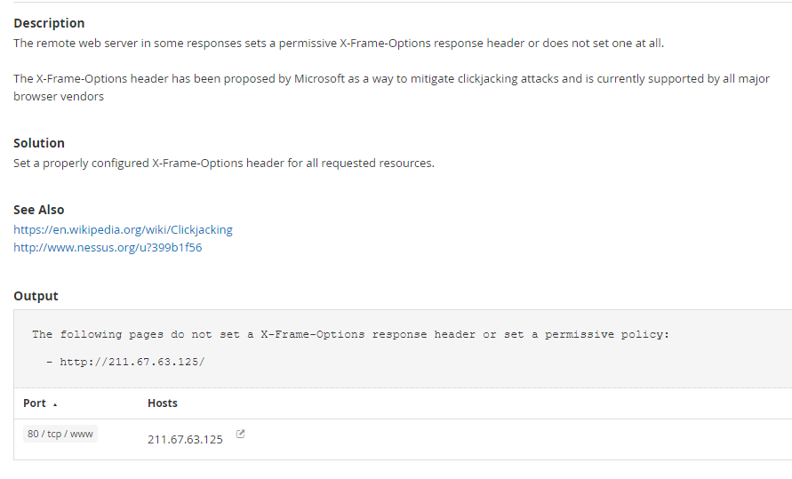
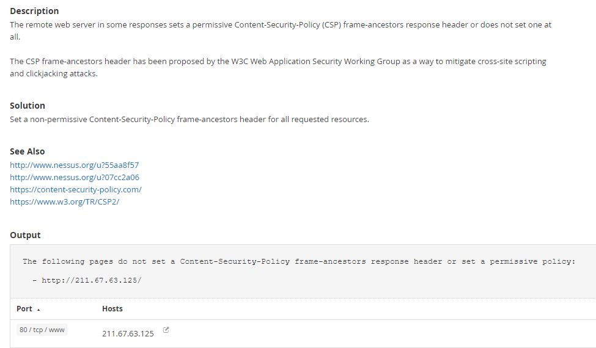
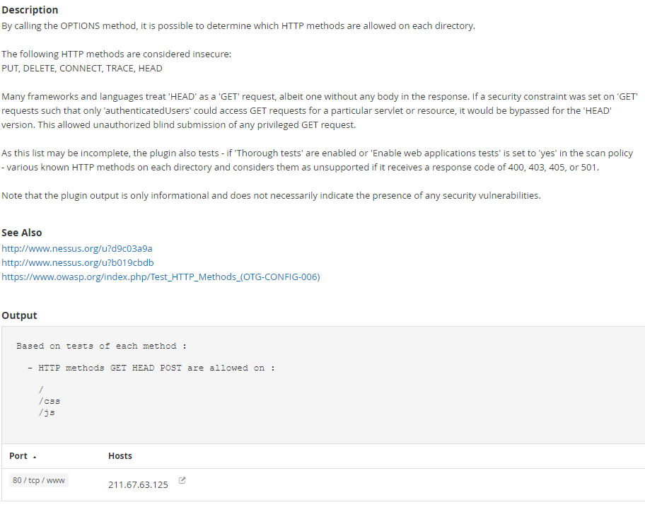
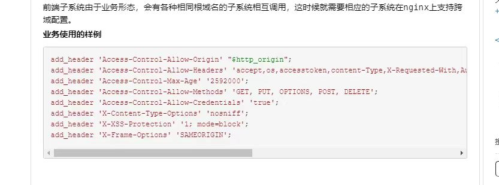

# Nessus的web漏洞解决

> 朋友的web项目在做安全检测的时候不过关，我这边帮忙解决，顺便把步骤记录下来。问题是一些跨域问题和安全加固问题

## 检测现状

### X-Frame-Options

> 这个header选项的作用是 
>
> - 防止点击劫持、
> - 设置页面是否能作为iframe嵌套








#### 防嵌套网页（点击劫持）

因为iframe享有着click的最优先权，当有人在伪造的主页中进行点击的话，如果点在iframe上，则会默认是在操作iframe的页面。 攻击者可以使用一个透明的、不可见的iframe，覆盖在目标网页上，然后诱使用户在该网页上进行操作，此时用户将在不知情的情况下点击透明的iframe页面。通过调整iframe页面的位置，可以诱使用户恰好点击iframe页面的一些功能性按钮上，导致被劫持。

钓鱼网站就是使用这个技术，通过诱导用户进行点击，比如设计一个"妹妹寂寞了"等之类的网页，诱导用户点击，但实际结果，你看到的不是"妹妹",而是被恶意微博吸粉。 
所以为了防止网站被钓鱼，可以使用window.top来防止你的网页被iframe.

```javascript
if(window != window.top){
    window.top.location.href = correctURL;
}
```

这段代码的主要用途是限定你的网页不能嵌套在任意网页内。如果你想引用同域的框架的话，可以判断域名。

```javascript
if (top.location.host != window.location.host) {
　　top.location.href = window.location.href;
}
```

当然，如果你网页不同域名的话，上述就会报错。
所以，这里可以使用try...catch...进行错误捕获。如果发生错误，则说明不同域，表示你的页面被盗用了。可能有些浏览器这样写是不会报错，所以需要降级处理。
这时候再进行跳转即可.

```javascript
try{
　　top.location.hostname;  //检测是否出错
　　//如果没有出错，则降级处理
　　if (top.location.hostname != window.location.hostname) { 
　　　　top.location.href =window.location.href;
　　}
}
catch(e){
　　top.location.href = window.location.href;
}
```

这只是浏览器端，对iframe页面的权限做出相关的设置。 我们还可以在服务器上，对使用iframe的权限进行设置.

#### X-Frame-Options （设置页面能否作为iframe嵌套）

用来确认是否浏览器可以在frame或iframe标签中渲染一个页面，网站可以用这个头来保证他们的内容不会被嵌入到其它网站中，以来避免点击劫持。

参数

##### DENY

表示该页面不允许在 frame 中展示（拒绝任何iframe的嵌套请求），即便是在相同域名的页面中嵌套也不允许。

等价于：

```javascript
if(window != window.top){
    window.top.location.href = window.location.href;
}
```

##### SAMEORIGIN

表示该页面可以在相同域名页面的iframe 中展示，例如网页为 foo.com/123.php，則 foo.com 底下的所有网页可以嵌入此网页，但是 foo.com 以外的网页不能嵌入。

设置后如果在不同域名页面通过iframe加载会报下面错误：in a frame because it set 'X-Frame-Options' to 'sameorigin'.

等价于：
```javascript
if (top.location.hostname != window.location.hostname) { 
　　　　top.location.href =window.location.href;
}
```

##### ALLOW-FROM uri

表示该页面可以在指定的uri页面中被iiframe加载。


### Content-Security-Policy

> **CSP 的实质就是白名单制度**，开发者明确告诉客户端，**哪些外部资源可以加载和执行，**等同于提供白名单。它的实现和执行全部由浏览器完成，开发者只需提供配置。
>
> CSP 大大增强了网页的安全性。攻击者即使发现了漏洞，也没法注入脚本，除非还控制了一台列入了白名单的可信主机。




### Access-Control-Allow-Method

> 目录允许使用的请求方法






## 最终策略

### Nginx

```bash
server {
    listen       80;
    listen  [::]:80;
    server_name  localhost;

    # access_log /var/log/nginx/host.access.log main;

    # 防止点击劫持（Clickjacking）攻击
    add_header X-Frame-Options SAMEORIGIN;
    add_header Access-Control-Allow-Methods POST,GET,PUT,DELETE;

    if ($request_method = 'OPTIONS') {
        return 204;
    }

    location / {
        root /usr/share/nginx/html;
        add_header 'Access-Control-Allow-Credentials' 'true';
        index index.html index.htm;
    }

    location ~ ^/(css|js) {
        root /usr/share/nginx/html;
        if ($request_method !~ ^(GET|HEAD|POST)$) {
            return 405 "Method Not Allowed";
        }
    }

    # location ~* \.(js|css|jpg|jpeg|gif|png|swf)$ {
    #     root /usr/share/nginx/html;
    #     if (-f $request_filename) {
    #         return 403;
    #         break;
    #     }
    # }

    error_page 404 /404.html;
    error_page 500 502 503 504 /50x.html;
    location = /50x.html {
        root /usr/share/nginx/html;
    }

}
```

