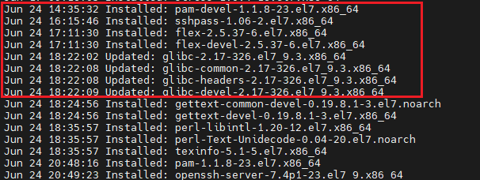

# pam-honey实现钓鱼ssh密码

> 实现永远无法登陆设备，任何密码都是失败，并且记录输入的密码。

## 安装devel包

CentOS中需要安装pam-devel包，其他操作系统自查。名字差不多

```bash
yum install -y pam-devel
```



## 下载模块源码

项目源码地址：[https://github.com/weddige/pam_honey.so](https://github.com/weddige/pam_honey.so)

右键这个连接下载或者复制链接去下载器下载。

本站下载： [pam_honey.c](./pam-honey实现钓鱼ssh密码.assets/pam_honey.c)

```bash
wget www.geekery.cn/xxxxxx.xxxxx/pam_honey.c
```

## 编译

```bash
gcc -fPIC -DPIC -shared -rdynamic -o pam_honey.so pam_honey.c
```

## 复制和配置

复制到so目录

```
mv -vf pam_custom_auth.so /lib64/security/
```

## 相关文件

Makefile

```bash
all: build install
build: 
	gcc -fPIC -DPIC -shared -rdynamic -o pam_honey.so pam_honey.c
install:
	mv -vf pam_custom_auth.so /lib64/security/
clean:
	rm pam_honey.so
```

## 测试

尝试登陆后会显示登陆失败。

在 /root/honey.txt 会显示你输入的密码

```bash
sshpass -p 123456 ssh root@127.0.0.1
cat /root/honey.txt
root:123456
```

