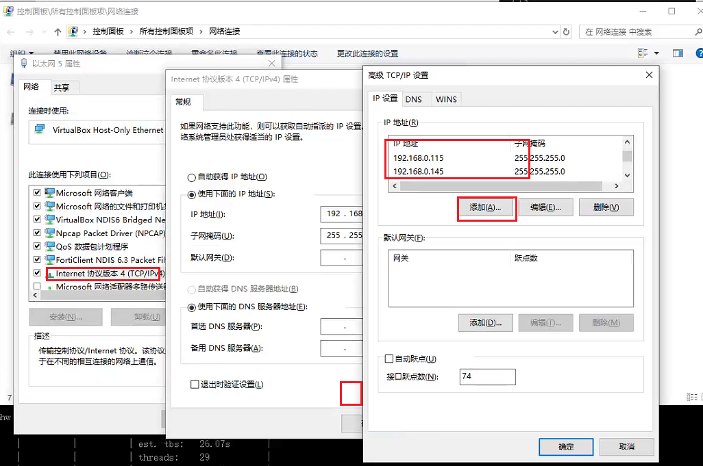

# Ssh设置正向代理

> ssh把远程端口映射到本地

## 应用场景1： docker容器端口映射到本地

```bash
 ssh -L 80:172.18.0.3:80 root@43.136.116.195
```

## 解释

| 字段                | 含义                                                         |
| ------------------- | ------------------------------------------------------------ |
| ssh                 | 命令                                                         |
| -L                  | 指定到本地（客户端）主机上给定 TCP 端口或 Unix 套接字的连接将被转发到远程端的给定主机和端口或 Unix 套接字。（服务器做正向代理） |
| 80:172.18.0.3:80    | 本地端口80 -> 远程主机里的 172.18.0.3 的 80端口              |
| root@43.136.116.195 | 远程连接用户@远程主机地址                                    |

## 选项解释： -L

```bash
     -L [bind_address:]port:host:hostport
     -L [bind_address:]port:remote_socket
     -L local_socket:host:hostport
     -L local_socket:remote_socket
              指定到本地（客户端）主机上给定 TCP 端口或 Unix 套接字的连接将被转发到远程端的给定主机和端口或 Unix 套接字。
              这是通过分配一个套接字来侦听本地端的 TCP 端口（可选地绑定到指定的 bind_address）或 Unix 套接字来实现的。 每当连接是
              与本地端口或套接字建立连接，连接通过安全通道转发，并与主机端口 hostport 或 Unix 套接字 remote_socket 建立连接，
              从远程机器。

              也可以在配置文件中指定端口转发。 只有超级用户可以转发特权端口。 可以通过将地址包含在
              方括号。

              默认情况下，本地端口根据 GatewayPorts 设置进行绑定。 但是，可以使用显式 bind_address 将连接绑定到特定地址。 这
              “localhost”的 bind_address 表示监听端口仅供本地使用，而空地址或“*”表示端口应可用于所有
              接口。
```

## 案例

设置本地ip地址



批量映射本地ip到远程

```bash
ssh -L 192.168.0.115:4014:192.168.0.115:4014  \
	-L 192.168.0.145:4014:192.168.0.145:4014 \
	-L 192.168.0.168:4014:192.168.0.168:4014 \
	-L 192.168.0.118:4014:192.168.0.118:4014 \
	-L 192.168.0.111:4014:192.168.0.111:4014 \
	-L 192.168.0.121:4014:192.168.0.121:4014 \
	-L 192.168.0.134:4014:192.168.0.134:4014 \
	-L 192.168.0.146:4014:192.168.0.146:4014 \
	-L 192.168.0.153:4014:192.168.0.153:4014 \
	-L 192.168.0.180:4014:192.168.0.180:4014 \
	a11@124.220.42.xx3 -p 52836
```

