# 虚拟化物理机

## 一、工具介绍

　　使用vmware公司提供的一款软件“vmware converter standalone”，有以下优点：

　　1、该过程对物理机无损

　　2、4.3以上的版本仅支持热克隆，保证在原来物理机运行的同时，尽可能保证数据的一致性

　　3、转换完成后，若物理机与虚机在同一网络需要修改其中一台机器的IP、机器名等信息

　　4、转换windows xp和windows server2008以上的版本（server 2003不确定是否可以）

## 二、转换原理

　　[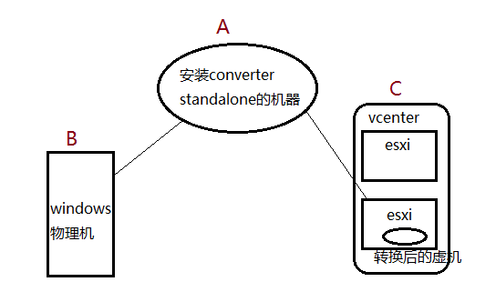](https://img2018.cnblogs.com/blog/1489604/201906/1489604-20190627165200680-1510240940.png)

A是一台windows机器，安装了“vmware converter standalone”软件

B是要转换的windows物理机

C是vcenter，管理着数台esxi服务器

物理机转换的原理是：

　　1、A 获取到BC的登陆信息后，在B上做快照
	　　2、在C上指定位置创建虚机
	　　3、将A上的快照数据拷贝到新建的虚机上

## 三、步骤

1、在执行转换之前，为了避免权限和网络的问题需要执行：

　　a、关闭防火墙

　　b、在“文件夹选项”中取消“使用共享向导（推荐）”

[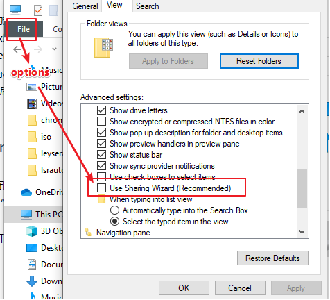](https://img2018.cnblogs.com/blog/1489604/201906/1489604-20190627170920562-1663029484.png)

2、以管理员身份打开“vmware vcenter converter standalone”软件，根据下图操作（保证物理机可远程登陆）

填写物理机信息

[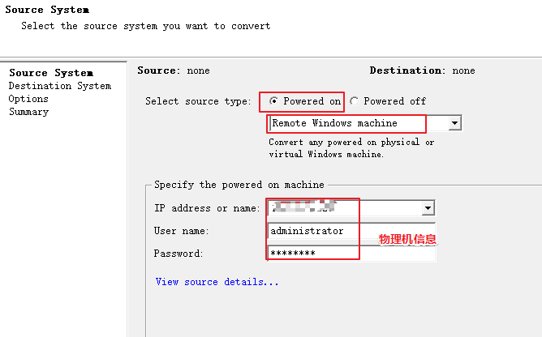](https://img2018.cnblogs.com/blog/1489604/201906/1489604-20190627171038728-494800728.png)

**【注】当出现“ Permission to perform this operation was denied ”的错误，需要执行以下操作：**

[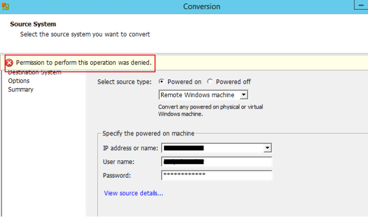](https://img2018.cnblogs.com/blog/1489604/201906/1489604-20190628095410963-1737848649.png)

\1. 登录到物理机。
\2. 打开本地安全策略（打开cmd并键入secpol.msc）。
\3. 转到：本地策略>安全选项，将“ User Access Control: Run all Administrators in Admin Approval Mode”从“已启用” 更改为“ 已禁用”。
4、重启物理机生效。

**【切记】当转换完成后，在虚机相同的位置将上述选项设置为“已启用”！！！**

3、弹出的对话框，建议选择自动卸载“vmware vcenter converter standalone”软件

[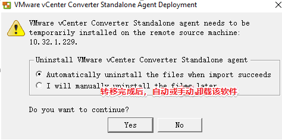](https://img2018.cnblogs.com/blog/1489604/201906/1489604-20190627171134933-1778468010.png)

4、将物理机转换到哪里，可以选择esxi也可以选择vmware workstations，但是选择esxi后，需要填写vcenter的信息。

[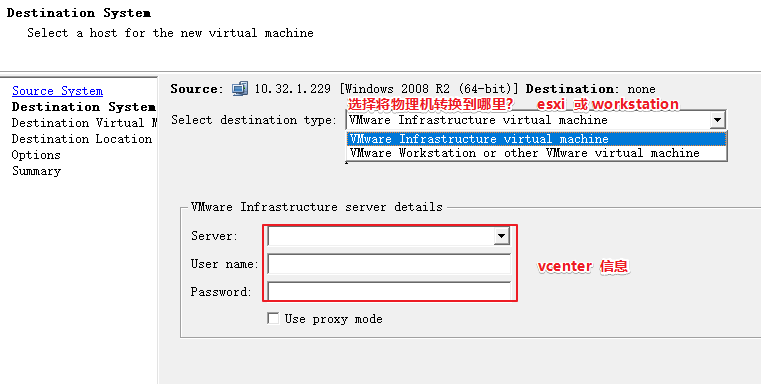](https://img2018.cnblogs.com/blog/1489604/201906/1489604-20190627171259446-1147453595.png)

5、等上一步验证可以成功连接到vcenter后，会出现vcenter连接的虚机列表，可以在最上面修改转换后的虚机名称

[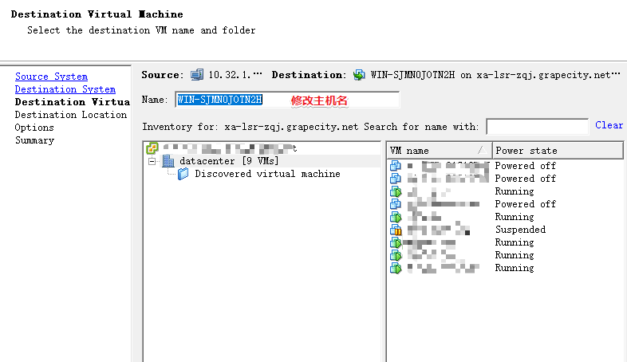](https://img2018.cnblogs.com/blog/1489604/201906/1489604-20190627171629672-1857950190.png)

6、选择将虚机存放到哪里

[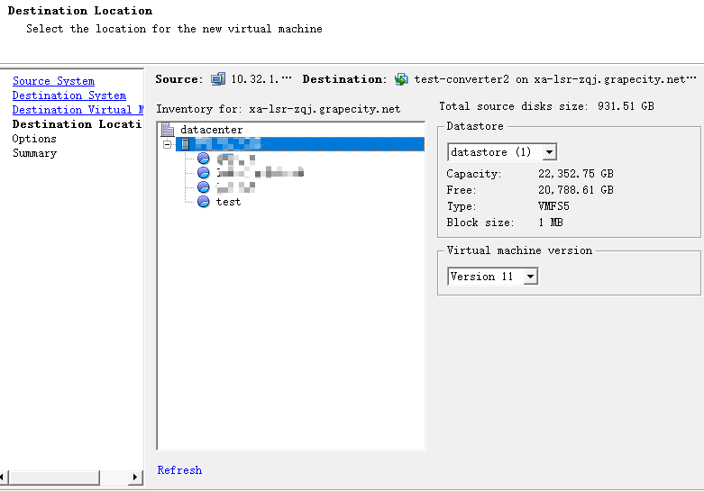](https://img2018.cnblogs.com/blog/1489604/201906/1489604-20190627171740972-537331403.png)

7、高级选项中可以自定义设置物理机转换后的虚机大小、网络、内存、物理机运行的服务等信息

下图，可以选择 如何拷贝物理机的硬盘数据，若物理机的C盘是200G，实际用了50G
若选择第一个，全部拷贝，那么会将200G数据全部拷贝到虚机上
若选择第二个，只会将实际占用的50G拷贝到虚机
第三个选择是，自定义拷贝多大，单位G
第四个选择是，自定义拷贝，单位MB

[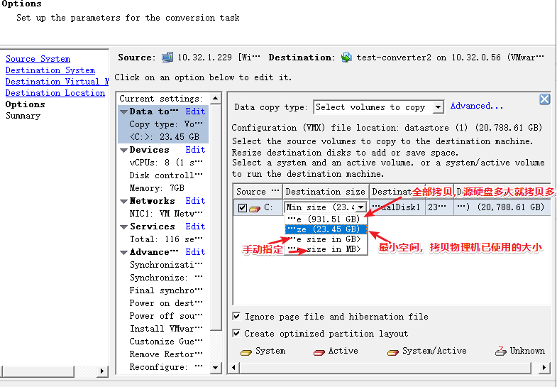](https://img2018.cnblogs.com/blog/1489604/201906/1489604-20190627171826803-15411889.png)

[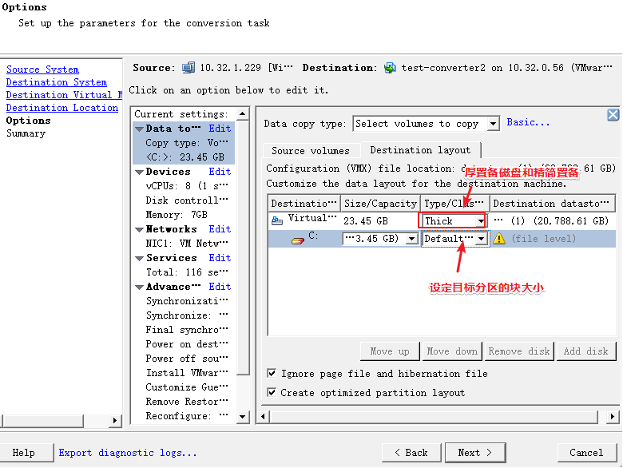](https://img2018.cnblogs.com/blog/1489604/201906/1489604-20190627172421072-699683713.png)

[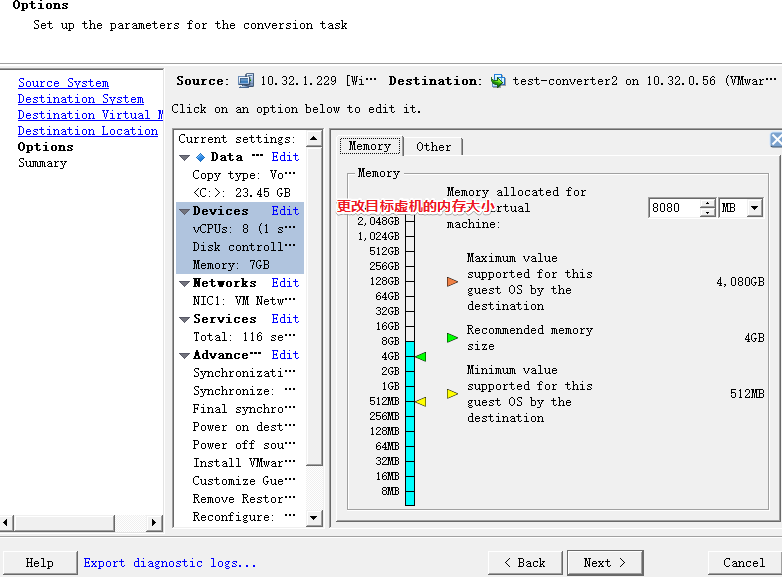](https://img2018.cnblogs.com/blog/1489604/201906/1489604-20190627172438223-2147464452.png)

[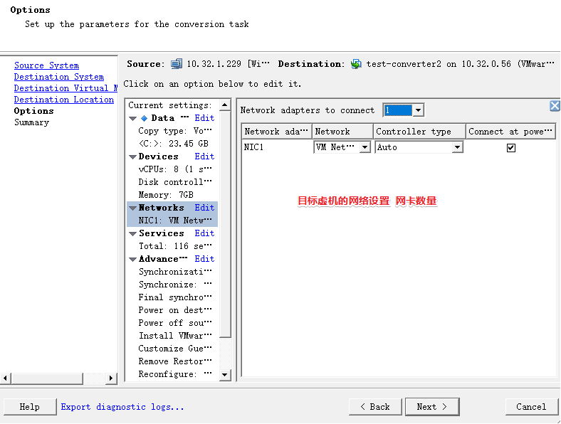](https://img2018.cnblogs.com/blog/1489604/201906/1489604-20190627172448143-1680792007.png)

建议停止物理机上运行的服务，尤其是SQL SERVER这样的重服务。

[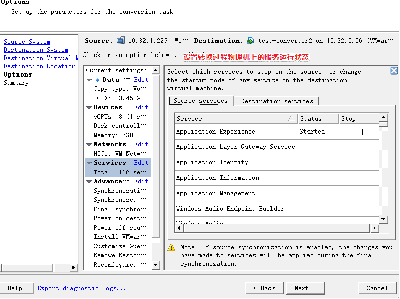](https://img2018.cnblogs.com/blog/1489604/201906/1489604-20190627172456319-2075777250.png)

[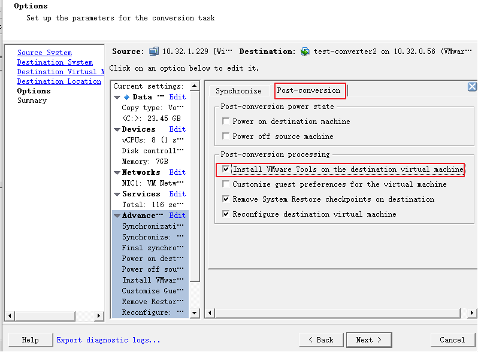](https://img2018.cnblogs.com/blog/1489604/201906/1489604-20190627172530204-1630602588.png)

8、检查配置无误后，执行

[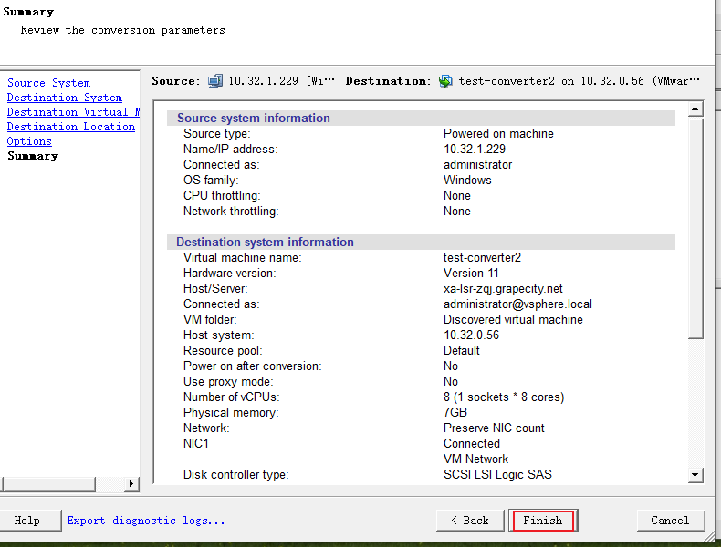](https://img2018.cnblogs.com/blog/1489604/201906/1489604-20190627172550258-1932680743.png)

9、等进度条到达100%后，即完成物理机的转换

[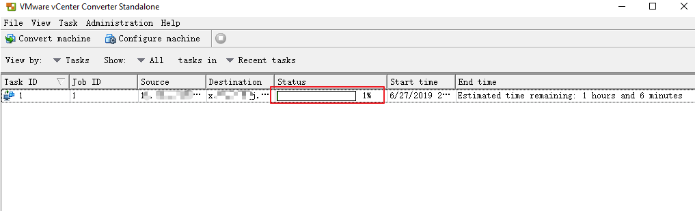](https://img2018.cnblogs.com/blog/1489604/201906/1489604-20190627172626581-1727231706.png)

10、转换后的操作：

　　*a、若使用虚机且虚机和物理机在同一网络时，需要注销将物理机的信息（域认证信息、主机名、ip等），保证不和虚机产生冲突
　　b、若物理机信息在域中，检查虚机域认证信息是否可用，不可用需要退域加域、添加用户的操作*

 