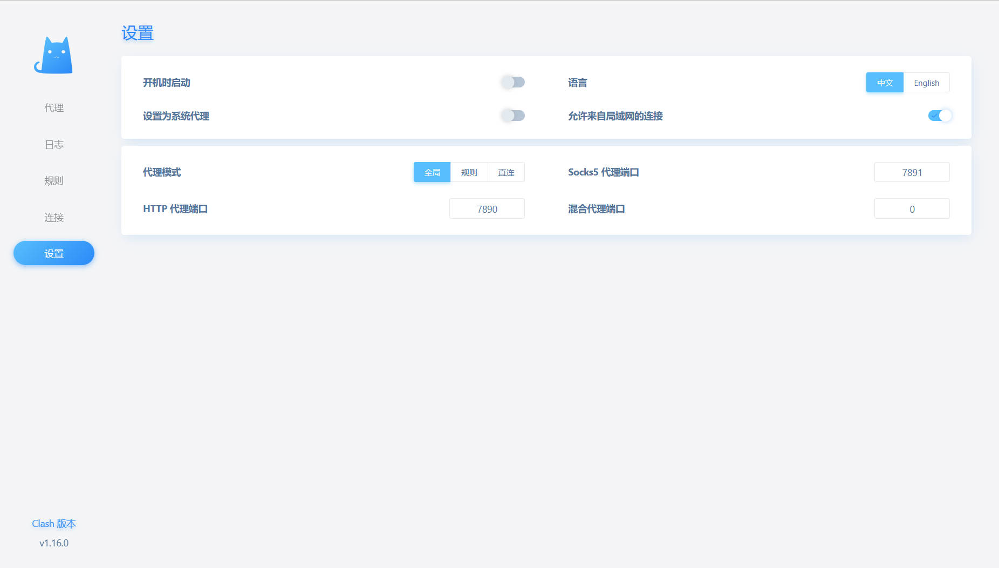

# Docker一键部署Clash服务与管理面板

> 部分资料来自： https://blog.laoyutang.cn/linux/clash.html

官方Clash部署需要采用两个镜像分别启动服务和面板，博主使用官方server镜像和官方管理面板前端代码，重新修改打包构建，使用一个镜像可以直接启动服务和管理面板，简单轻量。

## 镜像地址

[laoyutang/clash-and-dashboard](https://hub.docker.com/r/laoyutang/clash-and-dashboard)

## 修改后源码地址

[Github:clash-and-dashboard](https://github.com/LaoYutang/clash-and-dashboard)
可以查看源码，自行打包

## 修改内容

- 修改前端接口baseurl，不再通过用户配置，使用页面相对路径`/api`。
- 去除clash服务接口配置框。
- docker镜像增加nginx和前端打包文件。
- nginx反代clash管理接口，实现管理页面无需配置直接管理容器内clash服务。

## 启动容器


```
docker run -d \
  --name clash \
  --restart=always \
  --log-opt max-size=1m \
  --name clash-and-dashboard \
  -v /data/clash/clash.yaml:/root/.config/clash/config.yaml \
  -p 7888:8080 -p 7890:7890 \
  laoyutang/clash-and-dashboard:latest
```

- -v /data/clash/clash.yaml:/root/.config/clash/config.yaml 提供clash的yaml文件，文件如何获取请读者自行解决
- -p 7888:8080 管理**页面端口**
- -p 7890:7890 http**代理端口** socks端口使用7891
- laoyutang/clash-and-dashboard:latest 博主修改后的镜像

访问Ip:7888管理页面即可，注意非本机使用，请勾选**允许局域网连接**

## 自动更新yaml文件

### 配置定期更新

```Bash
crontab -e
```

添加如下内容：

```Bash
# 添加以下的内容
# 每隔 8 小时备份配置文件
0 */8 * * * cp /root/.config/clash/config.yaml /root/.config/clash/config.yaml.bak
# 每隔 8 小时延迟 5 分钟支更新配置文件
5 */8 * * * curl https://xxxxxxx > /root/.config/clash/config.yaml
# 每隔 8 小时延迟 6 分钟修改配置文件 allow-lan: false 修改为true
6 */8 * * * sed -i 's/allow-lan: false/allow-lan: true/' /root/.config/clash/config.yaml
# 每隔 8 小时延迟 7 分钟修改配置文件 external-controller:
7 */8 * * * sed -i 's/external-controller: 127.0.0.1:9090/external-controller: 0.0.0.0:9090/' /root/.config/clash/config.yaml
# 每隔 8 小时延迟 8 分钟修改配置文件 external-ui: dashboard 注释掉，即不使用内置的dashboard，有的机场提供的配置文件没有这个配置，就不需要添加这行
8 */8 * * * sed -i 's/external-ui: dashboard/#external-ui: dashboard/' /root/.config/clash/config.yaml
# 每隔 8 小时延迟 10 分钟重启 clash
10 */8 * * * docker restart clash-and-dashboard
```

重启 cron 服务

```Bash
sudo systemctl restart cron.service
```