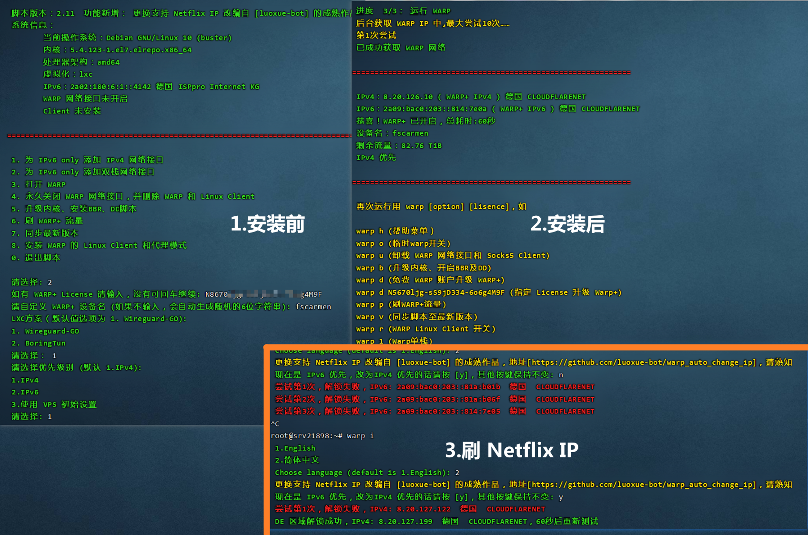
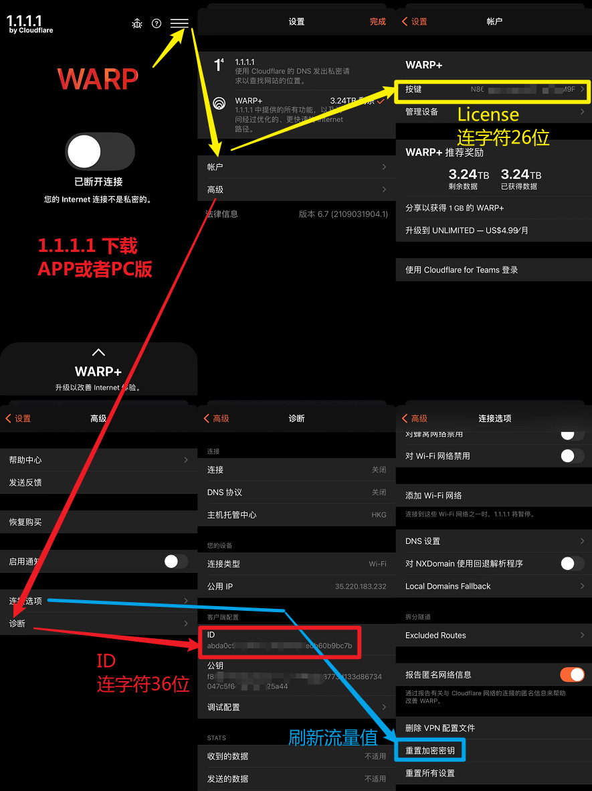
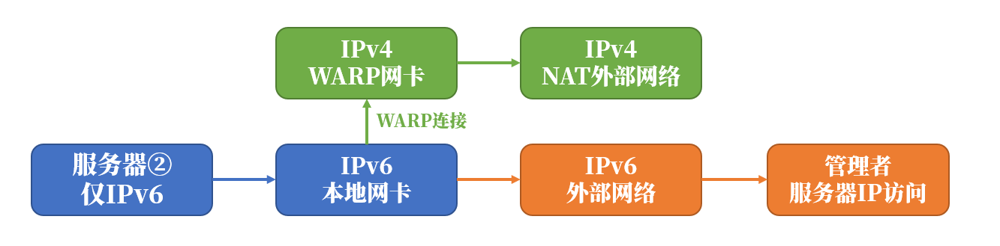
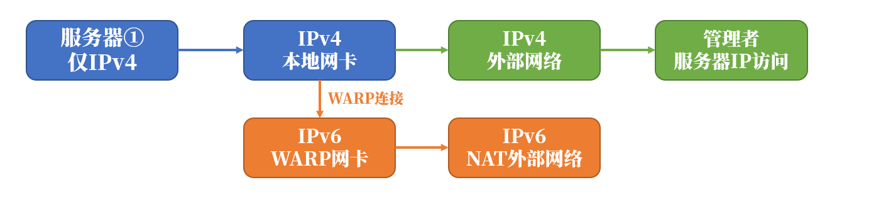
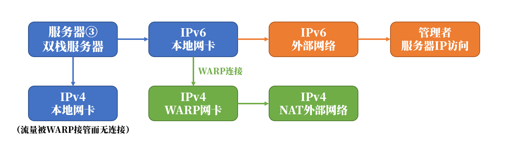

# 连接WARP为服务器添加IPv4和IPv6网络

> 通常ip被污染之后使用 WARP进行增加ip复活
>
> 使用warp有概率刷出原生ip
>
> 开源地址 https://github.com/fscarmen/warp

## 脚本特点

- 支持 WARP+ 账户，附带第三方刷 WARP+ 流量和升级内核 BBR 脚本
- 普通用户友好的菜单，进阶者通过后缀选项快速搭建
- 智能判断vps操作系统：Ubuntu 16.04、18.04、20.04; Debian 9、10、11，CentOS 7、8; Alpine 和 Arch Linux，请务必选择 LTS 系统
   智能判断硬件结构类型：AMD、ARM 和 s390x
- 结合 Linux 版本和虚拟化方式，自动优选三个 WireGuard 方案。
   网络性能方面：内核集成 WireGuard＞安装内核模块＞BoringTun＞wireguard-go
- 智能判断 WGCF 作者 github库的最新版本 （Latest release）
- 智能分析内网和公网IP生成 WGCF 配置文件
- 输出结果，提示是否使用 WARP IP ，IP 归属地

## WARP好处

- 解锁奈飞流媒体
- 避免 Google 验证码或是使用 Google 学术搜索
- 可调用 IPv4 接口，使青龙和V2P等项目能正常运行
- 由于可以双向转输数据，能做对方VPS的跳板和探针，替代 HE tunnelbroker
- 能让 IPv6 only VPS 上做的节点支持 Telegram
- IPv6 建的节点能在只支持 IPv4 的 PassWall、ShadowSocksR Plus+ 上使用



## 运行脚本

首次运行

```bash
wget -N https://raw.githubusercontent.com/fscarmen/warp/main/menu.sh && bash menu.sh [option] [lisence]
```

再次运行

```
warp [option] [lisence]
```

| [option] 变量1 变量2 | 具体动作说明                                                 |
| -------------------- | ------------------------------------------------------------ |
| h                    | 帮助                                                         |
| 4                    | 原无论任何状态 -> WARP IPv4                                  |
| 4 lisence name       | 把 WARP+ Lisence 和设备名添加进去，如 `bash menu.sh 4 N5670ljg-sS9jD334-6o6g4M9F Goodluck` |
| 6                    | 原无论任何状态 -> WARP IPv6                                  |
| d                    | 原无论任何状态 -> WARP 双栈                                  |
| o                    | WARP 开关，脚本主动判断当前状态，自动开或关                  |
| u                    | 卸载 WARP                                                    |
| n                    | 断网时，用于刷WARP网络 (WARP bug)                            |
| b                    | 升级内核、开启BBR及DD                                        |
| a                    | 免费 WARP 账户升级 WARP+                                     |
| a lisence            | 在上面基础上把 WARP+ Lisence 添加进去，如 `bash menu.sh a N5670ljg-sS9jD334-6o6g4M9F` |
| p                    | 刷 Warp+ 流量                                                |
| c                    | 安装 WARP Linux Client，开启 Socks5 代理模式                 |
| l                    | 安装 WARP Linux Client，开启 WARP 模式                       |
| c lisence            | 在上面基础上把 WARP+ Lisence 添加进去，如 `bash menu.sh c N5670ljg-sS9jD334-6o6g4M9F` |
| r                    | WARP Linux Client 开关                                       |
| v                    | 同步脚本至最新版本                                           |
| i                    | 更换 WARP IP                                                 |
| s                    | 单栈与双栈快速切换 ，如 `warp s 4`,`warp s 6`,`warp s d`     |
| e                    | 安装 iptables + dnsmasq + ipset 分流流媒体方案               |
| w                    | 安装 WireProxy 解决方案                                      |
| y                    | WireProxy 开关                                               |
| 其他或空值           | 菜单界面                                                     |

举例：想为 IPv4 的甲骨文添加 Warp 双栈，首次运行

```
wget -N https://cdn.jsdelivr.net/gh/fscarmen/warp/menu.sh && bash menu.sh d
```

刷日本 Netflix  运行

```
warp i jp
```


## 刷 Netflix 解锁 WARP IP 的方法

也可以用另一个通过 WARP 解锁流媒体的一键脚本: [【刷 WARP IP】 - 为 WARP 解锁流媒体而生](https://github.com/fscarmen/warp_unlock)

以刷 香港 hk 为例

- crontab 计划任务方式，流媒体解锁守护进程

```
bash <(curl -sSL https://raw.githubusercontent.com/fscarmen/tools/main/warp_crontab.sh)
```

- screen 多会话方式运行，会话任务名为 n

```
screen -USdm n warp i hk  ##创建名为 n 的会话
screen -Udr n  ##进入会话 n 看运行情况
## 按 Ctrl+a 再按 d 退出话 n，返回主界面
screen -ls  ##查看会话窗口列表
screen -SX n quit  ##关闭会议 n，结束运行
```

- nohup & 后台运行方式，把结果输出到 log 文件

```
nohup warp i hk > logs 2>&1 &   ##放进后台运行
jobs -l | grep warp  ##看后台任务
cat logs  ##查看运行日志文件
kill -9 $(jobs -l | grep warp | awk '{print $2}')  ##结束进程
```

- crobtab 计划任务

```
echo '@reboot root warp i hk' >>/etc/crobtab   ##在计划任务里加入一条新任务
sed -i '/warp i/d' /etc/crontab   ##删掉计划任务
kill -9 $(pgrep -f warp)   ##杀掉正在运行的进程
```

- 另外遇到问题仍然需要用户有一定的处理能力，如结束时没有网络，可以用 `warp o` 开关来获取，因此并没有写死在脚本里了。
- 如果长时间仍然未刷出解锁IP，可以查查 CloudFlare 当地是否在维护调路由：https://www.cloudflarestatus.com/


## Netflix 分流到 WARP Client Proxy、WireProxy 的方法

感谢 vpsxb admin 原创教程: [继续解锁奈飞（七）-WARP socks5 client分流](https://vpsxb.net/1069/)

先安装 WARP Client，假设使用默认的 40000 端口 并安装 [mack-a 八合一脚本](https://github.com/mack-a/v2ray-agent) 为例。编辑  `/etc/v2ray-agent/xray/conf/10_ipv4_outbounds.json`

```
{
    "outbounds": [
        {
            "protocol": "freedom"
        },
        {
            "tag": "media-unlock",
            "protocol": "socks",
            "settings": {
                "servers": [
                    {
                        "address": "127.0.0.1",
                        "port": 40000,
                        "users": []
                    }
                ]
            }
        }
    ],
    "routing": {
        "domainStrategy": "AsIs",
        "rules": [
            {
                "type": "field",
                "domain": [
                    "geosite:netflix",
                    "domain:ip.gs"
                ],
                "outboundTag": "media-unlock"
            }
        ]
    }
}
```


## Netflix,Google 分流到 Client WARP 网络接口的方法

感谢 LUDAN 老师提供的网络接口分流配置模板，注意：172.16.0.2 为 CloudFlareWARP 网络接口的 IP

```
{
    "outbounds":[
        {
            "tag":"INTERNET_OUT",
            "protocol":"freedom",
            "settings":{
                "domainStrategy":"UseIP"
            }
        },
        {
            "tag":"CLI_OUT",
            "protocol":"freedom",
            "settings":{
                "domainStrategy":"UseIPv4"
            },
            "sendThrough":"172.16.0.2"
        }
    ],
    "routing":{
        "rules":[
            {
                "type":"field",
                "outboundTag":"CLI_OUT",
                "domain":[
                    "geosite:google",
                    "geosite:netflix",
                    "domain:ip.gs"
                ]
            },
            {
                "type":"field",
                "outboundTag":"INTERNET_OUT",
                "network":"udp,tcp"
            }
        ]
    },
    "dns":{
        "servers":[
            "1.1.1.1",
            "1.0.0.1"
        ]
    }
}
```


## WARP+ License 及 ID 获取

以下是使用WARP和Team后 Argo 2.0 的官方介绍:[Argo 2.0: Smart Routing Learns New Tricks](https://blog.cloudflare.com/argo-v2/)

引用Luminous大神原话：实际测试WARP+在访问非CF的网站速度上和免费版没有差异，只有在访问CloudFlare的站点时付费版会通过Argo类似的技术通过与目标较近的数据中心前往源站，而免费版是仅限于连接地前往源站，仅此而已。



## WARP 网络接口数据，临时、永久关闭和开启

WireGuard 网络接口数据，查看 `wg`

临时关闭和开启 WARP（reboot重启后恢复开启） `warp o` 官方原始指令 `wg-quick down wgcf` ，恢复启动 `wg-quick up wgcf`

禁止开机启动 `systemctl disable --now wg-quick@wgcf`,恢复开机启动 `systemctl enable --now wg-quick@wgcf`


## WARP Teams 获取并用于 Linux 的方法

- 感谢 TonyLCH 提供的资讯 [#26](https://github.com/fscarmen/warp/issues/26) ，由于Team是无限制的，省去了刷 WARP+ 流量。方法大体： 1.安装通安卓模拟器，并在上面安装 1.1.1.1 apk连上 2.连上 teams 后抓包，把获取到的信息替换到wgcf.conf配置文件里

  具体原创文章:[Cloudflare for Teams Wireguard Config](https://parkercs.tech/cloudflare-for-teams-wireguard-config/)

- Download 下载:
   1、 Android Studio: [MAC](https://redirector.gvt1.com/edgedl/android/studio/install/2020.3.1.26/android-studio-2020.3.1.26-mac.dmg)     [WIN](https://redirector.gvt1.com/edgedl/android/studio/install/2020.3.1.26/android-studio-2020.3.1.26-windows.exe)
   2、 Android platform-tools: [MAC](https://dl.google.com/android/repository/platform-tools-latest-darwin.zip)     [WIN](https://dl.google.com/android/repository/platform-tools-latest-windows.zip)
   3、 1.1.1.1: Faster & Safer Internet V6.10: [Android](https://apkpure.com/cn/1-1-1-1-faster-safer-internet/com.cloudflare.onedotonedotonedotone/download/2158-APK-d58edfa7c40ff1891244c556b872f18d?from=versions%2Fversion)

- 感谢 Misaka 演示: [1.视频教程](https://www.bilibili.com/video/BV1gU4y1K7of/) [2.图文教程](https://owo.misaka.rest/cf-teams/)


## WARP原理

WARP是CloudFlare提供的一项基于WireGuard的网络流量安全及加速服务，能够让你通过连接到CloudFlare的边缘节点实现隐私保护及链路优化。

其连接入口为双栈（IPv4/IPv6均可），且连接后能够获取到由CF提供基于NAT的IPv4和IPv6地址，因此我们的单栈服务器可以尝试连接到WARP来获取额外的网络连通性支持。这样我们就可以让仅具有IPv6的服务器访问IPv4，也能让仅具有IPv4的服务器获得IPv6的访问能力。

- 为仅IPv6服务器添加IPv4

原理如图，IPv4的流量均被WARP网卡接管，实现了让IPv4的流量通过WARP访问外部网络。 

- 为仅IPv4服务器添加IPv6

原理如图，IPv6的流量均被WARP网卡接管，实现了让IPv6的流量通过WARP访问外部网络。 

- 双栈服务器置换网络

有时我们的服务器本身就是双栈的，但是由于种种原因我们可能并不想使用其中的某一种网络，这时也可以通过WARP接管其中的一部分网络连接隐藏自己的IP地址。至于这样做的目的，最大的意义是减少一些滥用严重机房出现验证码的概率；同时部分内容提供商将WARP的落地IP视为真实用户的原生IP对待，能够解除一些基于IP识别的封锁。 

- 网络性能方面：内核集成＞内核模块＞wireguard-go

Linux 5.6 及以上内核则已经集成了 WireGuard ，可以用 `hostnamectl`或`uname -r`查看版本。

甲骨文是 KVM 完整虚拟化的 VPS 主机，而官方系统由于版本较低，在不更换内核的前提下选择  "内核模块" 方案。如已升级内核在5.6及以上，将会自动选择 “内核集成” 方案。

EUserv是 LXC 非完整虚拟化 VPS 主机，共享宿主机内核，不能更换内核，只能选择 "wireguard-go" 方案。


## 鸣谢下列作者的文章和项目

互联网永远不会忘记，但人们会。

技术文章或相关项目（排名不分先后）:

- P3terx: https://p3terx.com/archives/use-cloudflare-warp-to-add-extra-ipv4-or-ipv6-network-support-to-vps-servers-for-free.html
- P3terx: https://github.com/P3TERX/warp.sh/blob/main/warp.sh
- 猫大: https://github.com/Oreomeow
- Luminous: https://luotianyi.vc/5252.html
- Hiram: https://hiram.wang/cloudflare-wrap-vps
- Cloudflare: https://developers.cloudflare.com/warp-client/setting-up/linux
   https://blog.cloudflare.com/announcing-warp-for-linux-and-proxy-mode/
   https://blog.cloudflare.com/argo-v2/
- WireGuard: https://lists.zx2c4.com/pipermail/wireguard/2017-December/002201.html
- Parker C. Stephens: https://parkercs.tech/cloudflare-for-teams-wireguard-config/
- Anemone: https://cutenico.best/posts/blogs/cloudflare-warp-fixed-youtube-location/
   https://github.com/acacia233/Project-WARP-Unlock
- wangying202: https://blog.csdn.net/wangying202/article/details/113178159
- LUBAN: https://github.com/HXHGTS/Cloudflare_WARP_Connect

服务提供（排名不分先后）:

- CloudFlare Warp(+): https://1.1.1.1/
- WGCF 项目原作者: https://github.com/ViRb3/wgcf/
- WireGuard-GO 官方: https://git.zx2c4.com/wireguard-go/
- ylx2016 的成熟作品: https://github.com/ylx2016/Linux-NetSpeed
- ALIILAPRO 的成熟作品: https://github.com/ALIILAPRO/warp-plus-cloudflare
- mixool 的成熟作品: https://github.com/azples/across/tree/main/wireguard
- luoxue-bot 的成熟作品:https://github.com/luoxue-bot/warp_auto_change_ip
- lmc999 的成熟作品: https://github.com/lmc999/RegionRestrictionCheck
- WireProxy 作者: https://github.com/octeep/wireproxy
- 获取公网 IP 及归属地查询: https://ip.gs/
- 统计PV网:https://hits.seeyoufarm.com/

CloudFlare WARP 全球站点和服务状态:

- Operational = 正常。Re-routed = 检修状态: https://www.cloudflarestatus.com/