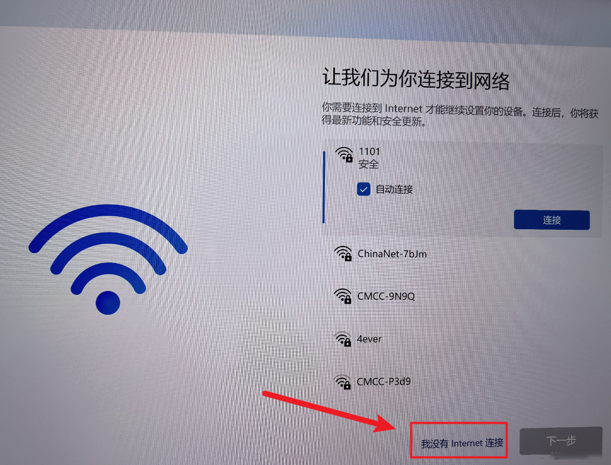

# Windows11安装系统跳过微软账号登录

在安装win11系统，进行到选择语言界面的时候，暂停下。

我们可以按下键盘的Shift+F10按键（部分电脑是Fn+Shift+F10），这时屏幕会出现命令行窗口。

我们需要在命令行内输入代码**oobe\bypassnro.cmd**然后回车，这时候电脑会重启。

```bash
oobe\bypassnro.cmd
```

PS：若无法输入命令，可以电脑插入鼠标点击一下命令行窗口（看到窗口外框变黑）再尝试。

我们就可以选择 我没有Internet链接 这个选项了（此时计算机如果插着网线正在联网的话需要先把网线拔掉才能有此选项）

