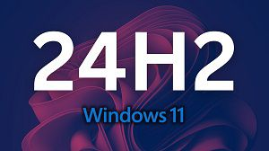

# Windows11的24H2出现扩展错误

## 原因

> - **默认SMB签名要求**：为了提高安全性，防止网络篡改和中继攻击，默认所有连接都需要SMB签名。
> - **禁用来宾登录**：为了提升连接到不可信设备时的安全性，Windows 11 24H2 专业版及后续版本中禁用了不安全的来宾登录。

## 解决方案



可以通过调整组策略或直接修改注册表来解决问题。

### 方法1：通过组策略调整

#### **禁用SMB客户端签名要求**

- 打开“开始”菜单，搜索并启动“编辑组策略”(gpedit) 应用。
- 导航至：“计算机配置” > “Windows 设置” > “安全设置” > “本地策略” > “安全选项”。
- 双击“Microsoft网络客户端：对通信进行数字签名（始终）”。
- 选择“已禁用”，点击“确定”。

#### **启用不安全的来宾登录**

- 在“开始”菜单搜索中输入 gpedit 并启动“编辑组策略”应用。
- 导航至：“计算机配置” > “管理模板” > “网络” > “Lanman 工作站”。
- 双击“启用不安全的来宾登录”。
- 选择“已启用”，点击“确定”。

完成上述步骤后，请重启计算机以使更改生效。

### 方法2：通过注册表修改

创建一个名为“修复共享签名认证.reg”的文件，内容如下：

一键[下载](http://192.168.0.61:8080/note-book/Windows/Windows11的24H2出现扩展错误.assets/修复共享签名认证.reg)

```
Windows Registry Editor Version 5.00

[HKEY_LOCAL_MACHINE\SYSTEM\CurrentControlSet\Services\LanmanWorkstation\Parameters]
"RequireSecuritySignature"=dword:00000000
"AllowInsecureGuestAuth"=dword:00000001
```

保存该文件后，双击运行，然后按照提示操作，重启计算机以应用更改。