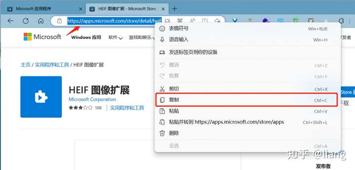
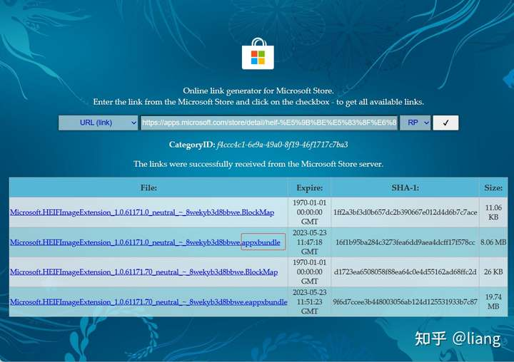
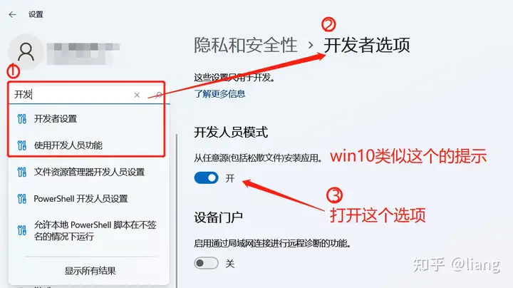
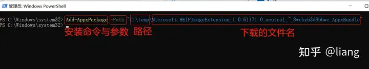

# Windows绕过MicroSoft Store直接下载应用\

> https://zhuanlan.zhihu.com/p/631642243

在浏览器打开微软商店（[Microsoft 应用程序](https://apps.microsoft.com/store/apps)），搜索所需要的应用，复制应用的Url链接



打开这个网站[Microsoft Store - Generation Project ](https://store.rg-adguard.net/) ，在输入框黏贴复制的链接，点击**√**（查询）。

出来查询结果，瞄准后缀为（appxBundle）的进行**下载**（记住这个文件保存的位置）。



在win11或win10的【设置】里面，找到开发人员选项，打开"允许任意（外部）安装应用"。



打开Windows PowerShell对刚刚下载的包进行安装

```text
# 命令
Add-AppxPackage -Path "下载的包绝对路径"
# 示例
Add-AppxPackage -Path "C:\temp\Microsoft.HEIFImageExtension_1.0.61171.0_neutral_~_8wekyb3d8bbwe.AppxBundle"
```



The end。